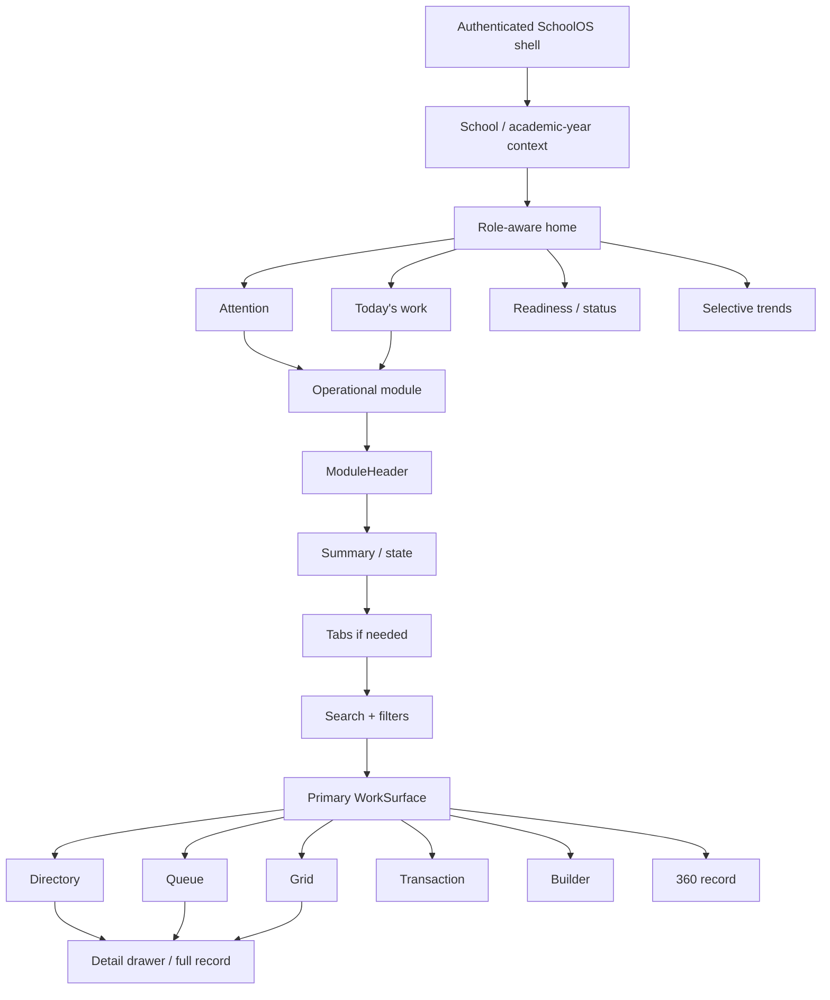
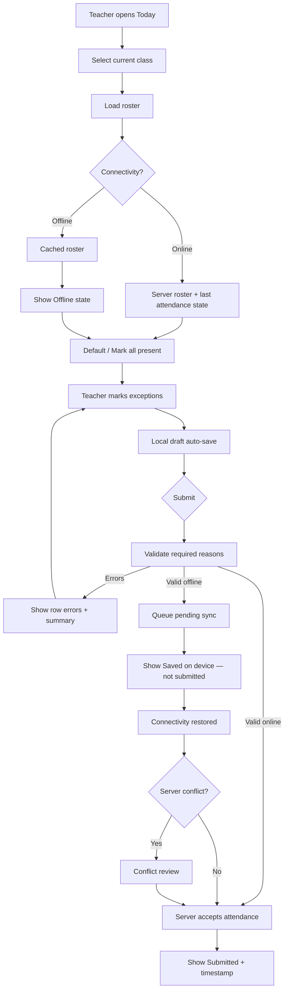
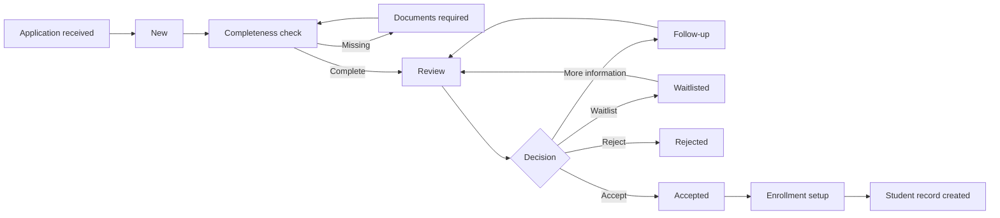
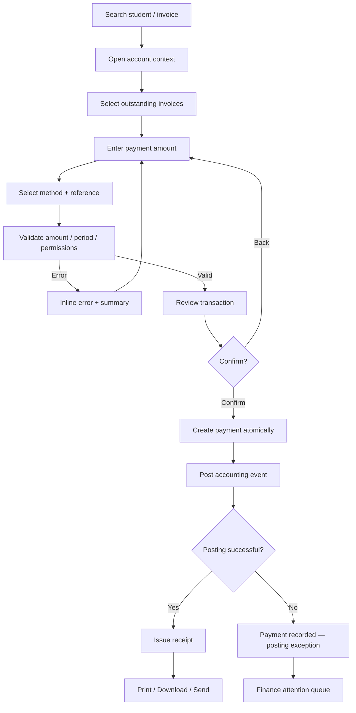

# SchoolOS UI/UX Master Blueprint

## Executive summary

This report extends the earlier SchoolOS design audit into a product-level UI/UX specification. The previous direction was fundamentally correct: SchoolOS should be a **role-aware operating workspace**, not a generic ERP homepage filled with charts and module shortcuts. fileciteturn0file0

The deeper research reinforces that conclusion. ManageBac+'s 2026 **My Workspace** explicitly tailors dashboard sections and widgets to Admin, Teacher, Student and Parent users; its teacher/admin experience keeps global navigation, search and Quick Add available while surfacing timetable, classes and deadlines. citeturn0search0turn0search2 Blackbaud similarly puts operational tasks, attendance, grade approval and items needing attention directly into academic workflows, while its Attendance Hub explicitly has a "Needs Attention" model. citeturn0search4turn0search5turn0search16 Alma's current BeaconAI positioning is likewise about moving school data from reporting toward action rather than presenting analytics for their own sake. citeturn0search8

The recommended SchoolOS design principle is therefore:

> **Context → Attention → Action → Work → Status/Evidence → Analytics**

rather than:

> Dashboard → many KPI cards → many charts → module shortcuts → tables.

The visual target should be **calm institutional clarity with premium SaaS polish**. SchoolOS should retain blue/navy as its operational identity, use mostly neutral surfaces, reserve semantic colors for actual status, limit dashboard charts to decisions that benefit from trends, and let different personas see fundamentally different dashboard compositions.

The three audited repositories remain useful references, but for distinct reasons. Velour-Lane demonstrates visual restraint, neutral-heavy surfaces, compact metric composition, quick actions and setup/readiness patterns. Its current admin dashboard explicitly combines a five-metric strip with recent work, inventory health, quick actions and setup status. fileciteturn11file0 Montessori-Marketing is the strongest workflow reference: its CMS defines a 260px dashboard shell, calm green/neutral surfaces, summary cards and operational tables; its dashboard combines workspace context, quick actions, a pipeline, and an "Action required" section. fileciteturn7file0 fileciteturn13file0 `demo` is the strongest analytics reference, with four top-line metrics followed by revenue/category analysis and operational exceptions. fileciteturn15file0

**Recommended product decisions**

| Decision | SchoolOS recommendation |
|---|---|
| Brand identity | Keep blue/navy; do not adopt green, rose or copper globally |
| Dashboard philosophy | Role-specific attention/action dashboard |
| Primary desktop shell | 64px topbar + 248px expandable sidebar |
| Main canvas | Cool neutral `#F4F7FB` |
| Primary action | `#2563EB`; use one dominant primary action per work context |
| Typography | Inter + Noto Sans Devanagari |
| Accessibility target | WCAG 2.2 AA, with several AAA-inspired practices |
| Mobile controls | Prefer 44px+ touch targets even though WCAG AA permits 24px under its target-size criterion |
| Desktop controls | 40px default; 44px important actions |
| Card style | White, 1px border, 12px radius, minimal shadow |
| Tables | Primary work surface for directories/finance; not decorative cards |
| Charts | Principal/Accounting/Platform selectively; minimal on Admin/Teacher/Parent |
| Parent product | Child-centered mobile interface, not mini ERP |
| Teacher product | Today's schedule and outstanding teaching work first |
| Offline | Explicit Online / Syncing / Offline / Conflict states |
| Tenant branding | Branding around product; semantic and operational tokens protected |

WCAG 2.2 sets 4.5:1 as the minimum contrast for normal text, 3:1 for large text, and 3:1 for required visual information in interactive components and meaningful graphics. It also requires a minimum 24×24 CSS-pixel target or sufficient spacing at AA; 44×44 is the enhanced AAA target and is a sensible SchoolOS mobile design goal. citeturn1search3turn5search0turn5search1turn5search2

## Visual foundation: color, typography and shell

**Color architecture**

SchoolOS should separate five concepts that are often incorrectly mixed:

`brand` = SchoolOS identity  
`surface` = visual hierarchy  
`semantic` = meaning/status  
`data` = visualization categories  
`tenant` = school branding

The three audited projects reinforce this separation. Velour has an extensive neutral stone system plus a specific storefront accent theme and motion tokens rather than making the entire interface rose-colored. fileciteturn5file0 Montessori uses a restrained `#1F6B57` brand over `#F4F7F5` and white panels. fileciteturn7file0 Demo uses forest/copper accents but keeps the majority of UI neutral. fileciteturn9file0

### Recommended SchoolOS tokens

| Token | Hex | Intended use | Contrast check |
|---|---:|---|---:|
| `brand-navy` | `#17324D` | Wordmark, major titles, authority | 13.13:1 on white — AAA |
| `primary-50` | `#EFF6FF` | Selected/background tint | `primary-700` = 6.16:1 |
| `primary-100` | `#DBEAFE` | Stronger selected tint | — |
| `primary-200` | `#BFDBFE` | Decorative data fills | — |
| `primary-500` | `#3B82F6` | Charts/icons; not default white-text button | — |
| `primary-600` | `#2563EB` | Primary buttons, links | 5.17:1 on white — AA |
| `primary-700` | `#1D4ED8` | Hover/selected text | 6.70:1 on white — AA |
| `primary-800` | `#1E40AF` | Strong emphasis | > AA |
| `primary-900` | `#1E3A8A` | Deep blue | > AA |
| `text-primary` | `#172033` | Main text | 16.27:1 on white — AAA |
| `text-secondary` | `#667085` | Secondary/body metadata | 4.97:1 on white — AA |
| `text-muted` | `#98A2B3` | Decorative/disabled only | 2.58:1 — **not normal text** |
| `surface-canvas` | `#F4F7FB` | App background | — |
| `surface-subtle` | `#F8FAFC` | Sidebar/toolbars | — |
| `surface-raised` | `#FFFFFF` | Cards, tables, panels | — |
| `border-subtle` | `#DDE4EC` | Nonessential separation | 1.28:1 on white |
| `border-control` | `#7C8799` | Required input/control boundary | 3.63:1 on white — UI pass |

Contrast ratios above are calculated using the WCAG relative-luminance formula. The important distinction is that `#DDE4EC` can remain a subtle visual divider, but **must not be the only visual cue identifying an interactive control**; WCAG requires meaningful UI-component visual information to achieve 3:1 against adjacent colors. citeturn1search0turn5search1

**Semantic palette**

The existing SchoolOS semantic direction should be darkened slightly so that status text works not only on white but also on its semantic tint.

| Semantic role | Foreground | Background | Foreground/background contrast | Meaning |
|---|---:|---:|---:|---|
| Success | `#18794E` | `#E8F5EE` | 4.82:1 | Completed, paid, healthy |
| Warning | `#8A5800` | `#FFF4D6` | 5.51:1 | Attention, overdue soon |
| Danger | `#B42318` | `#FEECEB` | 5.76:1 | Error, failed, overdue, destructive |
| Information | `#175CD3` | `#EBF2FF` | 5.32:1 | Informational state |
| Neutral | `#475467` | `#F2F4F7` | 6.98:1 | Draft, inactive, archived |

Color must never be the only status signal. WCAG's Use of Color criterion explicitly requires another visual means—such as text, iconography or shape—when color communicates meaning. citeturn6search4turn6search7

So:

```text
✓ Paid
! Needs review
× Failed
• Draft
```

not four identical unlabeled colored dots.

**Data-visualization colors**

Use a separate visualization palette so semantic red does not suddenly mean "Grade 10" or "Science":

```css
--data-blue:   #2563EB;
--data-teal:   #0F766E;
--data-violet: #7C3AED;
--data-gold:   #A15C00;
--data-slate:  #64748B;
--data-cyan:   #0E7490;
```

For charts, directly label values/categories wherever space permits rather than depending entirely on color legends. Carbon's current guidance recommends direct labeling when possible because legends require additional visual association. citeturn2search7

**Typography**

Recommended authenticated-product font stack:

```text
Latin/interface        Inter
Nepali/Devanagari      Noto Sans Devanagari
Fallback                system-ui, sans-serif
Financial numerics      Inter with tabular-nums
```

Noto Sans Devanagari explicitly supports Devanagari used for Nepali and includes the OpenType shaping support required by the script. citeturn3search1 Google Fonts' CSS API supports multiple families, variable-font ranges and `font-display`, so both families can be loaded efficiently rather than downloading arbitrary weights. citeturn3search0

| Token | Desktop | Mobile | Weight | Typical use |
|---|---:|---:|---:|---|
| `display-lg` | 32/40 | 28/36 | 700 | Dashboard greeting/major metric |
| `page-title` | 28/36 | 24/32 | 700 | Page `h1` |
| `section-title` | 20/28 | 18/26 | 600 | Major workspace section |
| `card-title` | 16/24 | 16/24 | 600 | Panel/card title |
| `body-md` | 14/22 | 15/23 | 400 | Standard content |
| `body-sm` | 13/20 | 14/21 | 400 | Compact supporting text |
| `label` | 13/18 | 14/20 | 600 | Form labels |
| `table` | 13–14/20 | n/a | 400–500 | Tables |
| `metadata` | 12/18 | 12/18 | 400–500 | Metadata |
| `button` | 14/20 | 15/20 | 600 | Buttons |
| `metric-lg` | 28–32/36 | 26–30/34 | 700 | Dashboard values |

Use Devanagari at the **same nominal token size**, then visually QA line-height and truncation instead of shrinking Nepali copy to force it into Latin layouts.

**Shell dimensions**

Montessori currently uses a 260px desktop sidebar, while Demo defines a 74px header and 46px control height. fileciteturn7file0 fileciteturn9file0 For SchoolOS, a slightly tighter institutional shell is preferable:

| Element | Recommended |
|---|---:|
| Desktop topbar | `64px` |
| Expanded sidebar | `248px` |
| Collapsed sidebar | `72px` |
| Max working content | `1440px` for dashboards |
| Dense table content | May use full remaining width |
| Standard page padding | `24px` |
| ≥1536px page padding | `32px` |
| Tablet page padding | `20px` |
| Mobile page padding | `16px` |
| Section gap | `24px` |
| Panel gap | `16–20px` |
| Standard desktop control | `40px` |
| Primary/critical control | `44px` |
| Mobile control | `44–48px` |
| Table row normal | `48px` |
| Table row compact | `40–44px` |
| Sidebar nav row | `40px` |
| Topbar icon target | `40–44px` |
| Card radius | `12px` |
| Button/input radius | `8px` |
| Drawer/modal radius | `16px` |

Because SchoolOS uses sticky shell elements, apply `scroll-padding-top` and test keyboard navigation so the topbar does not completely cover a newly focused component. WCAG 2.2 AA now explicitly addresses focus being obscured by author-created sticky content. citeturn6search0turn6search3

**Exportable foundation tokens**

```css
:root {
  /* Brand */
  --sos-brand-navy: #17324d;

  --sos-primary-50:  #eff6ff;
  --sos-primary-100: #dbeafe;
  --sos-primary-200: #bfdbfe;
  --sos-primary-500: #3b82f6;
  --sos-primary-600: #2563eb;
  --sos-primary-700: #1d4ed8;
  --sos-primary-800: #1e40af;
  --sos-primary-900: #1e3a8a;

  /* Surfaces */
  --sos-canvas: #f4f7fb;
  --sos-surface-subtle: #f8fafc;
  --sos-surface: #ffffff;
  --sos-surface-hover: #f8fafc;
  --sos-surface-selected: #eff6ff;

  /* Text */
  --sos-text: #172033;
  --sos-text-secondary: #667085;
  --sos-text-muted: #98a2b3;

  /* Borders */
  --sos-border: #dde4ec;
  --sos-border-control: #7c8799;

  /* Semantic */
  --sos-success: #18794e;
  --sos-success-soft: #e8f5ee;
  --sos-warning: #8a5800;
  --sos-warning-soft: #fff4d6;
  --sos-danger: #b42318;
  --sos-danger-soft: #feeceb;
  --sos-info: #175cd3;
  --sos-info-soft: #ebf2ff;
  --sos-neutral: #475467;
  --sos-neutral-soft: #f2f4f7;

  /* Geometry */
  --sos-radius-control: 8px;
  --sos-radius-card: 12px;
  --sos-radius-overlay: 16px;

  --sos-topbar-height: 64px;
  --sos-sidebar-width: 248px;
  --sos-sidebar-collapsed: 72px;

  /* Spacing */
  --sos-space-1: 4px;
  --sos-space-2: 8px;
  --sos-space-3: 12px;
  --sos-space-4: 16px;
  --sos-space-5: 20px;
  --sos-space-6: 24px;
  --sos-space-8: 32px;

  /* Motion */
  --sos-motion-instant: 100ms;
  --sos-motion-fast: 160ms;
  --sos-motion-standard: 220ms;
  --sos-motion-overlay: 280ms;
  --sos-ease-standard: cubic-bezier(.2, 0, 0, 1);

  /* Focus */
  --sos-focus: #1d4ed8;
}

:focus-visible {
  outline: 2px solid var(--sos-focus);
  outline-offset: 2px;
}

html {
  scroll-padding-top: calc(var(--sos-topbar-height) + 16px);
}

@media (prefers-reduced-motion: reduce) {
  *,
  *::before,
  *::after {
    scroll-behavior: auto !important;
    animation-duration: 0.01ms !important;
    animation-iteration-count: 1 !important;
    transition-duration: 0.01ms !important;
  }
}
```

Velour and Montessori both already include explicit reduced-motion behavior, so that is a pattern worth carrying directly into the SchoolOS design-system implementation. fileciteturn5file0 fileciteturn7file0

## Canonical page architecture and annotated wireframes

SchoolOS should not invent a separate layout for every module. Eight canonical page templates are enough to cover most of the product.

| Canonical template | Primary job | Main SchoolOS examples |
|---|---|---|
| **Executive monitoring** | Diagnose priorities and trends | Principal, Platform, Accounting overview |
| **Operational dashboard** | Execute today's queues/tasks | Admin, HR, Accountant |
| **Directory** | Find, filter and open records | Students, Staff, Guardians |
| **Queue / case review** | Process items through states | Admissions, approvals, corrections |
| **Transaction counter** | Safely complete a financial/action transaction | Fee collection, refunds, receipts |
| **Spreadsheet / grid** | Enter repetitive structured data | Attendance, marks, payroll, reconciliation |
| **Builder + preview** | Compose content/configuration | Notices, homework, timetable |
| **360° record** | Work within one person's persistent context | Student, Staff, Guardian |

Carbon's table model supports exactly the behavior needed by the directory and grid families: sorting, expansion, batch actions and toolbars for search/filter/actions. citeturn2search0turn2search5 GOV.UK's task-list research supports a different pattern for workflows such as onboarding/readiness where the goal is to understand incomplete tasks rather than inspect generic metrics. citeturn2search13turn2search23

**Master information hierarchy**



ManageBac+'s persistent top navigation and collapsible left navigation support this model, and its role-customized workspace confirms that the shell can remain consistent while the dashboard changes by persona. citeturn0search0turn0search2

**High-fidelity direction mock**

The following composite demonstrates the proposed color density, shell, metric strip, attention hierarchy and mobile visual language.


[Download the full-size SchoolOS UI mock](sandbox:/mnt/data/schoolos_ui_mock.png)

**Principal — Executive Monitoring**

```text
┌────────────────────────────────────────────────────────────────────────────┐
│ SCHOOL OPERATIONS                                      Sat, 22 Aug · 2083 │
│ Executive dashboard                                                      │
│ School operations requiring leadership attention      [Review approvals] │
├────────────────────────────────────────────────────────────────────────────┤
│                                                                            │
│ ┌────────────────┬────────────────┬────────────────┬────────────────────┐  │
│ │ ATTENDANCE     │ FEE COLLECTION │ ACADEMIC READY │ ADMISSIONS         │  │
│ │ 94.8%          │ NPR 1.82M      │ 91%            │ 8 open             │  │
│ │ ! 3 late       │ ! 3 exceptions │ ! 7 pending    │ 4 decisions        │  │
│ └────────────────┴────────────────┴────────────────┴────────────────────┘  │
│                                                                            │
│ ┌────────────────────────────────────────────┐ ┌─────────────────────────┐ │
│ │ NEEDS YOUR ATTENTION                       │ │ TODAY                   │ │
│ │ × 3 fee reconciliation failures       →   │ │ 42/45 classes marked   │ │
│ │ ! 7 marks submissions overdue         →   │ │ 4 teachers absent      │ │
│ │ ! 2 attendance corrections            →   │ │ 2 notices scheduled    │ │
│ │ i 4 admission decisions               →   │ │ 3 approvals waiting    │ │
│ │                                            │ │                         │ │
│ │ View all                                   │ │ Open school day →       │ │
│ └────────────────────────────────────────────┘ └─────────────────────────┘ │
│                                                                            │
│ ┌────────────────────────────────────────────────────────────────────────┐ │
│ │ SCHOOL READINESS                                                       │ │
│ │ Academic year                 Complete                                 │ │
│ │ Teacher assignments           96%                       Review 3 →      │ │
│ │ IEMIS readiness               91%                       Fix 12 →        │ │
│ │ Fees                          Complete                                 │ │
│ │ Backup                        Verified                                 │ │
│ └────────────────────────────────────────────────────────────────────────┘ │
│                                                                            │
│ ATTENDANCE TREND · 30 DAYS                                                │
│ [single line chart with directly labelled anomalies]                      │
└────────────────────────────────────────────────────────────────────────────┘
```

The KPI strip answers "how is school doing?" while attention answers "what requires my intervention?" Do not force those into the same visual treatment.

**Admin — Operational Dashboard**

```text
OPERATIONS DASHBOARD
Run today's school-office work.                            [Add student] [•••]

┌────────────────┬────────────────┬────────────────┬────────────────┐
│ Admissions     │ Attendance     │ Parent cases   │ Data quality   │
│ 8 open         │ 3 missing      │ 6 open         │ 12 issues      │
│ 4 ready        │ Resolve →      │ 2 urgent       │ Review →       │
└────────────────┴────────────────┴────────────────┴────────────────┘

┌────────────────────────────────────────────┬───────────────────────────────┐
│ ACTION REQUIRED                            │ TODAY                         │
│                                            │                               │
│ Guardian verification    3        Review → │ Applications created      12 │
│ Missing attendance       3       Resolve → │ Student transfers          4 │
│ Admissions ready         4          Open → │ Notices scheduled          2 │
│ Student corrections      4          Open → │ Parent requests            6 │
└────────────────────────────────────────────┴───────────────────────────────┘

┌────────────────────────────────────────────────────────────────────────────┐
│ SCHOOL READINESS                                                           │
│ ✓ Academic year    ✓ Classes    ! Teacher allocation 96%                  │
│ ✓ Fee structures  ! IEMIS 91%  ✓ Notifications                            │
└────────────────────────────────────────────────────────────────────────────┘
```

This takes the best element from Montessori's current CMS—the combination of workspace overview, quick action and action-required work—and applies it to school operations rather than marketing leads. fileciteturn13file0

**Teacher Web — Today Workspace**

ManageBac currently exposes timetable, tasks/deadlines and assigned classes from the teacher workspace, which is the right mental model for SchoolOS. citeturn0search2turn0search12

```text
TODAY                                                     Sat, 22 August
Your classes, attendance and teaching work.

                                                 [Create homework]

┌──────────────────────────────────────────────────────────────────────────┐
│ MY DAY                                                                   │
│                                                                          │
│ 08:00  Grade 8A · Mathematics       ✓ Attendance submitted              │
│ 09:00  Grade 9B · Mathematics       ! Mark attendance       [Start →]   │
│ 10:15  Grade 10A · Mathematics      Room 204                            │
│ 11:30  Free period                                                      │
│ 12:30  Grade 8B · Mathematics                                           │
└──────────────────────────────────────────────────────────────────────────┘

┌──────────────────────────────────┐ ┌─────────────────────────────────────┐
│ NEEDS ACTION                     │ │ UPCOMING                            │
│ 1 attendance class          →    │ │ Homework due tomorrow              │
│ 2 marks submissions         →    │ │ Unit test · Friday                 │
│ 8 homework submissions      →    │ │ Substitute · Monday P2            │
└──────────────────────────────────┘ └─────────────────────────────────────┘

MY CLASSES
[8A Mathematics] [8B Mathematics] [9B Mathematics] [10A Mathematics]
```

Teacher KPI cards such as "1,246 students" or school revenue should not exist here because they do not change the teacher's next action.

**Teacher Mobile — Immediate Action**

```text
┌───────────────────────────────┐
│ SchoolOS                  🔔  │
│                               │
│ Good morning, Anisha          │
│ Saturday · 22 Aug             │
├───────────────────────────────┤
│ NEXT CLASS                    │
│ Mathematics · Grade 9B        │
│ 09:00–09:45 · Room 204        │
│                               │
│ [      Mark attendance      ] │
├───────────────────────────────┤
│ TODAY                         │
│ ✓ 08:00   Grade 8A            │
│ ○ 09:00   Grade 9B            │
│ ○ 10:15   Grade 10A           │
│ ○ 12:30   Grade 8B            │
├───────────────────────────────┤
│ NEEDS ACTION                  │
│ 8 homework submissions     ›  │
│ Marks due tomorrow         ›  │
├───────────────────────────────┤
│ Home   Classes   Homework More│
└───────────────────────────────┘
```

Design target: opening the application to taking the current class attendance should require **one primary navigation decision**, not navigation through Dashboard → Attendance → Grade → Section → Period.

**Parent Mobile — Child-Centered**

Veracross promotes a unified family portal for schedules, assignments, notes, calendars and extracurriculars, and ManageBac similarly adapts its workspace by user type rather than exposing one generic dashboard. citeturn0search3turn0search0

```text
┌────────────────────────────────┐
│ SchoolOS                   🔔  │
│                                │
│ Aarav Shrestha ▼               │
│ Grade 6 · Section A            │
├────────────────────────────────┤
│ TODAY                          │
│ ✓ Present                      │
│ Checked in 8:12 AM             │
│ Next: Mathematics · 10:00      │
├────────────────────────────────┤
│ ATTENTION                      │
│ Homework due today         2 › │
│ Fee due · 28 Aug   NPR 12,500 ›│
├────────────────────────────────┤
│ QUICK ACCESS                   │
│ [Attendance]     [Homework]    │
│ [Results]        [Fees]        │
├────────────────────────────────┤
│ LATEST                         │
│ New science homework        ›  │
│ School notice               ›  │
│ Attendance confirmed        ›  │
├────────────────────────────────┤
│ Home   Updates Calendar Profile│
└────────────────────────────────┘
```

The parent Home screen should answer, in order: **Is my child at school? What needs attention? What is due? What did the school communicate?**

**Student 360 — Unified Record**

Veracross's current product positioning is explicitly "one-person, one-record," with departmental data sharing around a central record. citeturn0search13turn0search18 SchoolOS should implement that idea as a persistent contextual profile:

```text
STUDENTS / AARAV SHRESTHA

┌──────────────────────────────────────────────────────────────────────────┐
│ [Photo]  Aarav Shrestha                                  ● Active        │
│          STU-2083-01452 · Grade 6A                                       │
│          Primary guardian: Maya Shrestha                                 │
│                                                                          │
│          Attendance 94.7%   Outstanding NPR 12,500   Documents 8/9       │
└──────────────────────────────────────────────────────────────────────────┘

[Overview] [Enrollment] [Guardians] [Attendance] [Academics]
[Fees] [Documents] [Requests] [History]

┌──────────────────────────────────────────┬───────────────────────────────┐
│ STUDENT INFORMATION                      │ NEEDS ATTENTION               │
│ DOB               2072-05-14 BS          │ ! Missing emergency contact │
│ Address           Kathmandu              │ ! 1 document required       │
│ Admission         2080                   │                               │
│ Local level       Kathmandu Metro        │                               │
└──────────────────────────────────────────┴───────────────────────────────┘

GUARDIANS
Maya Shrestha · Mother · Verified
Academic ✓   Attendance ✓   Fees ✓   Pickup ✓

RECENT HISTORY
22 Aug · Attendance marked present
21 Aug · NPR 5,000 payment posted
20 Aug · Guardian contact updated
```

Use tabs for **distinct record domains**. Use a content switcher/segmented control only for alternative views of the same data; Carbon makes this distinction explicitly. citeturn2search24

**Attendance — Spreadsheet/Grid**

Blackbaud allows attendance for groups and individuals and has an Attendance Hub that identifies unrecorded attendance and late submissions requiring action. citeturn0search11turn0search16 SchoolOS should optimize the actual roster task:

```text
ATTENDANCE
Mark and review attendance for the selected class.          [Attendance history]

[Sat 22 Aug] [Grade 8 ▼] [Section A ▼] [Homeroom ▼]

34 students                     Draft saved 08:04         ● Online
                                                         [Mark all present]

┌──────┬──────────────────────────────┬────────────┬────────────────────────┐
│ Roll │ Student                      │ Status     │ Detail                 │
├──────┼──────────────────────────────┼────────────┼────────────────────────┤
│ 01   │ Aarav Shrestha               │ ✓ Present  │                        │
│ 02   │ Aarya Gurung                 │ ✓ Present  │                        │
│ 03   │ Nima Sherpa                  │ × Absent   │ [Reason ▼]             │
│ 04   │ Saanvi Karki                 │ ! Late     │ 08:13                  │
│ ...  │                              │            │                        │
└──────┴──────────────────────────────┴────────────┴────────────────────────┘

2 exceptions                      [Save draft] [Submit attendance]
```

**Admissions — Queue / Case Review**

```text
ADMISSIONS
Manage prospective students from application to enrollment. [New application]

┌───────────────┬───────────────┬───────────────────┬───────────────────┐
│ Open          │ Ready review  │ Missing documents │ Decision required │
│ 12            │ 5             │ 3                 │ 4                 │
└───────────────┴───────────────┴───────────────────┴───────────────────┘

[All] [New] [Review] [Waitlist] [Accepted]

Search applicant…          Grade ▼      Assigned ▼      More filters

┌────────────────────────────────────────────────────────────────────────────┐
│ Applicant       Grade    Stage                 Owner       Updated         │
│ Aarav KC        4        Review required       Anisha      20m          › │
│ Arya Thapa      2        Missing document      Suman       1h           › │
│ Nima Lama       7        Decision required     Principal   Yesterday    › │
└────────────────────────────────────────────────────────────────────────────┘

Selecting a straightforward case → right drawer
Complex review / decision          → dedicated applicant record
```

**Fees — Transaction Counter**

```text
FEES & RECEIPTS
Collect, post and reconcile student fees.                  [Receipt history]

Search student / invoice / receipt...
───────────────────────────────────────────────────────────────────────────

┌─────────────────────────────────────┬─────────────────────────────────────┐
│ AARAV SHRESTHA                      │ ACCOUNT                             │
│ Grade 6A · STU-2083-01452           │ Total due           NPR 12,500     │
│                                     │ Credit              NPR 0          │
│ OPEN INVOICES                       │                                     │
│ Tuition                 NPR 10,000  │ [View full ledger]                  │
│ Activity                 NPR 2,500  │                                     │
│                                     │                                     │
├─────────────────────────────────────┴─────────────────────────────────────┤
│ COLLECT PAYMENT                                                            │
│ Amount       [ 12,500              ]                                       │
│ Method       [ Cash              ▼ ]                                       │
│ Reference    [                     ]                                       │
│                                                                            │
│ You are about to post NPR 12,500 to Aarav Shrestha.                       │
│                                              [Cancel] [Review payment →]   │
└────────────────────────────────────────────────────────────────────────────┘

Review screen:
Student      Aarav Shrestha
Amount       NPR 12,500
Method       Cash
Invoices     Tuition + Activity

                                  [Back] [Confirm & issue receipt]
```

That explicit review/confirmation step is important for accessibility and error prevention: WCAG 2.2's financial/data error-prevention criterion requires an important submission to be reversible, checked, or reviewable/confirmable before finalization. citeturn6search2

**Marks — Spreadsheet/Grid**

Blackbaud's grades management similarly treats grading as a central operational workflow rather than a set of decorative cards. citeturn0search21

```text
MARKS ENTRY
Grade 10A · Mathematics · First Terminal · Theory / 75

Status: Draft                                        [Validate] [Submit marks]

Search student…                    [Show only issues □]

┌──────┬────────────────────────────┬───────────┬────────────┬──────────────┐
│ Roll │ Student                    │ Marks     │ Status     │ Remark       │
├──────┼────────────────────────────┼───────────┼────────────┼──────────────┤
│ 01   │ Aarav                      │ [ 68 ]    │ ✓ Valid    │              │
│ 02   │ Aarya                      │ [ 55 ]    │ ✓ Valid    │              │
│ 03   │ Nima                       │ [    ]    │ ! Missing  │              │
│ 04   │ Saanvi                     │ [ 79 ]    │ × Invalid  │ Max is 75    │
└──────┴────────────────────────────┴───────────┴────────────┴──────────────┘

× 1 invalid value · ! 1 missing value
Resolve all blocking errors before submission.
```

Keyboard behavior matters here: arrow keys move within editable cells, Enter confirms/moves down, Shift+Enter moves up, paste handles row/column data safely, and validation must be conveyed through text rather than red alone.

**Notices — Builder + Preview**

```text
CREATE NOTICE

┌────────────────────────────────────────────┬───────────────────────────────┐
│ COMPOSE                                    │ LIVE PREVIEW                  │
│                                            │                               │
│ Title                                      │ Annual Sports Day             │
│ [Annual Sports Day                    ]    │ 22 August                     │
│                                            │                               │
│ Audience                                   │ Dear Parents,                 │
│ [Parents ×] [Grade 6 ×]                    │                               │
│                                            │ Sports Day will be held...    │
│ Message                                    │                               │
│ ┌────────────────────────────────────────┐ │ attachment.pdf                │
│ │ Rich text editor                       │ │                               │
│ │                                        │ │                               │
│ └────────────────────────────────────────┘ │                               │
│                                            │                               │
│ Attachments [Upload]                       │                               │
│                                            │                               │
│ RECIPIENT ESTIMATE                         │                               │
│ 184 parents · 172 push · 12 SMS fallback  │                               │
└────────────────────────────────────────────┴───────────────────────────────┘

[Save draft]                       [Request approval] / [Publish]
```

Validation errors should appear both in a summary at the top and next to the field that needs correction, consistent with the evidence-backed GOV.UK error-summary pattern. citeturn2search10

**Accounting — Executive + Transactional Analytics**

Demo is useful here because its admin dashboard deliberately combines a small metric row, trends, recent transactions and exception data. fileciteturn15file0 Alma likewise uses attendance, enrollment, grading and family-engagement dashboards to help educators identify patterns and act, rather than treating analytics as a separate BI exercise. citeturn0search8

```text
FINANCE DASHBOARD
Shrawan 2083                                          Period ● OPEN

┌──────────────────┬──────────────────┬──────────────────┬──────────────────┐
│ Cash & bank      │ Receivables      │ Payables         │ Unposted         │
│ NPR 4.2M         │ NPR 1.1M         │ NPR 640K         │ 3                │
│ +4.2% MoM        │ ! 84 overdue     │ 12 due this week │ Fix postings →   │
└──────────────────┴──────────────────┴──────────────────┴──────────────────┘

ATTENTION
× 3 source transactions failed posting                            Review →
! 6 bank transactions unreconciled                               Review →
! Cashier closing awaiting approval                              Approve →

┌────────────────────────────────────────┬──────────────────────────────────┐
│ CASH FLOW · 6 MONTHS                   │ COLLECTION PERFORMANCE           │
│ [accessible line chart]                │ [bar / target chart]             │
└────────────────────────────────────────┴──────────────────────────────────┘

RECENT POSTINGS
Voucher      Date       Source         Debit        Credit       Status
JV-00128     22 Aug     Fees           12,500       —            Posted
JV-00127     22 Aug     Payroll        —            485,000      Pending
...
```

Charts should be accompanied by accessible tabular or textual summaries for key values, and graphics required for understanding must retain adequate non-text contrast. citeturn5search1

## Key workflows and interaction rules

The strongest SchoolOS workflows should have **visible state transitions**, reversible drafts where practical and a clear distinction between saving locally, syncing, submitting and locking.

**Attendance flow**



The key UX distinction is:

```text
Draft saved                 ≠
Saved on this device        ≠
Syncing                     ≠
Submitted to SchoolOS       ≠
Locked
```

Never show "Synced" before server acknowledgement.

**Admissions flow**



The UI should emphasize **next actionable state**, not the raw number of historical applications. Queue filters should include "Assigned to me", "Needs action", "Missing documents" and "Decision required".

**Fee collection flow**



Do not hide an accounting failure behind a generic green "Payment successful" message. A payment and downstream posting can have different states.

**Complex forms**

For long processes such as school onboarding, admissions configuration and report setup, use:

```text
Task navigation          Work area                 Summary / validation
────────────────         ─────────                 ────────────────────
Institution              Current step              Completion state
Academic year            fields                    Warnings
Classes                                             Affected records
Teacher assignment
Fees
IEMIS
Notifications
```

GOV.UK distinguishes services with a clear transactional journey from broad navigational applications and recommends task-list patterns where users need to complete multiple tasks and understand their completion states. citeturn2search20turn2search21

**Tables and density**

SchoolOS should use a real `<table>` when row/column relationships matter, not a set of divs styled to look like one. Carbon's current table guidance supports sorting, expansion, batch operations and keyboard-accessible sortable headers. citeturn2search0turn2search5turn2search17

Recommended table densities:

| Context | Row height | Rationale |
|---|---:|---|
| Student/staff directory | `48px` | Comfortable scanning |
| Admissions queue | `48px` | Includes state + metadata |
| Finance ledger | `44px` | Higher information density |
| Marks entry | `40–44px` | Spreadsheet-style work |
| Attendance | `44–48px` | Fast marking without excessive height |
| Touch/tablet | `48–52px` | Better pointer targets |

Do not force a ten-column table onto mobile. Transform into prioritized stacked records or create a dedicated mobile workflow.

## Component system and persona composition

SchoolOS should expose a small set of strong primitives rather than allowing every module to invent its own card, filter and header.

### Core component inventory

| Component | Essential props / variants | Behavior | Accessibility contract |
|---|---|---|---|
| `ModuleHeader` | `title`, `description`, `eyebrow`, `breadcrumbs`, `status`, `primaryAction`, `secondaryActions`, `context` | Standard module entry | One `h1`; breadcrumb labelled; action text explicit |
| `SummaryGrid` | `columns`, `density`, `children` | Responsive metric container | Visual order = DOM order |
| `SummaryCard` | `label`, `value`, `delta`, `icon`, `tone`, `href`, `status` | KPI/status summary | Never use tone alone; linked card has full keyboard focus |
| `AttentionList` | `items`, `severity`, `action`, `emptyState` | Priority queue | Severity expressed with text/icon; list semantics |
| `WorkspaceTabs` | `items`, `active`, `orientation` | Distinct page sections | Proper tab/tabpanel keyboard model |
| `FilterBar` | `search`, `filters`, `sort`, `savedView`, `clear` | Dataset controls | Inputs labelled; filter state announced |
| `WorkSurface` | `loading`, `empty`, `error`, `permission`, `children` | State wrapper | Loading status exposed; errors actionable |
| `DataTable` | `columns`, `rows`, `sort`, `selection`, `pagination`, `density` | Directories/transactions | Native table semantics; sortable headers reachable |
| `DataGrid` | `columns`, `rows`, `editable`, `validation` | Marks/payroll/etc. | Grid keyboard contract; row/cell errors programmatic |
| `StatusBadge` | `status`, `tone`, `icon`, `size` | State display | Text always present; noninteractive by default |
| `Chip` | `label`, `selected`, `removable`, `disabled` | Filter/token | Interactive chip keyboard accessible |
| `FormField` | `label`, `hint`, `error`, `required`, `control` | Standard input wrapper | Label association + `aria-describedby` |
| `ErrorSummary` | `errors` | Form-level errors | Focus on submit failure; links to fields |
| `Drawer` | `size`, `title`, `dismissible` | Quick detail/review | Focus managed; Escape; restore trigger focus |
| `Modal` | `size`, `danger`, `confirmation` | Blocking confirmation | Trap focus; labelled dialog; avoid unnecessary use |
| `EmptyState` | `icon`, `title`, `description`, `action` | Zero-state | Explain why empty and next valid action |
| `OfflineIndicator` | `state`, `queuedCount`, `lastSync`, `action` | Connectivity truth | `aria-live="polite"` only for meaningful changes |

Carbon's general component philosophy is useful here: components should solve a specific UI problem and be systematically reused to create product-wide consistency. citeturn2search19

**Button hierarchy**

```text
Primary
[Save changes]

Secondary
[Cancel]

Tertiary / link
View details

Danger
[Delete student]
```

Allow only **one visually dominant primary action per local task context**. A page may contain several actions, but they should not all look primary.

**StatusBadge contract**

```ts
type StatusTone =
  | "success"
  | "warning"
  | "danger"
  | "info"
  | "neutral";

type StatusBadgeProps = {
  label: string;
  tone: StatusTone;
  icon?: React.ReactNode;
  size?: "sm" | "md";
};
```

Good:

```text
✓ Paid
! Pending approval
× Failed
• Draft
```

Bad:

```text
green pill
yellow pill
red pill
```

The badge should normally **not be clickable**. A status and an action are separate concepts.

**Form field contract**

```ts
type FormFieldProps = {
  id: string;
  label: string;
  hint?: string;
  error?: string;
  required?: boolean;
  optional?: boolean;
  children: React.ReactElement;
};
```

Submission errors should produce both an error summary and errors adjacent to the affected fields, consistent with GOV.UK's documented error model. citeturn2search10

**Persona matrix**

The dashboard must change according to what decisions each persona can actually make. ManageBac's current dashboard explicitly tailors widgets and sections for Admin, Teacher, Student and Parent. citeturn0search0

| Persona | First question | Priority metrics | Primary actions | Avoid |
|---|---|---|---|---|
| **Principal** | What requires intervention? | Attendance exception rate, fee exceptions, academic readiness, admissions decisions | Review approvals, investigate exception, open readiness item | Operational micro-tasks |
| **Admin** | What office work is unfinished? | Admissions queue, missing attendance, guardian/data cases, setup readiness | Add student, resolve case, verify data | Large financial analytics |
| **Teacher** | What do I teach/do next? | Classes today, attendance due, marks deadlines, homework review | Mark attendance, create homework, enter marks | School-wide student/revenue KPIs |
| **HR** | What people issue needs action? | Absent staff, leave approvals, contract issues, payroll readiness | Approve leave, resolve record, prepare payroll | Academic charts |
| **Accountant** | What money is unposted/unreconciled? | Collection, receivables, failed postings, reconciliation, cashier close | Collect, reconcile, approve/post | Academic management |
| **Parent** | What is happening with my child? | Today's attendance, homework due, outstanding fees, latest results | Pay fee, read notice, view homework | Institutional dashboards |
| **Student** | What do I need to do? | Today's timetable, homework/tasks, exams, notices | Open assignment, view result | Administrative metrics |
| **Platform operator** | Is every tenant/system healthy? | Tenant health, queues, providers, error rate, backups, security events | Investigate tenant, retry queue, provider maintenance | Individual academic decisions |

**Dashboard customization**

ManageBac permits users to rearrange/enable dashboard sections appropriate to their user type. citeturn0search0 SchoolOS should eventually support similar customization, but only *within a role-approved catalog*.

For example, a Teacher may reorder:

```text
My Day
Needs Action
Upcoming
My Classes
School Notices
```

but cannot add:

```text
Payroll
School revenue
HR absences
Admissions conversion
```

This prevents customization from undermining role boundaries.

## Tenant branding, implementation architecture and quality bar

**Tenant branding**

Veracross explicitly supports customizable school-branded portals for different audiences, demonstrating why institutional branding matters for family-facing experiences. citeturn0search14 ManageBac also supports account-theme personalization and custom report-card colors. citeturn0search9turn0search22

SchoolOS should distinguish **school identity** from **SchoolOS interaction language**.

| Surface | Tenant influence |
|---|---|
| Login | Logo, school name, restrained tenant accent |
| Parent app header | Logo/avatar, school identity |
| Student portal | Restrained school identity |
| Report cards | Full approved school branding |
| Certificates | Full approved school branding |
| Receipts | School identity |
| Notices/documents | School logo + approved document theme |
| Principal/Admin ERP | Small logo/name only |
| Primary action color | **Protected SchoolOS token** |
| Success/warning/error | **Protected semantic tokens** |
| Focus indicator | **Protected accessibility token** |
| Input borders | **Protected accessibility token** |
| Destructive actions | **Protected danger token** |

Tenant-provided colors should pass a token validator before being used. A school entering `#FFFF00` should not automatically produce yellow buttons with white labels.

Recommended tenant API:

```ts
type TenantTheme = {
  logoUrl?: string;
  displayName: string;
  documentPrimary?: string;
  portalAccent?: string;
  loginArtworkUrl?: string;
};
```

Do not expose arbitrary global CSS or overrides.

**CSS architecture**

Recommended organization:

```text
styles/
  tokens.css
  reset.css
  typography.css
  utilities.css

components/
  Button/
  ModuleHeader/
  SummaryCard/
  StatusBadge/
  FormField/
  DataTable/
  DataGrid/
  Drawer/
  ...

patterns/
  ExecutiveDashboard/
  OperationalDashboard/
  DirectoryWorkspace/
  QueueWorkspace/
  TransactionWorkspace/
  GridWorkspace/
  BuilderWorkspace/
  Record360/

features/
  attendance/
  admissions/
  fees/
  academics/
  hr/
  accounting/
```

The rule should be:

> **Features compose patterns; patterns compose components; components consume tokens.**

Do not let feature modules introduce arbitrary hex values or one-off shadows.

Velour's current CSS demonstrates the value of explicit motion, spacing and theme variables. fileciteturn5file0 Montessori similarly centralizes dashboard shell, forms, summary cards, badges and data tables. fileciteturn7file0 Demo demonstrates the opposite risk: a large project stylesheet can accumulate page-specific shell, storefront, admin and status behavior in one global file. fileciteturn9file0 SchoolOS should keep the token discipline but move component styling into component scopes.

**Responsive system**

```text
0–639       phone
640–767     large phone / small tablet
768–1023    tablet
1024–1279   compact desktop
1280–1535   desktop
1536+       wide desktop
```

Behavior should change semantically, not only by shrinking.

```text
Desktop                      Mobile
──────────────────          ─────────────────
Persistent sidebar    →     Bottom nav / drawer
4-metric row          →     2×2 or horizontal summary
Large tables          →     Prioritized stacked records
Detail drawer         →     Full-screen detail route/sheet
Builder split view    →     Compose / Preview modes
Hover affordance      →     Explicit visible action
40px controls         →     44–48px controls
```

WCAG's reflow guidance uses an equivalent width of 320 CSS pixels for vertically scrolling content, so SchoolOS must remain usable without two-dimensional page scrolling at narrow widths, aside from genuine two-dimensional content such as certain grids where an exception may apply. citeturn5search4turn5search5

**Motion**

SchoolOS is an operating system, not an editorial storefront. Velour's 750ms editorial reveal works for commerce storytelling but is too slow for repetitive ERP navigation. fileciteturn5file0

Use:

```css
--motion-instant: 100ms;  /* pressed / tiny feedback */
--motion-fast:    160ms;  /* hover, tabs, disclosure */
--motion-standard:220ms;  /* drawer content, state changes */
--motion-overlay: 280ms;  /* modal/sheet/drawer entrance */
```

Avoid layout-shifting hover motion in dense tables. Never require animation to understand state.

**Offline states**

```text
● Online
  All changes saved

◌ Syncing
  3 changes sending…

○ Offline
  5 changes saved on this device

! Sync problem
  2 changes need review
```

A compact indicator belongs in the teacher mobile header and in offline-capable workstation pages. `Online` need not be permanently loud; `Offline`, queued work and conflicts do.

Each offline-capable feature must define:

```text
What can be read offline?
What can be edited offline?
When is a local draft created?
What establishes server acceptance?
What happens if the record changed elsewhere?
Who resolves a conflict?
```

**Accessibility and QA checklist**

WCAG 2.2 should be the baseline conformance target; W3C recommends adopting 2.2 and added criteria including target size, accessible authentication and focus-not-obscured. citeturn1search3turn5search3

| Test | Required SchoolOS standard |
|---|---|
| Normal text contrast | ≥4.5:1 |
| Large text contrast | ≥3:1 |
| Required UI/graphic contrast | ≥3:1 |
| Keyboard focus | Visible on every operable component |
| Sticky shell | Never fully hides focused control |
| Mobile touch controls | Prefer ≥44×44px |
| WCAG AA target floor | ≥24×24px or qualifying spacing |
| Color | Never sole status cue |
| 200% text zoom | No functionality lost |
| Reflow | Works at 320 CSS px equivalent |
| Tables | Keyboard sorting/selection where provided |
| Forms | Explicit labels, hint/error associations |
| Form submission | Error summary + inline errors |
| Finance/destructive actions | Review/correct/reverse where appropriate |
| Dialogs | Focus enter, trap, Escape, restore |
| Loading | Skeleton/status accessible without fake data |
| Empty states | Explain state and next available action |
| Reduced motion | Motion removed/reduced |
| Devanagari | Test real Nepali strings, wrapping and numerals |
| Screen reader | NVDA/JAWS + VoiceOver representative workflows |
| Mobile screen reader | TalkBack + VoiceOver |
| Offline | Every visual state tested under network transitions |

W3C requires color-independent cues, 3:1 meaningful non-text contrast and special safeguards for financial or important data submissions. citeturn5search1turn6search4turn6search2

## Roadmap, repository synthesis and source references

The implementation should prioritize **system primitives before individual module decoration**. Building twelve bespoke polished screens without a stable shell, token system and workspace patterns would create visual debt immediately.

### Prioritized roadmap

| Priority | Deliverable | Effort | Exit criterion |
|---|---|---|---|
| **P0** | Final color/accessibility tokens | Low | Tokens documented; contrast tests automated |
| **P0** | Typography + Devanagari stack | Low | Real Nepali/English screens QA'd |
| **P0** | 64px/248px shell | Medium | Desktop/tablet/mobile navigation stable |
| **P0** | `ModuleHeader`, buttons, fields, badges | Medium | No feature-specific basic controls |
| **P0** | `WorkSurface` states | Medium | Loading/empty/error/permission standardized |
| **P0** | Table + grid foundations | High | Keyboard, selection, sorting, density defined |
| **P0** | Form validation/error system | Medium | Error summary + inline errors consistent |
| **P0** | Principal + Admin dashboard | Medium | Role-specific attention model live |
| **P0** | Attendance workstation | High | Fast online/offline roster workflow validated |
| **P0** | Fees transaction flow | High | Review/confirmation/receipt/error states complete |
| **P1** | Teacher Web + Teacher Mobile | High | Today-first workflow established |
| **P1** | Student 360 | High | Stable cross-module student context |
| **P1** | Admissions queue/case pattern | High | Case state model reusable |
| **P1** | Marks data grid | High | Bulk/keyboard/validation behavior complete |
| **P1** | Parent mobile Home | High | Multi-child, fees, attendance, homework integrated |
| **P1** | Builder/preview framework | Medium | Notices + homework reuse same pattern |
| **P1** | Accounting dashboard | Medium | Exceptions + limited trend visualization |
| **P1** | Offline sync/conflict components | High | Shared status/queue/conflict primitives |
| **P2** | Dashboard personalization | Medium | Role-safe widget catalog |
| **P2** | Tenant portal branding | Medium | Validated theme tokens/document themes |
| **P2** | Advanced principal analytics | High | Drill-down analytics from operational data |
| **P2** | Saved table/filter views | Medium | User-specific operational views |
| **P2** | Extended accessibility automation | Medium | CI regression coverage for key components |

The P0/P1/P2 labels here express **product sequencing**, and Low/Medium/High describes relative design/engineering complexity rather than calendar duration.

### What to borrow—and what not to borrow

| Source | What works | Use in SchoolOS | Do not copy |
|---|---|---|---|
| **Velour-Lane** | Neutral-heavy palette; explicit motion tokens; compact metric strip; recent work + health + quick actions + setup checklist | Visual restraint, readiness/setup section, compact KPI composition, empty states | Rose/burgundy brand, editorial serif, storefront animation |
| **Montessori-Marketing** | 260px shell; calm background; strong form/table primitives; workspace overview; quick actions; action-required queue | Admin dashboard, grouped navigation, cards/surfaces, workflow-first information hierarchy | Green global identity; marketing-specific funnel |
| **demo** | Dense executive dashboard; 74px shell header; 46px controls; trend + recent transactions + exception panel | Accounting/Principal/Platform analytics where trend matters | Forest/copper branding, one giant global stylesheet, excessive commerce assumptions |
| **ManageBac+** | Role-specific workspace widgets; daily/weekly timetable; tasks/deadlines; classes/groups; persistent global tools; dashboard customization | Teacher Today, parent/student role adaptation, future safe customization | IB-specific curriculum complexity where SchoolOS does not need it |
| **Blackbaud** | Academics dashboard tasks; grade approvals; attendance tasks; Attendance Hub "Needs Attention"; student profile links | Attention queues, academic approval states, attendance-manager dashboard | Enterprise density or exposing every administrative option at once |
| **Alma BeaconAI** | Analytics organized around attendance, enrollment, grading, family engagement and incidents; explicit reporting-to-action positioning | Principal/accounting/management analytics philosophy | Turning every persona into an analyst |
| **Veracross** | One-person/one-record concept; customizable audience portals; unified school database philosophy | Student 360, family context, tenant portal branding | Allowing portal customization to override operational semantics |

Velour's current admin dashboard provides direct evidence for the compact KPI/recent work/setup recommendation. fileciteturn11file0 Its underlying CSS also separates editorial storefront themes from general UI typography and provides explicit motion/reduced-motion tokens. fileciteturn5file0 Montessori's current CMS is directly relevant to SchoolOS because its foundation includes a 260px shell, form controls, summary grids/cards, semantic badges, data tables and reduced-motion handling. fileciteturn7file0 Its current dashboard explicitly uses workspace context, quick actions, workflow/funnel information and an action-required surface. fileciteturn13file0 Demo's current admin dashboard provides the complementary pattern: a small metric strip, selective analytics, recent transactions and a clear exception list. fileciteturn15file0

ManageBac's April 2026 My Workspace update allows sections to be rearranged and enabled/disabled according to user type, while keeping timetable, classes/groups and role-specific widgets available. citeturn0search0 Its teacher/admin navigation keeps dashboard access, search, Quick Add and collapsible navigation globally available. citeturn0search2 Blackbaud's documented academics dashboard exposes grade approval and attendance tasks, and its Attendance Hub explicitly highlights unresolved attendance work. citeturn0search4turn0search5turn0search16 Alma's BeaconAI focuses its dashboards on interpretable school domains and describes the goal as moving from reporting to action. citeturn0search8

**The final synthesis should therefore be:**

```text
SchoolOS identity
    blue/navy + Nepal-specific institutional context

        +

Velour-Lane
    visual restraint
    compact summaries
    readiness/setup
    polished state handling

        +

Montessori-Marketing
    calm operational surfaces
    workflow hierarchy
    action-required design
    grouped administration

        +

demo
    selective analytical density
    financial/executive dashboards

        +

ManageBac+
    persona-aware workspace
    today/timetable/tasks
    safe dashboard personalization

        +

Blackbaud
    actionable academic queues
    attendance exception management
    approval workflows

        +

Alma
    analytics that lead to action

        +

Veracross
    one-person/one-record context
    audience-specific portals
```

The resulting SchoolOS should feel less like a conventional "school ERP dashboard" and more like a **school operating environment**: the same stable visual system, but different work surfaces depending on whether the user is leading the school, running the office, teaching a class, reconciling money or checking their child's day.

**Primary official/reference links**

[WCAG 2.2 — W3C](https://www.w3.org/TR/WCAG22/) citeturn1search3  
[WCAG: Target Size Minimum](https://www.w3.org/WAI/WCAG22/Understanding/target-size-minimum) citeturn5search0  
[WCAG: Non-text Contrast](https://www.w3.org/WAI/WCAG22/understanding/non-text-contrast.html) citeturn5search1  
[WCAG: Error Prevention for Financial/Data Operations](https://www.w3.org/WAI/WCAG22/Understanding/error-prevention-legal-financial-data.html) citeturn6search2  
[ManageBac+ My Workspace](https://help.managebac.com/hc/en-us/articles/4863365478041-Customising-your-Landing-Page-and-My-Workspace) citeturn0search0  
[ManageBac+ Teacher/Admin Navigation](https://help.managebac.com/hc/en-us/articles/360019107751-Navigating-ManageBac-as-a-Teacher-Advisor-or-Administrator) citeturn0search2  
[Blackbaud Academics Dashboard — Grades](https://webfiles-sc1.blackbaud.com/files/support/helpfiles/education/k12/full-help/content/sis-dashboard-approve-grades.html) citeturn0search4  
[Blackbaud Attendance](https://webfiles-sc1.blackbaud.com/files/support/helpfiles/education/k12/full-help/content/sis-attendance.html) citeturn0search20  
[Alma BeaconAI](https://www.getalma.com/beaconAI/) citeturn0search8  
[Veracross](https://www.veracross.com/) citeturn0search13  
[Carbon Data Table](https://v10.carbondesignsystem.com/components/data-table/usage/) citeturn2search0  
[GOV.UK Error Summary](https://design-system.service.gov.uk/components/error-summary/) citeturn2search10  
[GOV.UK Complete Multiple Tasks](https://design-system.service.gov.uk/patterns/complete-multiple-tasks/) citeturn2search13  
[Noto Sans Devanagari documentation](https://notofonts.github.io/noto-docs/specimen/NotoSansDevanagari/) citeturn3search1  
[Google Fonts CSS API](https://developers.google.com/fonts/docs/css2) citeturn3search0