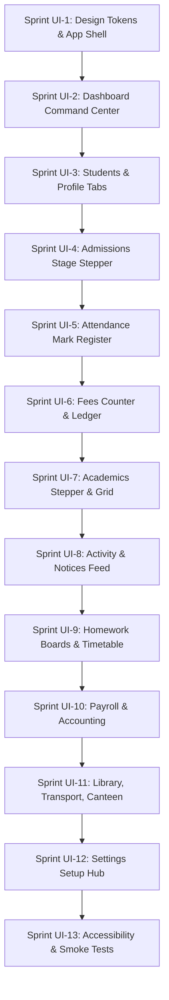

# SchoolOS Platform UI/UX Redo Implementation Plan

This document serves as the repo-based UI/UX audit and implementation plan for the **SchoolOS Platform UI/UX Redo**. It consolidates the current state, identifies core user experience issues, outlines target patterns following the **one screen = one main job** rule, and charts a sprint-by-sprint release path.

---

## 1. UI/UX Audit Map

| Route / Module | Existing Route | Current UX Issue | Target UX Pattern | API Dependency | Shared Component Needed | Risk | Sprint |
| :--- | :--- | :--- | :--- | :--- | :--- | :--- | :--- |
| **Global Shell & Shell UI** | `/dashboard/*` `/platform/*` | Navigation mixes operational, platform, and billing categories; style uses plain borders and lack of curated color depth; global search is limited to student entities only. | Deep blue/indigo theme (`#155EEF`), soft blue-grey background (`#F3F7FB`), sidebar with 8 clean categories (no phase labels), topbar global search suggestions by entity type. Platform control is strictly separated under `/platform`. | `api.listAcademicYears` `api.listSchools` `api.getUnreadNotificationsCount` | `DashboardShell`, `Sidebar`, `Topbar`, `SearchInput`, `ConfirmDialog`, `Toast` | Breaking existing routing context or auth cookie checks. | **UI-1** |
| **Dashboard Command Center** | `/dashboard` | Overloaded overview page with mixed lists of alerts, setup warnings, and long lists; report-heavy instead of a simple daily operating desk. | Summary-only command desk: Today KPI Cards (Students, Attendance, Fee, Alerts), Today's Tasks queue, simple Attendance and Fee Month-to-Date snapshots, and a Quick Actions grid. | `api.listStudents` `api.listAttendanceAnalytics` `api.listReceipts` `api.listDefaulters` `api.listNotices` `api.listActivityPosts` | `StatCard`, `SectionCard`, `Badge`, `Progress`, `EmptyState` | Loading delays on slow networks (low-bandwidth Nepal usage) due to concurrent dashboard queries. | **UI-2** |
| **Students Directory & Profile** | `/dashboard/students` `/dashboard/students/[studentId]` | Directory is a basic plain table with loose action triggers; profile detail page uses standard tabs that lack Academics integration. | Simple Directory: advanced search & quick class filters with one main action `[Admit Student]`. Profile tabs: Overview, Attendance, Fees, Documents, Activity, Academics, Guardians, History. Academics tab displays GPA history and CAS reviews. | `api.listStudents` `api.getStudentProfile` `api.getStudentFeeClearance` `api.updateStudent` `api.uploadStudentPhoto` | `StudentAvatar`, `StatusBadge`, `ActionMenu`, `ConfirmDialog`, `DataTable`, `Tabs` | Lifecycle changes (archive/delete/promote) executed without checking accounting clearance. | **UI-3** |
| **Admissions Pipeline** | `/dashboard/admissions` | Simple list table of applications; checklist and review steps are hidden or unstructured. | Stepper pipeline matching stages (Inquiry to Admitted), Right details panel showing document checklists, guardian contacts, and the single primary workflow action (e.g., `Request Documents` or `Enroll Student`). | `api.listAdmissions` `api.getAdmissionDetail` `api.updateAdmissionStatus` `api.enrollStudent` | `ProgressStepper`, `WorkflowTimeline`, `ActionMenu`, `ConfirmDialog` | Creating student profiles with duplicate admission numbers or wrong default classes. | **UI-4** |
| **Smart Attendance** | `/dashboard/attendance` | Multi-tap cycle is too slow for quick classroom marking; roster is not fully optimized for mobile grid views. | Class → Section → Date selection; one-click `[Auto Fill Present]` exception marking; Roll No, Student, Status (P, A, L, V) table; sticky bottom action bar (`Save Draft` / `Submit`); offline local draft sync with conflict handler. | `api.getAttendanceRoster` `api.submitAttendance` `api.saveAttendanceDraft` `api.syncAttendance` | `StatusBadge`, `ConfirmDialog`, `LoadingState`, `EmptyState` | Sync conflicts when the teacher submits offline draft but server already has locked attendance. | **UI-5** |
| **Fees & Receipts** | `/dashboard/fees` `/dashboard/finance` | Cashier payment counter and advanced accountant controls are mixed, raising operational confusion and security risks. | Split views: (1) Cashier payment form (quick student select, due invoices list, cash/eSewa checkout, print receipt); (2) Accountant center (general ledger, cashier day close, safe reversal requests with reasons). | `api.listInvoices` `api.getStudentLedger` `api.collectPayment` `api.reversePayment` `api.closeCashierDay` `api.getReceiptReprintHistory` | `MoneyDisplay`, `ConfirmDialog`, `DataTable`, `FilterBar` | Silent edits on payment history. Reversals must be confirmed, reasoned, permission checked, and audited. | **UI-6** |
| **Academics & Exams** | `/dashboard/academics` `/dashboard/exams` `/dashboard/marks-entry` | Separate scattered screens for grading, exams, CAS entry; lacking a locked publishing workflow. | Stepper-based exam workflow (Enter → Validate → Lock → Publish → Generate Reports). Spreadsheet-style marks entry grid with keyboard shortcuts (arrow navigation) and absent flags. | `api.listExamTerms` `api.getMarksEntryGrid` `api.saveMarksDraft` `api.lockMarks` `api.publishResults` `api.generateReportCards` | `ProgressStepper`, `DataTable`, `LockedRecordBanner`, `ConfirmDialog` | Locking marks with validation errors or missing entries. Generate report cards must run via queues (BullMQ). | **UI-7** |
| **Activity Feed & Notices** | `/dashboard/activity` `/dashboard/notices` | Notices and activity feed are styled similarly; lack of read-receipt tracking and photo-consent filters. | Activity Feed: classroom social updates, media cards, parent consent warnings (hide/mask student photos if consent is blocked). Notices Center: Official announcements with audience targeting, read receipt percentage trackers. | `api.listActivityPosts` `api.createActivityPost` `api.listNotices` `api.createNotice` `api.getNoticeNoticeDeliveryStats` `api.listNotificationDeliveries` | `NotificationBadge`, `StatusBadge`, `EmptyState`, `FileUploader` | Accidentally leaking student photos where parents explicitly blocked photo usage. | **UI-8** |
| **Homework & Timetable** | `/dashboard/homework` `/dashboard/timetable` | Complex widgets that lack a cohesive schedule layout; scheduling conflicts are not highlighted visually. | Homework: boards grouped by status (Due Today, Upcoming, Overdue, Checked). Timetable: visual Period vs Room calendar grid, showing conflict cards (e.g. room double-booking) with suggested resolutions. | `api.listHomeworkAssignments` `api.createHomework` `api.listTimetables` `api.getTimetableConflicts` `api.resolveTimetableConflict` | `Tabs`, `SectionCard`, `EmptyState`, `LockedRecordBanner` | Slow queries on scheduling grids. Calculations must be fast or cached. | **UI-9** |
| **HR, Payroll, Accounting** | `/dashboard/hr` `/dashboard/payroll` `/dashboard/accounting` | Mixed dashboards; payroll run is a single large screen; accounting lacks clearPosted/Locked/Reversed visual guards. | Staff Directory with designation list. Payroll Stepper (Prepare → Preview → Approve → Post → Pay → Payslip). Accounting: Trial balance summary, Debit/Credit match alerts, ledger rows with audit trails, period locks. | `api.listStaff` `api.getPayrollRun` `api.approvePayroll` `api.postPayrollToAccounting` `api.getGeneralLedger` `api.getTrialBalance` `api.reverseJournalEntry` | `ProgressStepper`, `LockedRecordBanner`, `ConfirmDialog`, `DataTable` | Posting payroll twice or editing transactions after accounting closure. Period blocks must be absolute. | **UI-10** |
| **Library, Transport, Canteen** | `/dashboard/library` `/dashboard/transport` `/dashboard/canteen` | Low usability for fast daily desks (checkouts are multi-step, transport lacks timeline, canteen POS has no allergy warnings). | Library: side-by-side issue/return scanner. Transport: vehicles status cards & active trip timelines. Canteen: rapid serving POS with large student photo, wallet balance alerts, allergy warning red flash. | `api.issueLibraryBook` `api.returnLibraryBook` `api.getTransportTripDetails` `api.getCanteenWalletBalance` `api.serveCanteenMeal` `api.listCanteenInventory` | `QrResolver`, `StatusBadge`, `MoneyDisplay`, `ConfirmDialog` | Serving meals to allergic students. Overrides must be explicitly approved and audited. | **UI-11** |
| **Settings & Setup** | `/dashboard/settings` | Mixed settings where developer details are exposed to normal administrators; confusing pricing plan pages. | School Setup Hub: academic year config, fee templates, role rules, class registry. Developer/Platform configuration (API keys, queue status, providers connectivity) must be strictly hidden from school settings. | `api.getSchoolSettings` `api.updateSchoolSettings` `api.listClasses` `api.createClass` `api.listAcademicYears` | `Tabs`, `SectionCard`, `EmptyState`, `Toast` | Saving incorrect configuration mid-session breaking active student invoice generation. | **UI-12** |
| **Accessibility & Smoke Tests** | (Whole App) | Icon-only buttons have no alt labels; lack of keyboard focus indicators; no fallback skeleton frames. | Keyboard navigation (`focus-visible`), aria-label bindings, loading skeletons instead of spinners, error boundary wrappers for widgets, Playwright smoke suite checking core routes. | None. | `ErrorBoundary`, `LoadingState`, `EmptyState` | Brittle browser tests causing build blocks. Tests should check basic path loading only. | **UI-13** |

---

## 2. Core Implementation Strategy

To ensure a clean and production-safe rollout, we will adhere to the following guardrails:

### 2.1 Component Standardization (Sprint UI-1)
Before redesigning routes, we will audit and align the shared components in `apps/web/components/ui/` to match the target style tokens (deep blue `#155EEF`, rounded `16-24px`, Inter typography, light grey slate borders). We will make sure that:
- Every interactive element has an active state and a focus outline.
- Icons are wrapped in buttons with explicit `aria-label` properties.
- Spinners are replaced by skeleton frames matching the target card shapes.

### 2.2 Server Components & URL State
- All page filters and pagination params will be persisted in search query parameters (`searchParams`). This supports bookmarking, browser back-button preservation, and avoids client-side filter loss.
- Server-side filtering and pagination will be leveraged for datasets (e.g. students, fee receipts, notices). We will avoid fetching full databases and sorting locally.

### 2.3 Permission Gating & Tenant Safety
- All pages will fetch data from APIs that strictly filter by the current `tenantId` (extracted from the secure cookie session).
- UI elements representing forbidden operations will be hidden, and direct URL entry to unauthorized areas will display a clean `PermissionState` card instead of a blank screen or a technical error.
- Destructive actions (deletions, financial reversals, marks publishing, cashier day closure) will require confirmation modal inputs with a mandatory "Reason" description that writes to the audit database.

---

## 3. Sprint Release Plan

### Sprint UI-1: Design Tokens + App Shell
- Standardize CSS custom properties in `globals.css`.
- Update `DashboardShell`, `Sidebar`, and `Topbar` to match deep blue colors and 24px border radiuses.
- Group sidebar items into: Home, Students, Daily Operations, Academics, School Operations, Staff & Finance, Reports, System.
- Securely hide developer control plane (`/platform/*`) links from school admins.

### Sprint UI-2: Dashboard Command Center
- Replace old metric widgets with high-contrast StatCards.
- Implement Attention tasks queue, Attendance present/absent ratios, Fee Month-to-Date target progress, and Quick Actions grid.
- Build clean skeleton frames for query loading.

### Sprint UI-3: Students + Student Profile
- Clean up Student directory table, adding filters for class/section/status.
- Update profile to display tabs: Overview, Attendance, Fees, Documents, Activity, Academics, Guardians, History.
- Design quick guardian cards with click-to-dial functionality.

### Sprint UI-4: Admissions Pipeline
- Re-architect Admissions route to show a pipeline stage stepper.
- Implement right-side detail preview and workflow actions matching current application status.

### Sprint UI-5: Attendance Marking UX
- Simplify attendance mark form to single-tap exceptions.
- Wire local draft storage recovery in case of connectivity issues.
- Build attendance submission confirmation dialog.

### Sprint UI-6: Fees & Receipts UX
- Isolate cashier payment collection screen from accounting ledger.
- Embed receipt details page with payment methods and reprint log.
- Group dangerous financial updates behind reason modals.

### Sprint UI-7: Academics UX
- Build workflow stepper for exams marks entry.
- Implement spreadsheet-style keyboard event triggers for marks entry table.
- Wrap report card PDF downloads under a queue status progress bar.

### Sprint UI-8: Activity Feed + Notices
- Separate classroom social feed from official notifications.
- Apply parent photo consent filter check when loading activity pictures.
- Add notification bell panel for administrative reminders.

### Sprint UI-9: Homework + Timetable
- Re-align homework entries in status boards (Due Today, Upcoming, Overdue, Checked).
- Design Timetable period vs room schedule grid with scheduling conflict alerts.

### Sprint UI-10: HR, Payroll, Accounting
- Structure HR leave approval queue.
- Build payroll runs preview and locking workflow.
- Embed ledger general trial balance metrics with strict locked-period banners.

### Sprint UI-11: Library, Transport, Canteen
- Library: issue checkout scanner layout.
- Transport: trip timeline stops tracker.
- Canteen: POS serving panel with wallet status notifications and big allergy warning flags.

### Sprint UI-12: Settings + Setup UX
- Restructure school settings tab by operational domains.
- Safely separate operator settings from regular customer admins.

### Sprint UI-13: Accessibility + Smoke Coverage
- Run focus-ring audit and add `aria-label` tags.
- Verify browser route-change smoke test suite.
