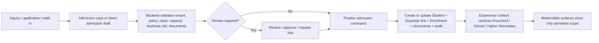
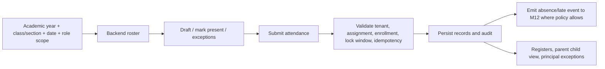
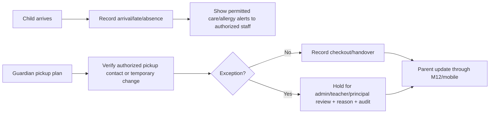
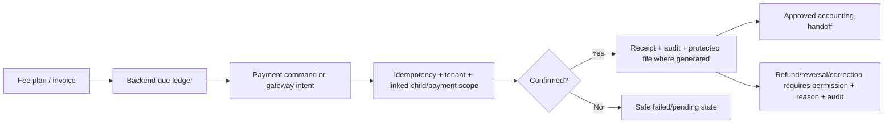
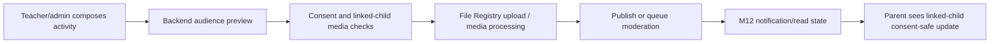
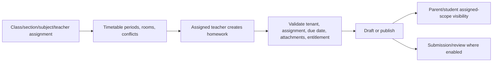
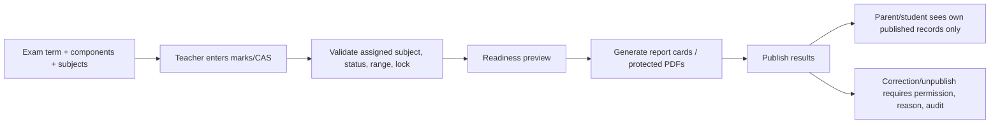
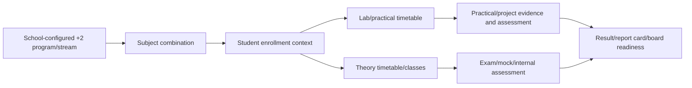
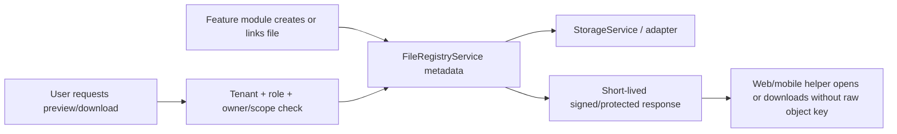

# SchoolOS Functional Requirements Specification

**Product:** SchoolOS
**Market:** Nepal-focused school operating SaaS
**Target schools:** Preschool, School (Grade 1-10), Higher Secondary / +2, and Bachelor's-level programs inside one multi-tenant product
**Document type:** Functional Requirements Specification
**Status:** Canonical FRS
**Owner/audience:** Product management, QA lead, backend/web/mobile leads, school administrator, accountant, teacher, principal, support/operations
**Scope:** Functional workflows, inputs, outputs, validations, states, transitions, permissions, edge cases, acceptance criteria, and stage-aware workflow behavior.
**Precedence:** Product intent is owned by `SCHOOLOS_PRODUCT_REQUIREMENTS.md`; software/non-functional requirements by `../requirements/SCHOOLOS_SRS.md`; module design by `../architecture/SCHOOLOS_MODULE_DESIGN_CATALOG.md`; current readiness by `../project/SCHOOLOS_PRODUCTION_READINESS_AUDIT.md`.
**Inputs/source documents:** `SCHOOLOS_BRD.md`, `SCHOOLOS_PRODUCT_REQUIREMENTS.md`, `SCHOOLOS_BACKEND_WEB_MOBILE_FEATURE_ALLOCATION.md`, `../requirements/SCHOOLOS_SRS.md`, `../architecture/SCHOOLOS_ARCHITECTURE_AND_SECURITY.md`, `../architecture/SCHOOLOS_MODULE_DESIGN_CATALOG.md`, `../architecture/SCHOOLOS_NOTIFICATION_ARCHITECTURE.md`, `../design/SCHOOLOS_WEB_FRONTEND_DESIGN_PLAN.md`, `../design/SCHOOLOS_MOBILE_APP_UI_UX_DESIGN_PLAN.md`, repository source inspected on 2026-06-20.
**Out-of-scope content:** Endpoint URL invention for proposed APIs, Prisma migrations, UI visual layouts, staging credentials, and GA readiness claims.
**Last reviewed date:** 2026-06-26

---

## 1. Purpose

This FRS breaks SchoolOS into feature-level functional behavior. It describes what each module must allow users to do, what validations must happen, what states must be supported, and what acceptance criteria must be satisfied.

The PRD remains the product master document. This FRS is meant for developers, QA, designers, and implementation agents who need detailed feature behavior.

Use [`SCHOOLOS_BACKEND_WEB_MOBILE_FEATURE_ALLOCATION.md`](SCHOOLOS_BACKEND_WEB_MOBILE_FEATURE_ALLOCATION.md) for module-by-module backend ownership, web/mobile exposure, allowed roles, and explicit surface exclusions. This FRS remains authoritative for functional rules, validation, states, edge cases, and acceptance criteria.

Important distinction:

```text
Current core = broad implemented management foundation with remaining seed, browser, mobile, staging, provider, and pilot verification gates
Stage-aware expansion = one shared core plus configurable Preschool, School, Higher Secondary, and proposed Bachelor's experience direction
Master's = Student App eligibility/future extension only; no active full management pack
M12 Notification/Communication = explicit notification center, event, template, delivery, preference, retry, notice, chat, and emergency-audit module
M13 Learning Layer = backend, web runtime, parent/student web summary, and Flutter summary foundation implemented locally; AI/adaptive/simulation depth remains staged
M14 Intelligence / AI = deferred roadmap only
Inventory & Asset Management = scrapped from active scope
```

`M8A`, `M8B`, and `M8C` are obsolete labels. Use M8 Library, M9 Transport, and M10 Canteen.

---

## 2. Functional Requirement Format

Each module follows this structure:

1. Purpose.
2. Primary actors.
3. Core functions.
4. Key states.
5. Validation rules.
6. Edge cases.
7. Acceptance criteria.

---

## 3. Global Functional Rules

These rules apply to every module:

1. Every tenant-owned action must be scoped to the authenticated tenant.
2. Parent users can only access linked child records.
3. Student users can only access their own allowed records. Broad Student App access is permitted only for active Bachelor or Master enrollments after backend eligibility, enrollment, entitlement, role, tenant, and self-scope checks exist.
4. Staff users can only perform actions allowed by role and permission.
5. Platform override must require reason and audit.
6. Sensitive files must be accessed only through protected File Registry flows.
7. Money-related actions must be idempotent.
8. Reversals must require permission, reason, and audit.
9. Background jobs must re-check tenant, feature, entity, and permission state before executing.
10. Disabled/mock provider modes must be explicit in the UI.
11. Learning activity/session data must be tenant-scoped and must not duplicate core student, teacher, class, subject, parent, file, notification, or audit systems.
12. Teacher-created learning content must be limited to assigned class/section/subject unless an explicit admin permission allows broader curriculum management.
13. Student learning session access must fail closed when session, class, section, tenant, feature, or school-only policy validation fails.
14. Preschool, Grade 1-10, and Grade 11-12 / +2 students must not receive broad Student App APIs or routes; only approved controlled learning/session flows may be exposed.
15. Parent learning summaries must be child-scoped, non-comparative, and free from public ranking.
16. Dashboard and summary surfaces must use permission-filtered backend responses; a browser must not calculate official attendance, financial, payroll, accounting, readiness, delivery, library, transport, or canteen totals.
17. A missing, locked, unauthorized, queued, failed, partial-failure, or unavailable summary must remain distinct from a genuine zero state.
18. Screen actions must resolve into a real permitted workflow. A dashboard card, right rail, quick action, or contextual button must not simulate a backend state in browser-only production state.
19. Any user-visible aggregate that spans modules must be explicitly approved as a server-owned summary or consist only of separately authorized, non-official safe summaries.
20. Notification delivery must be backend-owned. Source modules emit events; M12 owns recipient resolution, templates, routing, provider state, retries, delivery logs, read state, and audit.
21. Web is the detailed school operating surface; mobile is persona-first and purpose-limited. Surface allocation must follow `SCHOOLOS_BACKEND_WEB_MOBILE_FEATURE_ALLOCATION.md` and must not weaken backend authorization or ownership checks.
22. Inventory & Asset Management is not active scope; do not add requirements for it unless re-approved.

---

## 4. Active Module Functional Map

| Module | Functional scope |
|---|---|
| M0 Platform Core | Tenants, plans, feature flags, provider readiness, queues, File Registry, support override, audit, platform settings. |
| M1 Admissions and Student Profiles | Admission pipeline, student lifecycle, guardian links, documents, duplicate review, QR/ID, iEMIS readiness. |
| M2 Smart Attendance | Roster attendance, lock windows, corrections, parent visibility, anomalies, registers, absence/late alerts. |
| M3 Fees and Receipts | Fee setup, invoices, payments, receipts, reversals, refunds, waivers, cashier close, reconciliation handoff. |
| M4 Academics, Exams, CAS, Report Cards | Subjects, marks, CAS, exam terms, grade sheets, report cards, promotion, academic reports. |
| M5 Activity Feed and Milestones | Class updates, milestones, consent-aware media, parent feed, moderation, activity timeline. |
| M6 Homework and Timetable | Homework, timetable, substitutions, conflicts, attachments, student/parent visibility. |
| M7 HR and Payroll | Staff records, documents, attendance, leave, salary structures, payroll, payslips, staff self-service. |
| M8 Library | Catalogue, copies, issue/return, reservations, fines, lost/damaged, reports, parent child-scoped view. |
| M9 Transport | Routes, stops, vehicles, driver/conductor assignments, trips, boarding/deboarding, parent status, GPS-readiness. |
| M10 Canteen | Menu, POS, student meal QR, allergy/medical warnings, wallet controls, receipts, low balance, vendor/stock workflows. |
| M11 Accounting and Finance | Chart of accounts, vouchers, journals, fiscal periods, locks, reconciliation, snapshots, reports. |
| M12 Notifications, Notices, Communication, Chat | Notification center, event intake, recipient resolution, templates, providers, delivery logs, notices, read receipts, chat, moderation. |
| M13 Learning Layer | Teacher activities, smart-board sessions, school lab mode, practice/quiz engine, progress, parent summaries. |
| M14 Intelligence / AI | Deferred analytics/AI roadmap only. |

---

## 4A. Stage-Aware Workflow And API Evidence

The workflows below define functional direction. A diagram does not prove implementation. Each workflow must be checked against backend code, OpenAPI/shared contracts, web/mobile clients, tests, and current verification evidence before it is claimed as implemented or ready.

### 4A.1 Stage-Aware Capability Contract Status

| Capability | Existing verified endpoint | Existing but unverified endpoint | Missing endpoint | Needs OpenAPI confirmation | Needs DTO | Needs authorization rule | Needs idempotency rule |
|---|---|---|---|---|---|---|---|
| Shared student/guardian/enrollment | No fresh verification in this pass | Yes, broad M1/student/admission controllers exist | No | Yes for stage additions | Yes for stage additions | Existing rules plus stage scope | Yes for finalization/direct admission |
| Preschool authorized pickup | No | No | Yes | Yes | Yes | Yes | Yes for temporary changes |
| Preschool arrival/checkout | No | Attendance exists, preschool checkout not verified | Yes for checkout/pickup exception | Yes | Yes | Yes | Yes for replay-safe mobile events |
| Activity diary/milestones/media | No fresh verification | Yes, M5 activity/media/milestone controllers exist | Preschool policy gaps remain | Yes for preschool diary | Yes for diary/observation | Yes for care/media scope | Yes for media retry/cleanup |
| School attendance/homework/exams/fees | No fresh verification | Yes, broad M2/M3/M4/M6 controllers exist | No for core workflows | Yes before new UI paths | As needed | Existing role/scope rules | Required for money/sync |
| Higher Secondary streams/combinations | No | No | Yes | Yes | Yes | Yes | Depends on write commands |
| Higher Secondary practical/project flow | No | Partial assessment/practical fields exist | Yes for full lifecycle | Yes | Yes | Yes | Yes for submissions/publishing |
| ExperienceContext | No | No | Yes | Yes | Yes | Yes | N/A |
| Bachelor's program/course/term model | No | No | Yes | Yes | Yes | Yes | Depends on write commands |
| Bachelor/Master broad Student App eligibility guard | No | No | Yes | Yes | Yes | Yes | N/A |

### 4A.1A Student App Functional Policy

Broad Student App access must be backend-authorized and allowed only when all of these are true: the authenticated user has the student role, the tenant is active, the relevant module entitlement allows Student App, an active enrollment exists, the verified education level is Bachelor or Master, the requested record belongs to the same student, and role/permission checks pass.

For Preschool, Grade 1-10, and Grade 11-12 / +2, broad Student App routes and APIs must fail closed. Controlled learning/session routes remain separate and may be exposed only when session, tenant, assignment, enrollment, module entitlement, and self-scope checks pass.

### 4A.2 Admissions To Enrollment



### 4A.3 Attendance



### 4A.4 Preschool Arrival And Pickup/Drop

Current status: **NEEDS_SCHEMA_DESIGN**.



### 4A.5 Fees, Payment, Receipt, Reversal



### 4A.6 Activity Feed And Consent-Safe Media



### 4A.7 Homework And Timetable



### 4A.8 Exam, Marks, Report-Card Publishing



### 4A.9 Higher Secondary Stream/Combination/Practical/Project Flow

Current status: **NEEDS_SCHEMA_DESIGN** beyond partial subject practical fields.



### 4A.10 Notice And Notification Delivery

```mermaid
flowchart LR
  Source["Feature module or notice composer"] --> Event["Normalized event / notice"]
  Event --> Recipients["M12 recipient resolver"]
  Recipients --> Template["Template + language + priority + quiet hours"]
  Template --> Queue["Delivery queue"]
  Queue --> Providers["In-app / push / email / SMS provider mode"]
  Providers --> Callback["Verified callbacks / retry / failure"]
  Callback --> Center["Notification center + read receipts + audit"]
```



### 4A.11 Protected File Preview/Download



## 5. M0 Platform Core / SaaS Foundation

### 5.1 Purpose

Manage tenants, platform administration, feature controls, provider readiness, queues, File Registry, API keys, SaaS billing records, support override, onboarding, audit workflows, Preschool / School / Higher Secondary settings, and module entitlement.

### 5.2 Core functions

1. View tenant list and tenant detail.
2. Suspend, activate, or archive tenant with reason and audit.
3. Manage plans, module entitlements, feature flags, and overrides.
4. Manage provider settings with secret masking.
5. Run provider readiness checks for SMS, email, push, storage, and payment providers.
6. View queue health and failed jobs.
7. Retry or discard failed jobs with audit.
8. View File Registry entries and report export history.
9. Use support tenant override with reason and expiry where supported.
10. Configure school experience coverage: `PRESCHOOL`, `SCHOOL`, `HIGHER_SECONDARY`, and future `BACHELOR` after the backend-owned program/stage model is designed.
11. Enable/disable M12 Notification/Communication and M13 Learning Layer per tenant/plan.

### 5.3 Acceptance criteria

1. Every platform override action is audited.
2. Suspended tenants are blocked across dashboard, API, mobile, jobs, downloads, reports, notifications, and learning sessions.
3. Disabled provider mode never pretends to send real notifications, payments, or storage actions.
4. API keys are stored hashed and only shown once during creation.
5. File and queue failure screens show safe, non-secret diagnostics.

---

## 6. M1 Admissions and Student Profiles

### Purpose

Manage student lifecycle from inquiry/application to active, transferred, withdrawn, graduated, archived, or alumni state where enabled, including guardians, protected documents, duplicate review, QR/ID credential lifecycle, and IEMIS reporting readiness.

### Core functions

1. Create or continue one tenant-scoped Admission Case from office/walk-in, parent online, phone inquiry, transfer request, or import sources.
2. Configure a school default admission policy plus selected academic-year, grade-band, class, source, or transfer rules without creating a separate fast-admission system.
3. Keep normal Nepal office admission direct when policy permits; route only policy-, approval-, document-, interview-, capacity-, or duplicate-blocked cases through review.
4. Create, reopen, and server-save admission-case drafts while progressively capturing student, guardian, academic placement, medical/emergency, and protected document information.
5. Evaluate backend-owned admission eligibility, including missing requirements, tenant-scoped placement, duplicate candidates, policy requirements, optional capacity state, and the safe next action.
6. Review duplicate candidates using Nepali/English names, guardian phone reuse, DOB, previous school, and sibling clues; never auto-merge.
7. Admit directly or finalize an approved case through a serializable, retry-safe command that creates the student, guardian link, enrollment, lifecycle history, protected document links, follow-up state, and audit atomically.
8. Keep optional documents, IEMIS information, guardian portal verification, and QR/ID readiness as post-admission follow-up where policy permits; M1 must not create M3 payment or receipt records.
9. Manage lifecycle: active, transferred, withdrawn, graduated, archived, alumni.
10. Generate protected documents such as ID card and transfer certificate where supported.
11. Manage guardian links and removal with immediate file-access revocation.
12. Generate/rotate/revoke QR credentials with audit.
13. Review IEMIS/export readiness issues.

### Acceptance criteria

1. Parent access remains linked-child scoped.
2. Teacher access remains assignment scoped.
3. Student documents and photos use File Registry protected access.
4. Duplicate warnings appear before conversion.
5. Lifecycle mutations require permission and audit.
6. A repeat finalization/direct-admission submission cannot create a second student.
7. Principal approval policy is enforced by backend role checks, not frontend labels.
8. Ordinary users see simple business statuses rather than internal workflow statuses.

---

## 7. M2 Smart Attendance

### Purpose

Manage daily class attendance, correction workflows, lock windows, anomaly detection, registers, parent alerts, and mobile teacher workflows.

### Core functions

1. View assigned class roster.
2. Mark present, absent, late, half-day, excused, and not-marked states.
3. Save drafts where supported.
4. Submit attendance with idempotency.
5. Request or approve correction after lock window.
6. Generate monthly registers and exports.
7. Trigger absence/late notifications through M12.
8. Show parent child-scoped attendance.

### Acceptance criteria

1. Teachers cannot mark unassigned classes unless permission allows it.
2. Lock windows are backend-enforced.
3. Parent absence/late notifications are duplicate-safe.
4. Registers are generated through protected export flow.

---

## 8. M3 Fees and Receipts

### Purpose

Manage fee plans, invoices, payments, receipts, waivers, discounts, refunds, reversals, cashier close, and finance/accounting handoff.

### Core functions

1. Configure fee heads and plans.
2. Generate invoices and dues.
3. Record cash, bank, cheque, eSewa/Khalti-ready, and manual payments where configured.
4. Generate receipts only after confirmed backend success.
5. Manage discounts, waivers, reversals, and refunds with reason and audit.
6. Run cashier close and collection reports.
7. Emit payment/dues notifications through M12.
8. Hand off official finance events to M11 Accounting through approved boundaries.

### Acceptance criteria

1. Backend Decimal/numeric values are the source of truth.
2. Payment submit is idempotent.
3. Receipt files use protected access.
4. Posted or confirmed records are corrected by reversal/correction, not silent mutation.

---

## 9. M4 Academics, Exams, CAS, Report Cards

### Purpose

Manage academic structures, marks, CAS/continuous assessment, exam terms, report cards, promotion, subject combinations, streams, projects, and practicals where staged.

### Core functions

1. Manage subjects, grading components, exam terms, and assessment policies.
2. Allow assigned teachers to enter marks.
3. Validate marks and CAS components.
4. Generate grade sheets and report cards.
5. Publish results to parents/students where allowed.
6. Handle promotion, transfer, withdrawal, graduation, and archived academic states.
7. Emit result/exam notifications through M12.

### Acceptance criteria

1. Subject teacher cannot edit unassigned subject marks.
2. Locked report cards cannot be regenerated unsafely.
3. Report-card PDFs use File Registry.
4. Parent sees published, child-scoped records only.

---

## 10. M5 Activity Feed and Milestones

### Purpose

Manage classroom/school updates, media, milestones, parent feed, consent handling, moderation, and activity timeline.

### Core functions

1. Create class or student-specific activity posts.
2. Attach protected media/files.
3. Tag students with consent checks.
4. Publish to parent-visible feeds.
5. Moderate/report/archive posts where allowed.
6. Show latest activity timelines.
7. Emit activity notifications through M12.

### Acceptance criteria

1. Parent sees only linked-child and consent-safe media.
2. Removed guardians lose access immediately.
3. Media uses protected file helpers.
4. Moderation actions are audited.

---

## 11. M6 Homework and Timetable

### Purpose

Manage homework assignment, attachments, due dates, timetable setup, substitutions, conflict checks, and student/parent visibility.

### Core functions

1. Create, draft, publish, lock, and archive homework.
2. Attach protected resources.
3. Configure timetable periods, teachers, rooms, and subjects.
4. Detect teacher, class, room, and period conflicts.
5. Display parent/student homework and timetable views.
6. Emit homework/timetable notifications through M12.

### Acceptance criteria

1. Teacher scope is assignment-limited.
2. Conflicts show before publish.
3. Attachments use File Registry.
4. Parent/student see assigned published work only.

---

## 12. M7 HR and Payroll

### Purpose

Manage staff lifecycle, contracts, documents, attendance, leave, salary structures, payroll, payslips, statutory readiness, staff self-service, and payroll accounting controls.

### Core functions

1. Manage staff profiles and documents.
2. Track staff lifecycle and contract expiry.
3. Manage leave requests, approvals, balances, and unpaid leave effects.
4. Manage salary structures with versioning and effective dates.
5. Draft, review, approve, post, reverse, and correct payroll.
6. Generate payslips and protected reports.
7. Emit HR/payroll notifications through M12.

### Acceptance criteria

1. Salary, bank, PAN, and payslip fields are permission-gated and masked by default.
2. Staff self-service is own-record scoped.
3. Payroll totals are backend-owned.
4. Posted payroll uses reversal/correction only.

---

## 13. M8 Library

### Purpose

Manage book catalogue, physical copies, issue/return, borrower rules, reservations, overdues, fines, lost/damaged lifecycle, reports, labels, scanner workflows, and parent child-scoped visibility.

### Core functions

1. Manage title-level catalogue.
2. Manage copy-level lifecycle and barcode/QR labels.
3. Issue, return, and renew books using scanner-first workflow.
4. Validate borrower eligibility and policy limits.
5. Manage reservations and holds.
6. Calculate/display overdues and fines from backend rules.
7. Manage lost/damaged/replacement cases.
8. Generate reports and exports.
9. Show parent child-scoped borrowed books, due dates, and fines.
10. Emit library notifications through M12.

### Acceptance criteria

1. Catalogue totals and fine calculations come from backend APIs.
2. Parent view never exposes other borrowers.
3. Override/waive/lost/damaged actions require permission, reason, and audit where required.
4. Scanner/mobile sync states are explicit.

---

## 14. M9 Transport

### Purpose

Manage school transport routes, stops, vehicles, driver/conductor assignments, trip state, boarding/deboarding, parent status, stale GPS warnings, emergency contacts, and maintenance reminders where supported.

### Core functions

1. Manage vehicles, routes, stops, and assignments.
2. Assign drivers/conductors.
3. Start/end trips.
4. Record boarding and deboarding.
5. Show parent child-route scoped status with timestamp and stale labels.
6. Accept/reject GPS pings where device-auth contracts support it.
7. Manage one-day route changes.
8. Emit transport status and emergency notifications through M12.

### Acceptance criteria

1. Parent transport reads are child-route scoped.
2. Driver data is assigned-trip scoped.
3. Live map/WebSocket/SSE UI is deferred unless backend/provider/load/privacy decisions are confirmed.
4. Stale GPS/status is visibly labelled.

---

## 15. M10 Canteen

### Purpose

Manage canteen POS, menu, student meal QR, wallet/spending controls, allergy/medical warnings, low-balance events, receipt reprint idempotency, and vendor/stock workflows where supported.

### Core functions

1. Configure menu and meal items.
2. Serve meal/POS order with student lookup or QR.
3. Show allergy/medical warnings before submit.
4. Debit wallet atomically from backend.
5. Apply spending controls and negative-balance policy.
6. Reprint receipts idempotently.
7. Emit low-balance and canteen notifications through M12.
8. Generate canteen reports.

### Acceptance criteria

1. Wallet debit is atomic and backend-owned.
2. Duplicate serve/reprint is idempotent.
3. Parent spending APIs are child-scoped.
4. Allergy warnings are visible before serving.

---

## 16. M11 Accounting and Finance

### Purpose

Manage school accounting: chart of accounts, vouchers, journals, posting, fiscal periods, locks, reversals, source mapping, bank reconciliation, snapshots, exports, and principal read-only snapshots.

### Core functions

1. Configure Nepal-ready chart templates.
2. Create and approve vouchers.
3. Post journals through accounting boundaries.
4. Enforce fiscal period locks.
5. Reconcile bank statements.
6. Generate reports and snapshots.
7. Provide source drilldown across fees, payroll, canteen, library, and other approved modules.
8. Emit approval/status notifications through M12.

### Acceptance criteria

1. No direct ledger writes from other modules.
2. Posted records use reversal/correction.
3. Fiscal locks block unsafe backdated changes.
4. Large reports use export jobs and protected files.

---

## 17. M12 Notifications, Notices, Communication, Chat

### Purpose

Own the communication and notification lifecycle for SchoolOS: notification event intake, recipient resolution, templates, preferences, quiet hours, channel routing, provider delivery, callbacks, retries, read state, notices, chat, moderation, emergency alerts, and audit.

### Core functions

1. Accept normalized notification events from feature modules.
2. Resolve recipients deterministically on the backend.
3. Render templates per event type, channel, language, tenant override, and priority.
4. Route delivery through in-app, push, SMS, and email providers where configured.
5. Track delivery attempts, callbacks, retries, provider state, and safe errors.
6. Provide notification center, unread count, read-all, archive, and deep links.
7. Manage notification preferences and quiet hours.
8. Create notices with recipient targeting and preview.
9. Schedule notices and track read receipts.
10. Support parent-teacher chat within assignment/permission scope.
11. Support chat report, block, escalation, and moderation.
12. Audit emergency broadcasts and high-impact retries.

### Acceptance criteria

1. Source modules do not call providers directly.
2. Provider-disabled or failed delivery never appears as successfully sent.
3. Provider callbacks are verified before state changes.
4. Parent notifications and chats are child/assignment scoped.
5. Deep links reauthorize at open time.
6. Provider secrets, callback payload secrets, private message bodies, and raw object keys are never leaked.

---

## 18. M13 Learning Layer

### Purpose

Support teacher-led classroom learning inside SchoolOS through activity builder, smart-board mode, school-only learning sessions, computer-lab individual mode, practice/quiz engine, progress tracking, resource library, and parent summaries.

### Core functions

1. Create learning activities.
2. Attach protected learning resources.
3. Launch smart-board or lab sessions.
4. Manage session participants and heartbeat.
5. Autosave and submit student attempts.
6. Track progress and mastery foundation.
7. Show parent child-scoped summaries.
8. Show student self-scoped summaries.
9. Emit session/progress notifications through M12 where enabled.

### Acceptance criteria

1. Teacher activity creation is assigned-scope unless wider permission exists.
2. Student access is active-session/self-scoped.
3. Parent summaries are child-scoped and non-comparative.
4. No public leaderboard or AI tutor/runtime is active unless later approved.

---

## 19. M14 Intelligence / AI

### Purpose

Deferred roadmap for teacher-reviewed analytics and safe AI. It is not active implementation scope.

### Functional boundaries

1. No AI/ML runtime or LLM calls until explicitly approved.
2. No automated punishment, ranking, or high-stakes student risk action.
3. Human review is mandatory for recommendations.
4. Tenant isolation, audit logging, explainability, and privacy controls are mandatory before implementation.

---

## 20. Principal Dashboard and Operating Desk Requirements

SchoolOS web must provide a role-aware operating desk rather than a generic shortcut dashboard.

Principal/authorized-admin dashboard functions may include:

1. View permission-filtered school health summary.
2. View attention items and pending approvals.
3. Drill into daily operations: attendance, fees, transport, canteen, admissions, communication, notifications, and learning where enabled.
4. View safe academic readiness, homework, report-card, and controlled-learning summaries.
5. View safe collection/overdue/cashier summaries where finance permissions allow.
6. View notification delivery/read-state risks where M12 permissions allow.
7. View permission-filtered recent activity and upcoming/scheduled work.
8. Use role-safe quick actions that open existing workflows.
9. View module state only for enabled/entitled modules.

Dashboard validation rules:

1. The dashboard must not expose private message bodies, raw protected-file details, salary/bank data, accounting journals, or unavailable module data solely because a principal summary exists.
2. The school-day/open status must come from configured/calendar-backed backend context where it is shown; it must not depend only on browser time.
3. Charts render only when the backend returns valid, meaningful time-series data. A text summary replaces an absent series.
4. A dashboard alert, KPI, queue item, or quick action must check current role, permission, tenant, module entitlement, and record scope again when opened.
5. Financial cards and payment-method breakdowns use backend Decimal/numeric values. The UI must not calculate authoritative totals.
6. Dashboard failure of one section must not blank independent successful sections.
