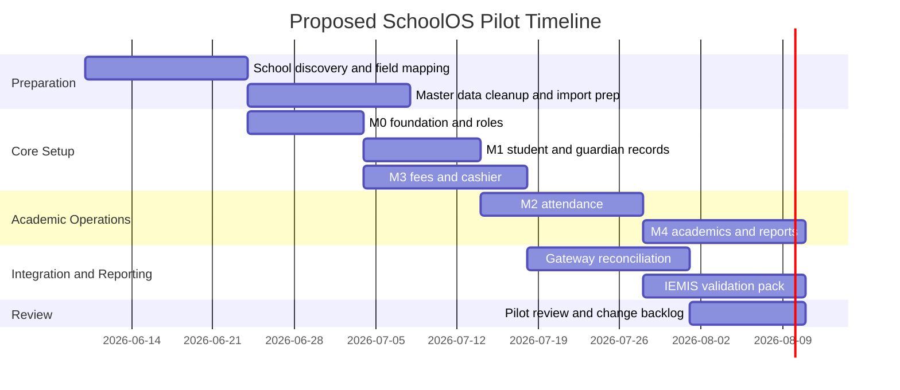

# SchoolOS Product Requirements Document - Researched Draft 2026

**Product:** SchoolOS  
**Market:** Nepal-focused school management SaaS  
**Target schools:** Montessori to Class 10, with future K-12/+2 extensibility  
**Document type:** Researched PRD draft for comparison with `docs/product/SCHOOLOS_PRD.md`  
**Status:** Research-backed comparison draft; do not treat as replacement until reviewed  
**Last updated:** 2026-06-03

---

## 0. Maintainer Note

This file is a separate researched PRD draft created for comparison against the existing PRD:

```text
docs/product/SCHOOLOS_PRD.md
```

Do not delete or replace the existing PRD until the owner reviews both versions.

This researched draft strengthens the product document with Nepal-specific operating context, IEMIS readiness, compliance assumptions, payment-provider realities, pilot workflows, measurable non-functional requirements, and competitive positioning.

---

## 1. Executive Summary

SchoolOS should be positioned as a **Nepal-first school operating system**, not merely a generic student information system.

The core product thesis:

```text
One login, one school ledger, one student record, one audit trail.
```

SchoolOS must help Nepali schools manage daily operations, student records, attendance, fees, accounting, exams, report cards, parent communication, HR/payroll, library, transport, canteen, file privacy, and official-readiness from one tenant-isolated platform.

The strongest product direction is to build around four anchors:

1. **School master data** strong enough to support government reporting, audits, class setup, student lifecycle, staff assignments, and school configuration.
2. **Academic operations** covering attendance, timetable, homework, gradebook, exams, report cards, promotion, and parent/student visibility.
3. **Cashier and finance operations** reliable enough for real-world fee collection, receipt generation, refunds, reversals, daily close, and accounting controls.
4. **Privacy, auditability, and tenant isolation** as first-class requirements because SchoolOS stores student, guardian, staff, financial, and communication data.

The product should first aim for a controlled pilot that proves:

```text
1 school
1 clean source of truth
1 reconciled fee flow
1 teacher-friendly daily workflow
1 parent-visible student record
1 reporting/export validation layer
```

Do not expand into AI, microservices, Angular migration, or broad live-map/mobile depth until the pilot workflows are stable.

---

## 2. Product Overview

SchoolOS is a production-grade, multi-tenant SaaS school management and financial operating system for Nepali schools. It supports Montessori to Class 10 institutions first, with future extensibility for +2 and larger institutional networks.

The product covers:

```text
Platform/SaaS control
Tenant/school setup
Admissions
Student records
Guardians
Attendance
Fees and receipts
Accounting
Notices and communication
Activity feed
Academics, exams, CAS, report cards
Homework and timetable
HR and payroll
Library
Transport
Canteen
Reports and exports
Future school intelligence
```

SchoolOS should not feel like a generic CRUD dashboard. It must match real school-office workflows in Nepal: front-desk fee collection, principal oversight, teacher attendance/marks entry, guardian communication, transport tracking, library/canteen counters, and periodic reporting pressure.

---

## 3. Product Vision

To become the default operating system for Nepali schools by offering a reliable, locally relevant, financially accurate, and easy-to-use SaaS platform that supports the full school lifecycle from admission to accounting and parent engagement.

SchoolOS should win through:

- Nepal-first workflows.
- Strong accounting and fee correctness.
- Tenant-safe SaaS architecture.
- Parent/teacher/mobile readiness.
- Protected file registry and private media access.
- QR identity for student operations.
- Canteen, library, transport, and HR depth in one system.
- Gradual code-file modularization instead of premature microservices.

---

## 4. Nepal Market and School Operating Context

### 4.1 Nepal-First Requirements

SchoolOS must assume the following Nepal realities:

| Area | Product implication |
|---|---|
| Academic year and fiscal year may differ | Support academic-year context and fiscal-year/accounting period context separately. |
| Schools use class/section/roll conventions | Class, section, roll number, academic year, and lifecycle status must be first-class fields. |
| Parents expect simple communication | Parent app/portal should show child-specific dues, attendance, notices, homework, results, and receipts without admin complexity. |
| School offices often use mixed manual/digital workflows | Import/export, CSV/Excel, printable receipts, and manual reconciliation must be supported. |
| Nepali and English usage both matter | UI labels, reports, receipts, notices, and templates should be localization-ready. |
| Official reporting pressure exists | IEMIS/export readiness must be treated as a validation workflow, not a single static file export. |
| Connectivity can be inconsistent | Important workflows need drafts, retry-safe submissions, and clear sync/conflict behavior. |

### 4.2 Education System and Reporting Context

SchoolOS should support the operational structure used by Nepali schools:

- Montessori/ECD and primary levels.
- Basic and secondary class progression.
- Class and section setup.
- Teacher/class teacher/subject teacher assignments.
- Exam terms, assessment components, CAS/continuous assessment, grade sheets, and report cards.
- Promotion, transfer, withdrawal, graduation, and archived student states.
- Scholarships, student category flags, and official/export-related fields where needed.

The product should maintain a clean distinction between:

```text
Academic structure: class, section, subject, timetable, exam term
Student lifecycle: applicant, active, transferred, withdrawn, graduated, archived
Financial lifecycle: fee plan, invoice, payment, receipt, reversal, refund, cashier close, journal posting
Reporting lifecycle: draft data, validation errors, official-ready state, exported artifact, audit trail
```

---

## 5. Target Users and Daily Workflows

| User | Daily need |
|---|---|
| SchoolOS Platform Operator | Manage tenants, subscriptions, provider readiness, queues, API keys, audit, and support override. |
| School Owner / Principal | See school health, collections, attendance gaps, academic status, pending approvals, and operational risks. |
| School Admin | Manage admissions, students, guardians, documents, classes, settings, and day-to-day records. |
| Accountant / Finance Staff | Manage fee setup, invoices, payments, receipts, refunds, reversals, ledgers, reports, and reconciliation. |
| Cashier | Search student, collect fees, issue receipt, handle partial payments, reconcile daily collections, and close day. |
| Teacher | Mark attendance, assign homework, enter marks/CAS, view timetable, communicate with parents, and review class progress. |
| Parent / Guardian | View linked child dues, receipts, attendance, notices, homework, report cards, transport/canteen status, and messages. |
| Student | View own timetable, homework, notices, attendance, report cards, library/canteen information where allowed. |
| Librarian | Manage books, copies, borrower lookup, issue/return, fines, QR/barcode scans, and reports. |
| Transport Staff / Driver | Manage routes, vehicles, trips, student boarding/drop status, and live/stale location signals. |
| Canteen Operator | Manage menu, meal plans, POS sales, student wallets, QR serving, allergies, spending controls, inventory, and receipts. |
| HR / Payroll Staff | Manage staff profiles, leave, attendance, salary structures, payroll runs, payslips, and payroll posting. |

### 5.1 Workflow Stories

**Cashier:** As a cashier, I need to collect a partial or full payment, print or share a receipt, and close my cashier day without needing to understand the full accounting module.

**Teacher:** As a teacher, I need one simple daily surface for timetable, attendance, homework, and marks/CAS entry for only my assigned classes.

**Parent:** As a parent, I need to see only my child’s dues, attendance, homework, notices, receipts, and report cards.

**Principal:** As a principal, I need one dashboard showing today’s collection, attendance anomalies, overdue fees, pending approvals, and reporting-readiness issues.

**Driver:** As a driver, I need assigned trips, stops, student list, boarding/drop status, and a simple way to report delay or exception.

**Canteen Operator:** As a canteen operator, I need QR/student search, wallet balance, allergy warnings, spending controls, POS receipts, and fast serving flow.

---

## 6. Product Planes

SchoolOS has three logical product planes inside the same modular monolith.

| Plane | Audience | Purpose | Frontend route | Backend route |
|---|---|---|---|---|
| Platform Control Plane | SchoolOS owner/operator | SaaS tenants, billing, provider readiness, queues, API keys, support override, audit | `/platform/*` | `/platform/*` |
| Tenant Configuration Plane | Principal/admin | Academic years, classes, school profile, logo, fee settings, roles, module settings | `/dashboard/settings/*` | `/settings/*`, `/tenant-settings/*` |
| School Operations Plane | Staff, parents, students | Students, attendance, fees, academics, HR, library, transport, canteen, notices | `/dashboard/*` and mobile app | module APIs |

Rules:

1. Do not mix SchoolOS SaaS billing with school fee collection.
2. Platform tenant override must be explicit, reason-required, time-bound, and audited.
3. Tenant configuration affects only the selected school.
4. School operations APIs must always be tenant-scoped.
5. Parent/student/driver/mobile APIs must be purpose-limited and must not expose admin-shaped responses.

---

## 7. Product Principles

| Principle | Requirement |
|---|---|
| Nepal-first | Support NPR, Nepali/English readiness, class/section conventions, local reporting needs, receipts, and future BS calendar support. |
| Single source of truth | Student, guardian, staff, class, fee, payment, and report state live in canonical backend models. |
| Role clarity | Cashier, teacher, parent, principal, driver, and operator screens should be purpose-built. |
| Auditability | Sensitive actions must be logged with actor, tenant, timestamp, reason, and before/after context where practical. |
| Financial correctness | Fees, receipts, refunds, reversals, cashier close, and accounting must reconcile. |
| Privacy by default | Student documents, photos, receipts, report cards, payslips, messages, and exports use protected access. |
| Code-file modularity | Large services/components must split by responsibility; this is not microservices. |
| Pilot-first delivery | Each phase must produce usable workflows before expanding scope. |

---

## 8. Nepal Compliance, Privacy, and Governance Assumptions

This PRD is not legal advice. It defines product requirements based on Nepal-focused school data sensitivity and official operating expectations.

SchoolOS must treat the following as sensitive data:

```text
student identity
guardian identity and phone/email
attendance
marks, CAS, report cards
medical/allergy notes
student documents and photos
parent-teacher messages
fee invoices, receipts, refunds, reversals
staff salary, bank, identity, leave, payroll
transport location and child trip status
canteen wallet/spending data
```

### Required governance controls

| Control area | Requirement |
|---|---|
| Tenant isolation | Every tenant-owned query, file, report, export, and job must be scoped by authenticated `tenantId`. |
| Role-based access | Users see only the minimum data needed for their role. |
| Parent/guardian access | Parents can only access linked children. Guardian removal must revoke access immediately. |
| Student access | Students can only access their own allowed data. |
| Staff privacy | Salary, bank, identity, and sensitive HR fields must be masked unless permission allows. |
| Audit | Sensitive actions require audit logs. |
| Export governance | Bulk exports require permission and audit. |
| File privacy | Raw object keys and permanent public URLs must not be exposed. |
| Platform support override | Must require reason, audit, explicit tenant, and expiry. |
| Data retention | Retention rules should be configurable by record class and finalized during pilot/legal review. |

### Audit logs required for

- Tenant override.
- Suspend/activate tenant.
- Payment reversal/refund.
- Accounting posting/reversal/fiscal reopen.
- Marks unlock/correction/report regeneration.
- Payroll approval/post/reversal.
- Student guardian changes.
- QR generate/rotate/revoke.
- Sensitive file preview/download.
- Notice moderation/removal.
- Queue retry for sensitive jobs.
- Support override entry/exit.

---

## 9. IEMIS and Official Reporting Readiness

SchoolOS should treat IEMIS readiness as a **validation and export readiness workflow**, not a single export button.

### 9.1 Reporting field families

| Field family | Minimum SchoolOS coverage | Requirement |
|---|---|---|
| School master profile | school code, levels served, ownership type, location, contacts, academic setup | Required before official-ready state. |
| Student profile | identity, guardian, class/section, roll, status, transfer/promote/leave state | Required for enrollment and class reporting. |
| Scholarship / financial aid | eligibility flags, payment/bank verification state where required | Must be explicit, not free-text only. |
| Teacher/staff roster | identity, role/post, subject/class assignment, status | Must align with timetable and attendance ownership. |
| Physical/infrastructure profile | rooms, facilities, buildings, transport/assets where needed | Must support school profile readiness. |
| Stream/program flags | technical/open-school/special categories where needed | Must be explicit. |
| School lifecycle | active, merged, closed, transferred | Prevent stale reporting. |
| Budget/program base data | counts and foundational school data | Used for reporting packs where required. |

### 9.2 Validation rules

| Validation rule | Expected behavior |
|---|---|
| One active student, one active class assignment | Student cannot be simultaneously active in multiple mutually exclusive class states. |
| Class/section must exist before records | Attendance, fees, marks, and timetable cannot reference missing setup. |
| Teacher assignment must reference active staff | Prevent orphan timetable/marks ownership. |
| Guardian link must be current | Parent access fails closed when guardian link is removed. |
| Scholarship/payment readiness requires required fields | Do not mark official-ready if required identity/payment fields are missing. |
| School profile must be complete | Disable official-ready export if core school profile fields are incomplete. |
| Special flags must be explicit | Technical, disability, scholarship, transfer, dropout, and status states must not be hidden in notes. |

### 9.3 Export policy

- Exports should show `Draft`, `Validation Failed`, `Ready`, `Exported`, and `Archived` states.
- Export failures must not create false success states.
- Exported artifacts must be tenant-scoped and stored through File Registry when retained.
- Unsupported or unmapped official fields must be documented instead of silently guessed.
- Claims of final iEMIS compliance require validation against real official templates during pilot/staging.

---

## 10. Competitive and Market Analysis

SchoolOS competes not only with software products, but also with the current manual operating stack:

```text
paper registers
Excel sheets
manual fee ledgers
WhatsApp/Viber groups
standalone accounting software
attendance notebooks
PDF/printed report-card templates
unstructured Google Drive folders
```

### 10.1 Software comparison

| Product / approach | Strength | Gap SchoolOS can target |
|---|---|---|
| Generic school ERP/SIS | Broad student, attendance, report, and parent portal features | Often not Nepal-first or IEMIS-aware. |
| Frappe Education / ERP-style systems | Strong open-source ERP foundation | Requires localization, setup, and school-specific workflow depth. |
| openSIS / QuickSchools / Classter-like platforms | Mature SIS patterns and parent portals | Not optimized for Nepal fee/reporting/accounting realities. |
| Nepal-local school systems | Local familiarity, Nepali calendar/support claims | Public evidence often thin on tenant isolation, audit, File Registry, and accounting correctness. |
| Excel/manual ledgers | Familiar, flexible, low cost | Error-prone, no audit, no parent visibility, hard reporting, no integrated ledger. |
| WhatsApp/Viber communication | Already used by parents/staff | Unstructured, hard to audit, no read-state governance, privacy risk. |

### 10.2 Differentiation

SchoolOS should differentiate through:

- Nepal-first school workflows.
- Strong cashier and accounting correctness.
- IEMIS/reporting readiness matrix.
- Tenant-safe SaaS with support override audit.
- Parent/teacher/mobile purpose-limited APIs.
- QR identity for student operations.
- Private File Registry for documents/media/reports.
- Library, transport, canteen, HR, payroll, and accounting in one connected platform.
- Practical low-bandwidth and school-office UX.

---

## 11. Payment and Provider Readiness

The payment design should follow provider reality rather than assuming instant success from redirect/callback.

### 11.1 Supported payment modes

| Mode | Pilot stance |
|---|---|
| Cash | Required. Must support receipt, cashier close, and reconciliation. |
| Manual bank transfer | Required as controlled workflow with reference/proof and approval. |
| eSewa | Supported through provider-ready integration only after sandbox/staging verification. |
| Khalti | Supported through provider-ready integration only after sandbox/staging verification. |
| Mock provider | Allowed for demo/dev only; UI must clearly show disabled/mock mode. |
| Card/bank host-to-host | Future. Do not claim before bank-specific research and integration. |

### 11.2 Payment state model

| Requirement | Product decision |
|---|---|
| Payment intent | SchoolOS creates its own payment intent/order before provider redirect/initiation. |
| Idempotency | Deduplicate by provider reference + SchoolOS order/reference + amount. |
| Verification | Do not finalize receipt from redirect/callback alone; verify with provider lookup/status check where supported. |
| Pending state | Pending/initiated states remain visible and reconcilable. |
| Failure state | Expired, failed, user-canceled, and provider-error states are retained for audit/support. |
| Refund/reversal | Must create explicit refund/reversal record, not overwrite original receipt. |
| Daily reconciliation | Cashier/accounting can reconcile gateway totals against SchoolOS receipts. |
| Disabled provider | UI must show provider-disabled state and block fake real-payment collection. |

### 11.3 Payment acceptance criteria

- Payment creation is idempotent.
- Duplicate callbacks do not create duplicate receipts.
- Receipt is issued only after payment save and provider verification rules pass.
- Manual reconciliation requires permission and audit.
- Reversal/refund requires permission, reason, and accounting impact.
- Cashier close detects variance between expected and actual collection.

---

## 12. Core Modules and Requirements

The module numbering below follows the current SchoolOS product structure. These are product modules inside the modular monolith, not microservices.

---

## M0: Platform Core / SaaS Foundation

### Purpose

Provide SaaS foundation for tenant management, platform administration, feature controls, provider readiness, queues, File Registry, API keys, billing records, support override, and audit workflows.

### Functional requirements

- Multi-tenant architecture using `tenantId`.
- Platform tenant list/detail/dashboard/status flows.
- Reason-required tenant suspend/activate.
- Plans, features, tenant subscriptions, feature overrides, usage counters.
- Platform API key management with one-time secrets, hashed storage, masked list responses, revoke flow, and audit records.
- Provider configuration masking and readiness checks.
- Queue health, failed job inspection, retry metadata, and audited retry actions.
- File Registry and report export history.
- Onboarding checklist and platform health summary.
- Storage provider readiness for local, R2, S3-compatible, and MinIO-style providers.

### Edge cases

- Suspended tenant attempts login, API access, mobile access, background job, file download, or report generation.
- Platform admin uses tenant override without reason.
- Tenant override remains active too long.
- Disabled feature route is accessed directly.
- API key is revoked while a request is in progress.
- Provider is misconfigured but UI attempts dependent action.
- Queue retry replays a job for an archived tenant.
- File Registry points to a missing object.

### Acceptance criteria

- Every platform override is audited.
- Suspended tenants are blocked consistently.
- Disabled provider mode never pretends to send real notifications, payments, or storage actions.
- API keys are hashed and only shown once during creation.
- File and queue failure screens show safe, non-secret error details.

---

## M1: Admissions and Student Profiles

### Purpose

Manage the full student lifecycle from admission to active, transferred, graduated, withdrawn, or archived states.

### Functional requirements

- Inquiry/application/admission workflow.
- Student profile creation and editing.
- Guardian details and relationship management.
- Class, section, roll number, and academic year assignment.
- Student documents and photo uploads.
- Student identity and QR credential lifecycle.
- Duplicate candidate detection.
- iEMIS/export readiness fields.
- Student search and lifecycle history.

### Edge cases

- Same student entered twice with spelling differences.
- Same admission number created concurrently.
- Siblings share guardian phone.
- Student transfers class mid-year.
- Student leaves and rejoins.
- Guardian is removed after parent access exists.
- Student photo upload succeeds but database save fails.
- QR is screenshotted, rotated, revoked, or expired.
- iEMIS field does not exist in SchoolOS model.

### Acceptance criteria

- Duplicate candidates are shown before risky merge actions.
- Parent access is revoked when guardian linkage is removed.
- Revoked/rotated QR credentials fail.
- Student documents/photos do not expose raw storage keys.
- Lifecycle changes preserve historical attendance, fees, report cards, documents, and accounting links.

---

## M2: Smart Attendance

### Purpose

Digitize student attendance with correction requests, sync conflict handling, parent/student views, analytics, and export/report support.

### Functional requirements

- Daily attendance sessions and records.
- Present, absent, late, leave, correction states.
- Teacher-scoped marking.
- Attendance drafts and offline/reconnect recovery.
- Correction request and approval workflow.
- Attendance history, monthly analytics, and exports.
- Parent/student child-scoped access.

### Edge cases

- Teacher marks same class twice.
- Two teachers submit attendance for same class/date.
- Attendance submitted after lock window.
- Offline draft conflicts with server data.
- Student joins after attendance was taken.
- Student transfers class mid-month.
- Attendance attempted on holiday/weekend/exam-only day.
- Parent views attendance for non-linked child.

### Acceptance criteria

- Duplicate submissions are blocked or merged by deterministic conflict rules.
- Late edits go through correction workflow.
- Offline sync shows conflict choices instead of overwriting silently.
- Parent/student attendance APIs fail closed.
- Attendance exports are tenant-scoped and registered through File Registry where retained.

---

## M3: Fees and Receipts

### Purpose

Manage fee setup, invoices, student ledgers, payments, receipts, refunds, reversals, cashier close, reconciliation, and finance reports.

### Functional requirements

- Fee heads, fee plans, student assignments, invoices, invoice lines.
- Payment collection and receipt generation.
- Partial payments, dues, student ledgers, and reconciliation.
- Receipt PDF and reprint history.
- Refunds/reversals with permission and reason.
- Cashier close and day-end summary.
- Gateway readiness state.
- M9 accounting consistency.

### Edge cases

- Partial payment against multiple invoice lines.
- Parent overpays.
- Cashier double-clicks payment submit.
- Same payment reference submitted twice.
- Receipt PDF generation fails after payment save.
- Receipt reversal attempted after cashier close.
- Online payment webhook arrives twice or out of order.
- Gateway disabled but UI attempts payment collection.
- Cashier close submitted concurrently by two users.

### Acceptance criteria

- Payment creation is idempotent.
- Reversals require permission and reason.
- Receipt reprint does not create a new payment.
- Dues, ledgers, receipts, and accounting remain consistent after partial payment, overpayment, refund, or reversal.
- Gateway-disabled mode is clear and blocks fake real-payment collection.

---

## M4: Academics, Exams, CAS, and Report Cards

### Purpose

Manage subjects, exams, assessments, marks, CAS records, grading, report cards, result publishing, corrections, and promotion readiness.

### Functional requirements

- Exam terms and assessment components.
- Subject and class setup.
- Marks entry and CAS entry.
- Marks lock/unlock workflow.
- Nepal grading/GPA preview.
- Report card generation and history.
- Correction/regeneration workflow.
- Result publishing and promotion readiness.
- Academic CSV/PDF exports.

### Edge cases

- Teacher enters marks for unassigned subject/class.
- Marks submitted after lock.
- Student absent from exam.
- Retest/make-up required.
- Grade rounding differs from school policy.
- Report card regenerated after correction.
- Student has unpaid dues and school wants to hold result.
- Promotion differs from automatic result calculation.
- Report-card file generation succeeds but storage registration fails.

### Acceptance criteria

- Locked marks cannot change without correction/unlock workflow.
- Report-card regeneration preserves version history.
- Result publication is explicit and auditable.
- Promotion readiness shows incomplete, failed, withheld, and ready states.
- Generated report files are tenant-scoped and authorized.

---

## M5: Activity Feed and Milestones

### Purpose

Provide safe school/class/student activity feed, developmental milestones, mood logs, attachments, reactions, parent views, and moderation lifecycle.

### Functional requirements

- Activity posts with targeting.
- Student tags and class visibility.
- Media attachments with private access.
- Draft, approve, reject, archive, remove lifecycle.
- Reactions and detail view.
- Milestones and mood logs.
- Parent child-scoped feed.
- Media privacy and consent handling.

### Edge cases

- Teacher posts media for wrong class.
- Parent lacks photo/media consent.
- Activity media URL is shared externally.
- Student removed from class after post approval.
- Attachment upload succeeds but post creation fails.
- Parent accesses another child’s tagged media.
- Removed content appears in cached feed.

### Acceptance criteria

- Parent feed shows only approved child-scoped content.
- Missing consent hides media safely.
- Media does not expose public URLs, raw storage keys, or unsafe internal IDs.
- Removed/archived posts disappear from feed/detail views.
- Moderation actions are audited.

---

## M6: Homework and Timetable

### Purpose

Manage homework assignment lifecycle, submissions, reminders, reviews, timetable versions, conflict validation, teacher workload, substitutions, and parent/student views.

### Functional requirements

- Homework creation, assignment, due dates, attachments, submissions, reviews, corrections.
- Homework reminders and reports.
- Timetable periods, rooms, versions, slots, publish/lock/archive/reopen.
- Teacher availability, workload limits, weekly subject requirements, substitutions.
- Parent/student homework and timetable read views.

### Edge cases

- Homework due date before publish date.
- Homework deleted after reminder job queued.
- Attachment too large/wrong type/missing.
- Student submits after deadline.
- Parent views homework for wrong child.
- Teacher assigned to two classes at same time.
- Room double-booked.
- Teacher on leave but assigned in timetable.
- Published timetable edited without versioning.

### Acceptance criteria

- Homework reminders re-check current status before sending.
- Homework attachments are private and tenant-scoped.
- Timetable publish blocks teacher, room, workload, and absence conflicts.
- Published timetable edits preserve version history.
- Parent/student reads fail closed.

---

## M7: HR and Payroll

### Purpose

Manage staff records, contracts, documents, attendance, leave, salary structures, payroll runs, payslips, approval, accounting posting, and staff self-service.

### Functional requirements

- Staff profile and lifecycle management.
- Staff documents and sensitive field masking.
- HR attendance and leave management.
- Salary structures, payroll runs, payroll lines, payslips.
- Payroll approval, posting, reversal.
- Payroll reports, PDF payslips, PF/TDS/component/leave summaries.
- Staff self-service access.

### Edge cases

- Staff joins/leaves mid-month.
- Leave without pay affects payroll.
- Salary structure changes after payroll draft.
- Payroll approved and staff data changes.
- Payroll posts twice.
- Payroll reversal does not reverse accounting.
- Unauthorized user views salary/bank details.
- Duplicate payroll run for same period.

### Acceptance criteria

- Approved payroll is locked from unsafe edits.
- Payroll posting is idempotent.
- Payroll reversal updates accounting through approved path.
- Sensitive fields are masked unless permission allows.
- Staff self-service exposes only authenticated staff member’s allowed data.

---

## M8A: Library Management

### Purpose

Manage books, copies, issue/return, overdue, fines, borrower history, QR lookup, reports, and fine-to-fees/payment integration.

### Functional requirements

- Book and copy catalog.
- Issue, return, lost, damaged, overdue workflows.
- Fine settings and calculation.
- Student/staff borrower support.
- QR borrower lookup using student identity.
- Book/copy history and reports.
- CSV exports.

### Edge cases

- Same physical copy issued twice.
- Book copy lost/damaged while issued.
- Student leaves school with borrowed book.
- Overdue fine crosses holidays/weekends.
- Staff borrower follows different rules.
- QR resolves to revoked credential.
- Library fine posts twice to fees.
- Fine paid in fees but library status not updated.

### Acceptance criteria

- One copy cannot be actively issued to multiple borrowers.
- Lost/damaged status preserves issue history.
- Fine posting to fees is idempotent.
- QR lookup is tenant-scoped and respects revoked credentials.
- Borrower history remains visible after return/loss/lifecycle change.

---

## M8B: Transport Management

### Purpose

Manage routes, stops, vehicles, drivers, student assignments, trips, boarding/drop statuses, location ingestion, reports, and future live map/driver/parent workflows.

### Functional requirements

- Routes, stops, vehicles, drivers, assignments.
- Trip lifecycle and boarded/dropped/absent statuses.
- Latest trip location and location logs.
- GPS ingestion validation.
- Redis latest-location cache and throttled database persistence.
- Tenant/trip-scoped location fanout.
- Parent active-trip endpoint.
- Trip and boarding reports.

### Edge cases

- Student assigned to two active routes accidentally.
- Morning/evening routes differ.
- Driver marks wrong student boarded.
- GPS device sends too many updates.
- GPS stops updating mid-trip.
- Parent sees stale location as live.
- Route changes for one day only.
- Vehicle/driver assigned to overlapping trips.

### Acceptance criteria

- Location UI shows stale-location state when data is old.
- GPS ingestion throttles high-frequency updates.
- Parent active-trip access is child-scoped.
- Trip status distinguishes boarded, dropped, absent, not-boarded, delayed, and completed.
- Live map and driver app routes remain hidden/disabled until approved.

---

## M8C: Canteen Management

### Purpose

Manage menu items, meal plans, serving, student wallets, POS sales, spending controls, receipts, suppliers, inventory, purchase bills, wastage, stock ledger, reports, and parent spending visibility.

### Functional requirements

- Menu item and meal plan management.
- Meal plan enrollments and serving.
- Student wallet top-up, history, correction, reversal.
- POS sales and receipt JSON/PDF.
- Spending controls and low-balance reports.
- Supplier and inventory item management.
- Purchase bills, stock movement, wastage, stock ledger.
- Sales, spending, meal count, low-balance, and stock reports.
- QR resolve for canteen serving.

### Edge cases

- Wallet has insufficient balance.
- POS sale submitted twice.
- Meal plan overlaps with existing plan.
- Meal plan cancelled after M3 invoice issued.
- Wallet reversal creates negative balance.
- Inventory stock goes negative.
- Student QR revoked but used at canteen.
- Parent daily/monthly spending control exceeded.
- Receipt reprint creates duplicate transaction.

### Acceptance criteria

- Wallet balance never goes negative unless explicit policy enables overdraft.
- POS sales are idempotent.
- Overlapping meal plans are blocked.
- Meal plan cancellation follows clear invoice/credit/void policy.
- QR serving rejects revoked credentials.
- Receipt reprint does not create new POS transaction.

---

## M9: Accounting and Finance

### Purpose

Provide double-entry accounting, chart of accounts, fiscal years, journals, ledgers, vouchers, reconciliation, financial reports, snapshots, audit logs, and source-based posting from school modules.

### Functional requirements

- Chart of accounts.
- Fiscal years and periods.
- Journal entries and vouchers.
- Double-entry enforcement.
- Decimal-safe posting.
- Immutable posted journals.
- Source-based idempotent posting.
- Reversal/correction workflow.
- Fiscal close/reopen.
- Trial balance, general ledger, cash book, income statement, balance sheet, VAT/TDS/PF summaries.
- CSV/PDF exports and report snapshots.
- Bank reconciliation and auto-match suggestions.
- Accounting audit log viewer.

### Edge cases

- Unbalanced journal is submitted.
- Decimal precision causes one-paisa mismatch.
- Backdated transaction attempted in closed fiscal period.
- Posted journal edited directly.
- Fee receipt reversal does not reverse accounting.
- Payroll posts twice.
- Canteen/library/transport source maps to wrong account.
- Default chart missing for tenant.
- Large ledger export times out.

### Acceptance criteria

- Unbalanced journals never post.
- Posted journals are immutable.
- Corrections use reversal/correction entries.
- Source-based posting is idempotent.
- Closed-period posting is blocked unless fiscal reopen policy permits.
- Large reports use background export when needed.

---

## M10: Notices, Communication, and Messaging

### Purpose

Centralize notices, events, consent, communication preferences, notification delivery, read tracking, parent-teacher messaging, attachments, retries, failure dashboards, and moderation foundations.

### Functional requirements

- School-wide, class-specific, and targeted notices.
- Event and consent template support.
- Guardian consent and communication preferences.
- Notification center, delivery records, retry/read tracking, unread recipients.
- Provider modes: dev-log, disabled, configured-provider.
- Delivery failure dashboard and retry metadata.
- File Registry-backed notice/chat attachments.
- Parent-teacher thread/message foundation.
- Chat availability, escalation, and abuse report foundation.

### Edge cases

- Notice sent to wrong class/recipient group.
- Admin sends notice before previewing recipients.
- Parent removed from student but still has old message link.
- Attachment URL shared externally.
- Provider disabled but UI shows delivered state.
- Provider callback duplicated or forged.
- Message delivery fails but read status is shown.
- Unread recipient list includes removed guardians.

### Acceptance criteria

- Recipient preview is available before high-impact notices.
- Parent/guardian message access is child-scoped.
- Attachments use protected access and never expose raw storage keys.
- Provider mode is explicit in UI and diagnostics.
- Delivery retry does not duplicate messages.
- Abuse, escalation, and moderation actions are audited.

---

## M11: School Intelligence and Analytics

### Purpose

Provide future analytics and intelligence after reliable production data exists.

### Functional requirements

- Student performance trends.
- Attendance risk indicators.
- Fee collection analytics.
- Staff and class-level insights.
- Parent engagement analytics.
- Predictive analytics in later phases only.
- Human-review queue for recommendations.

### Edge cases

- Analytics uses incomplete pilot data.
- AI insight exposes sensitive student/staff data.
- Prediction is treated as final decision.
- Cross-tenant aggregation leaks tenant identity.
- Financial analytics disagree with accounting reports.

### Acceptance criteria

- Do not implement AI/intelligence until reliable production data exists.
- No automated punishment, ranking, discipline, payroll, or parent message action.
- Analytics must be explainable and tenant-scoped.
- Financial analytics must reconcile with accounting source of truth.
- Sensitive insights are permission-gated.

---

## 13. Cross-Cutting Edge Case Requirements

### 13.1 Tenant isolation

- Every database query, file access, queue job, export, and report must be tenant-scoped.
- Same names, phone numbers, admission numbers, class names, or receipt numbers across schools must never cause leakage.
- Platform override requires explicit reason and audit trail.

### 13.2 Parent and student access

- Parents can only access linked children.
- Students can only access their own records.
- Guardian removal revokes access immediately.
- Shared links must not bypass ownership checks.

### 13.3 File privacy

- Student photos, documents, receipts, report cards, payslips, notices, chat attachments, activity media, and exports use protected access.
- Raw storage keys, public object URLs, and internal file IDs must not be exposed to unauthorized clients.
- Signed URLs must be short-lived.

### 13.4 Money and accounting

- All payment, refund, reversal, payroll, canteen, library fine, and accounting posting flows are idempotent.
- Posted accounting records are immutable.
- Every reversal has reason, permission check, and audit trail.
- Financial reports reconcile with source ledgers.

### 13.5 Offline, slow network, and recovery

- Long forms preserve drafts where practical.
- Expired sessions recover safely without duplicate submission.
- Offline/reconnect sync shows conflicts instead of overwriting silently.
- Low-bandwidth media fails gracefully.

### 13.6 Background jobs

- Jobs re-check tenant status, feature status, entity status, and permissions before executing.
- Retried jobs do not duplicate messages, payments, reports, or postings.
- Failed jobs expose safe diagnostics without secrets.

---

## 14. Non-Functional Requirements

These are product targets for pilot/staging validation, not claims about the current implementation.

| Area | Target |
|---|---|
| Availability | 99.5% monthly for pilot SaaS environment, excluding announced maintenance. |
| Common page response | p95 under 2.0 seconds for common dashboard workflows under pilot data size. |
| Attendance/marks save | p95 write under 1.5 seconds. |
| Cashier receipt generation | Receipt issued under 2 seconds after confirmed save. |
| Search | Student/staff lookup under 1 second p95 for pilot data size. |
| Audit integrity | 100% of configured sensitive actions logged. |
| Backup | Daily full backup plus intra-day snapshot/incremental strategy. |
| Recovery | Target RPO 24 hours or better; target RTO 8 business hours for pilot. |
| Access control | Role checks on all business actions; step-up approval for reversals, refunds, bulk export. |
| Localization | Nepali + English UI baseline; BS/AD date support; printable formats configurable. |
| Data portability | CSV/Excel export for major masters and transactions; archival export for tenant offboarding. |
| Observability | Failed payments, failed jobs, failed exports, and provider problems visible to operators. |
| Mobile/low bandwidth | Mobile screens must degrade gracefully on intermittent connections. |
| List scalability | Growing lists must be paginated and server-filtered. |

---

## 15. Pilot Readiness Checklist

SchoolOS is ready for controlled pilot only when the following are true.

### 15.1 Backend verification

- `pnpm db:generate` passes.
- `pnpm db:validate` passes.
- `pnpm verify:openapi` passes.
- `pnpm lint` passes.
- `pnpm typecheck` passes.
- `pnpm test` passes.
- `pnpm test:e2e` passes or known blockers are documented and waived.
- `pnpm build` passes.
- `pnpm verify:production` passes.
- `pnpm smoke:phase1` passes with API, web, Postgres, and Redis running.

### 15.2 Browser and dashboard verification

The following routes must load without fatal error using seeded credentials:

- Platform dashboard.
- Tenant dashboard.
- Students.
- Attendance.
- Fees/finance.
- Academics.
- Accounting.
- Homework/timetable.
- HR/payroll.
- Library.
- Transport.
- Canteen.
- Notices/communication.
- Settings.

### 15.3 High-risk pilot scenarios

Before pilot, manually verify:

1. School A cannot access School B students, files, reports, fees, or messages.
2. Parent can only view linked children.
3. Student QR revoke/rotate stops old QR from working.
4. Partial payment, overpayment, receipt reprint, refund, and reversal keep ledger/accounting correct.
5. Cashier close blocks unsafe reversal.
6. Attendance correction request works after lock window.
7. Offline attendance draft conflict is recoverable.
8. Marks lock, correction, report regeneration, and result publishing work.
9. Payroll approval, posting, payslip download, and reversal work.
10. Canteen POS sale cannot duplicate on double submit.
11. Library copy cannot be issued twice.
12. Transport stale GPS location is shown as stale, not live.
13. Notice attachment cannot be accessed by unauthorized parent.
14. Suspended tenant is blocked consistently.
15. Report exports are stored and downloaded through protected access.

---

## 16. Pilot Timeline



---

## 17. MVP and Release Scope

### 17.1 Controlled Pilot MVP

The controlled pilot should include:

1. Multi-tenant login and RBAC.
2. Student profiles and guardian linkage.
3. Attendance with correction workflow.
4. Fees, receipts, refunds/reversals, cashier close, and ledgers.
5. Accounting core and financial reports.
6. Notices and read/delivery tracking.
7. Academics, marks, CAS, report cards, and result publishing.
8. Homework/timetable pilot-ready flows.
9. HR/payroll pilot-ready flows.
10. Library, transport, and canteen admin foundations.
11. Protected File Registry and report export flows.
12. Browser smoke coverage and staging verification.

### 17.2 Explicitly out of scope for immediate pilot

- Deep parent/mobile module expansion beyond the current companion app foundation.
- Driver live-trip workflow beyond current shell.
- Live transport map/WebSocket/SSE UI.
- AI/ML features.
- Angular migration.
- Microservices.
- Biometric workflows.
- Unapproved real payment-provider collection.

---

## 18. Success Metrics

### 18.1 Pilot success metrics

| Metric | Target |
|---|---:|
| Successful pilot schools onboarded | 1-3 |
| Critical P0 workflow blockers | 0 |
| Tenant isolation incidents | 0 |
| Fee receipt/accounting mismatch | 0 |
| Attendance marking completion | 85%+ pilot class days initially; 95%+ target after stabilization |
| Parent access success | 70%+ target parent cohort can access child data |
| Parent notice read rate | 70%+ |
| Staging verification pass rate | 100% or explicitly waived |
| Dashboard fatal route errors | 0 for pilot modules |
| Payment provider reconciliation | 100% deterministic final state for tested callbacks/lookups |

### 18.2 Product success metrics

| Metric | Target |
|---|---:|
| Monthly active schools | 80%+ onboarded schools |
| Fee collections recorded through SchoolOS | 80%+ |
| Parent/guardian activation | 50%+ linked guardians |
| Support tickets per school | Decreasing month over month |
| Admin workflow time saved | 30%+ |
| Report/export success rate | 99%+ |

---

## 19. Risks and Mitigations

| Risk | Impact | Mitigation |
|---|---|---|
| Tenant isolation bug | Severe data breach | Tenant tests, fail-closed access, support override audit. |
| Financial inconsistency | Loss of trust | Idempotency, double-entry enforcement, reconciliation tests, reversal audit. |
| Dirty legacy data | Broken imports, duplicate identities | Staged import, duplicate detection, mandatory review queue. |
| Too many modules expanded at once | Instability | Follow phase gates and harden one vertical at a time. |
| Payment false positives | Receipt issued before verified settlement | Provider verification before final completion. |
| Weak browser smoke coverage | Pilot failure | Run seeded Playwright/browser smoke before pilot. |
| Provider misconfiguration | Failed notifications/storage/payments | Provider readiness checks and disabled-mode UI. |
| File privacy leak | Sensitive data exposure | Protected file access, short-lived URLs, no raw keys in responses. |
| Teacher workflow friction | Poor adoption | One daily teacher surface, simple attendance and marks entry. |
| Parent channel mismatch | Low parent adoption | Pilot-test portal, SMS, and messaging preferences. |
| Single-file code growth | Maintenance collapse | Enforce code-file modularization by touched area. |

---

## 20. Open Research Items

| Open item | Why it remains open |
|---|---|
| Exact IEMIS field schema and import/export format | Public notices establish reporting categories, but implementation requires real template validation. |
| Bank integration specifics beyond eSewa/Khalti | Bank-specific settlement and host-to-host flows require separate provider research. |
| Statutory numeric retention periods by record class | Requires legal/pilot-school policy review. |
| Nepal-local competitor pricing | Public structured pricing is limited; discovery interviews are better source. |
| Pilot school device/network baseline | Must be collected from real pilot schools. |
| Nepali/Bikram Sambat formatting expectations | Must be validated against school receipt/report preferences. |

---

## 21. Source Notes

This researched draft was informed by public Nepal education/legal/payment context and school software market research. Key source categories used during research:

- Nepal Constitution and official legal index references.
- MoEST School Education Sector Plan 2079-2088 context.
- CEHRD/IEMIS public notices around school, student, teacher, technical-stream, scholarship, physical-status, and budget-base data updates.
- eSewa ePay merchant documentation.
- Khalti ePayment documentation.
- Public product/pricing pages for Frappe Education, openSIS, QuickSchools, Classter, and local Nepali school software references where available.

Final implementation claims must still be validated against real pilot-school workflows, official export templates, provider sandbox/staging flows, and production security review.
