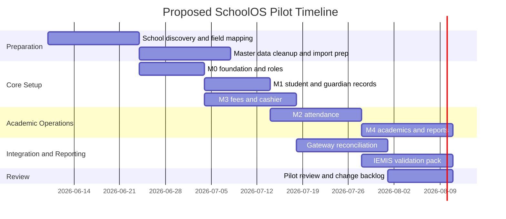

# SchoolOS Product Requirements Document - Combined Master 2026

**Product:** SchoolOS  
**Market:** Nepal-focused school management SaaS  
**Target schools:** Montessori to Class 10 first, with future K-12/+2 extensibility  
**Document type:** Combined master PRD merged from the original pilot-hardening PRD and the researched 2026 PRD draft  
**Status:** Combined review draft for controlled pilot hardening and product planning  
**Last updated:** 2026-06-03  
**Source inputs:** `SCHOOLOS_PRD.md` and `SCHOOLOS_PRD_RESEARCHED_2026.md`

---

## 0. Maintainer Note

This combined master keeps the original SchoolOS PRD details and merges in the researched 2026 additions. It should be reviewed by the product owner before replacing either source document.

The merge intentionally preserves:

- Original product goals, technical direction, edge cases, acceptance criteria, pilot-readiness checklist, and final product direction.
- Researched Nepal-specific context, IEMIS readiness, compliance assumptions, payment-provider realities, competitive positioning, measurable non-functional requirements, pilot workflow/timeline, and open research items.
- Original-only edge cases that were shorter or omitted in the researched draft.
- Researched-only context that strengthens pilot readiness and product positioning.

This document should be treated as the single working PRD after review, but implementation claims must still be validated against real pilot-school workflows, official reporting templates, provider sandbox/staging flows, and production security review.

---

## 1. Executive Summary

SchoolOS should be positioned as a **Nepal-first school operating system**, not merely a generic student information system.

The core product thesis:

```text
One login, one school ledger, one student record, one audit trail.
```

SchoolOS must help Nepali schools manage daily operations, student records, guardians, attendance, fees, receipts, accounting, exams, CAS, report cards, parent communication, HR/payroll, library, transport, canteen, file privacy, official-readiness, and future school intelligence from one tenant-isolated platform.

The strongest product direction is to build around four anchors:

1. **School master data** strong enough to support government reporting, audits, class setup, student lifecycle, staff assignments, and school configuration.
2. **Academic operations** covering attendance, timetable, homework, gradebook, exams, CAS, report cards, promotion, and parent/student visibility.
3. **Cashier and finance operations** reliable enough for real-world fee collection, receipt generation, refunds, reversals, day-end close, reconciliation, and accounting controls.
4. **Privacy, auditability, and tenant isolation** as first-class requirements because SchoolOS stores student, guardian, staff, financial, transport, canteen, and communication data.

The product should first aim for a controlled pilot that proves:

```text
1 school
1 clean source of truth
1 reconciled fee flow
1 teacher-friendly daily workflow
1 parent-visible student record
1 reporting/export validation layer
```

Do not expand into AI, microservices, Angular migration, broad live-map workflows, biometric workflows, or deep mobile expansion until the pilot workflows are stable.

---

## 2. Product Overview

SchoolOS is a production-grade, multi-tenant SaaS school management and financial operating system for Nepali schools. It is designed to support Montessori to Class 10 institutions first, with future extensibility for +2, K-12, and larger institutional networks.

The platform covers:

```text
Platform/SaaS control
Tenant/school setup
Admissions and student profiles
Guardians and parent access
Smart attendance
Fees and receipts
Accounting and finance
Notices and communication
Activity feed and milestones
Academics, exams, CAS, and report cards
Homework and timetable
HR and payroll
Library
Transport
Canteen
Reports and exports
Protected File Registry
Future school intelligence
```

SchoolOS should not feel like a generic CRUD dashboard. It must match real school-office workflows in Nepal: front-desk fee collection, principal oversight, teacher attendance/marks entry, guardian communication, transport tracking, library/canteen counters, and periodic reporting pressure.

The product should first prioritize pilot reliability, financial correctness, tenant isolation, parent/student access boundaries, protected files, auditability, and operational stability before expanding into advanced AI, mobile, payment, biometric, or live-map workflows.

---

## 3. Problem Statement

Many schools in Nepal still operate through fragmented systems: paper registers, Excel sheets, manual fee ledgers, offline accounting tools, attendance notebooks, printed/PDF report-card templates, WhatsApp/Viber groups, unstructured Google Drive folders, and disconnected parent communication channels.

This creates:

- Duplicate data entry.
- Weak financial visibility.
- Fee receipt/accounting mismatch risk.
- Inconsistent student records.
- Slow parent communication.
- Poor auditability.
- Weak file privacy.
- Limited school-level analytics.
- Difficult official-reporting preparation.

SchoolOS solves this by providing a single tenant-isolated system where each school can manage operations, academics, finance, communication, files, compliance-readiness, and reporting workflows in one place.

---

## 4. Product Vision

To become the default operating system for Nepali schools by offering a reliable, locally relevant, financially accurate, and easy-to-use SaaS platform that supports the full school lifecycle from admission to accounting and parent engagement.

SchoolOS should win through:

- Nepal-first workflows.
- Strong accounting and fee correctness.
- Tenant-safe SaaS architecture.
- Parent/teacher/mobile readiness.
- Protected File Registry and private media access.
- QR identity for student operations.
- IEMIS/reporting readiness matrix.
- Canteen, library, transport, HR, payroll, academics, communication, and accounting in one connected platform.
- Practical low-bandwidth and school-office UX.
- Gradual code-file modularization instead of premature microservices.

---

## 5. Product Goals

### 5.1 Business Goals

1. Enable multiple schools to run independently on one SaaS platform.
2. Support controlled pilot deployment after staging verification.
3. Provide strong coverage for school operations, fees, accounting, academics, attendance, communication, and parent access.
4. Build trust through accurate receipts, ledgers, reports, audit trails, and protected files.
5. Prepare a foundation for future analytics, mobile expansion, provider integrations, and SaaS billing automation.
6. Differentiate through Nepal-first operating context, cashier workflows, IEMIS readiness, and strong tenant isolation.

### 5.2 Product Goals

1. Centralize school data under secure tenant isolation.
2. Provide school administrators with one operational dashboard.
3. Provide principals with visibility into school health, collections, attendance gaps, academic status, pending approvals, and reporting-readiness issues.
4. Allow teachers to manage attendance, homework, academics, marks/CAS, timetable, and communication.
5. Allow parents to view child-specific notices, dues, fees, receipts, attendance, homework, progress, report cards, and future transport/canteen views.
6. Allow students to view their own timetable, homework, notices, attendance, report cards, library/canteen information, and allowed school content.
7. Provide finance staff/cashiers with fee ledgers, receipts, refunds, reversals, cashier close, reconciliation, and accounting controls.
8. Keep platform administration separate from tenant/school operations.
9. Treat official reporting and IEMIS readiness as a validation workflow, not a static export button.

### 5.3 Technical Goals

1. Keep the NestJS modular monolith as the primary architecture.
2. Use PostgreSQL/Prisma for persistence and Redis/BullMQ for cache and queues.
3. Maintain strict `tenantId` boundaries across all modules.
4. Avoid premature migration to microservices or Angular.
5. Continue using Next.js for the current dashboard and Flutter for the companion app.
6. Keep browser auth cookie-first and mobile/API access bearer-token compatible.
7. Split large services/components by responsibility as code-file modularization, not microservices.
8. Keep parent/student/driver/mobile APIs purpose-limited and avoid exposing admin-shaped responses.

---

## 6. Nepal Market and School Operating Context

### 6.1 Nepal-First Requirements

| Area | Product implication |
|---|---|
| Academic year and fiscal year may differ | Support academic-year context and fiscal-year/accounting period context separately. |
| Schools use class/section/roll conventions | Class, section, roll number, academic year, and lifecycle status must be first-class fields. |
| Parents expect simple communication | Parent app/portal should show child-specific dues, attendance, notices, homework, results, and receipts without admin complexity. |
| School offices often use mixed manual/digital workflows | Import/export, CSV/Excel, printable receipts, and manual reconciliation must be supported. |
| Nepali and English usage both matter | UI labels, reports, receipts, notices, and templates should be localization-ready. |
| Official reporting pressure exists | IEMIS/export readiness must be treated as a validation workflow, not a single static file export. |
| Connectivity can be inconsistent | Important workflows need drafts, retry-safe submissions, and clear sync/conflict behavior. |
| Local financial workflows matter | Cash, manual bank transfer, eSewa/Khalti readiness, cashier close, and reconciliation must be explicit. |
| Local naming patterns matter | Nepali names, mixed scripts, guardian phone reuse, and duplicate candidate matching must be handled. |
| Low-bandwidth usage is common | Media and dashboards must degrade gracefully. |

### 6.2 Education System and Reporting Context

SchoolOS should support the operational structure used by Nepali schools:

- Montessori/ECD and primary levels.
- Basic and secondary class progression.
- Future +2/K-12 extensibility.
- Class and section setup.
- Roll number assignment by academic year/class/section.
- Teacher, class teacher, and subject teacher assignments.
- Exam terms, assessment components, CAS/continuous assessment, grade sheets, and report cards.
- Promotion, transfer, withdrawal, graduation, and archived student states.
- Scholarships, student category flags, and official/export-related fields where needed.
- School profile readiness, infrastructure fields, stream/program flags, and staff roster readiness.

The product should maintain a clean distinction between:

```text
Academic structure: class, section, subject, timetable, exam term
Student lifecycle: applicant, active, transferred, withdrawn, graduated, archived
Financial lifecycle: fee plan, invoice, payment, receipt, reversal, refund, cashier close, journal posting
Reporting lifecycle: draft data, validation errors, official-ready state, exported artifact, audit trail
```

---

## 7. Target Users and Daily Workflows

| User | Needs / daily workflows |
|---|---|
| SchoolOS Platform Operator | Manage SaaS tenants, subscriptions, platform settings, provider readiness, billing records, feature access, usage, queues, API keys, support override, and audit logs. |
| School Owner / Principal | View school health, finance, collections, attendance gaps, academics, staff, communication, pending approvals, reports, and operational risks. |
| School Admin | Manage admissions, students, guardians, classes, settings, documents, notices, school profile, module settings, and daily records. |
| Accountant / Finance Staff | Manage fee setup, invoices, payments, receipts, refunds, reversals, accounting, ledgers, reports, reconciliation, and day-end close. |
| Cashier | Search students, collect partial/full payments, print/share receipts, handle payment references, reconcile daily collections, and close cashier day without needing the full accounting module. |
| Teacher | Mark attendance, assign homework, manage marks/CAS, view timetable, manage class progress, and communicate with parents for assigned classes. |
| Parent / Guardian | View linked child data, dues, receipts, notices, attendance, homework, progress, report cards, transport/canteen status, and messages. |
| Student | View own timetable, homework, notices, attendance, report cards, and library/canteen information where allowed. |
| Librarian | Manage books, copies, issues, returns, fines, borrower lookup, QR/barcode scans, borrower history, and reports. |
| Transport Staff / Driver | Manage routes, vehicles, trips, stops, student boarding/drop status, delay/exception reporting, and future live-trip workflows. |
| Canteen Operator | Manage menu, meal plans, serving, student wallets, QR/student search, allergy warnings, spending controls, POS sales, vendors, inventory, receipts, and reports. |
| HR / Payroll Staff | Manage staff records, contracts, documents, leave, attendance, salary structures, payroll runs, payslips, payroll reports, and payroll posting. |

### 7.1 Workflow Stories

**Cashier:** As a cashier, I need to collect a partial or full payment, print or share a receipt, handle duplicate-submit risk, and close my cashier day without needing to understand the full accounting module.

**Teacher:** As a teacher, I need one simple daily surface for timetable, attendance, homework, and marks/CAS entry for only my assigned classes.

**Parent:** As a parent, I need to see only my child’s dues, attendance, homework, notices, receipts, report cards, and relevant transport/canteen information.

**Principal:** As a principal, I need one dashboard showing today’s collection, attendance anomalies, overdue fees, pending approvals, academic status, reporting-readiness issues, and operational risks.

**Driver:** As a driver, I need assigned trips, stops, student list, boarding/drop status, and a simple way to report delay or exception.

**Canteen Operator:** As a canteen operator, I need QR/student search, wallet balance, allergy warnings, spending controls, POS receipts, and a fast serving flow.

---

## 8. Product Planes

SchoolOS has three separate product planes inside the same modular monolith.

| Plane | Audience | Purpose | Frontend route | Backend route |
|---|---|---|---|---|
| Platform Control Plane | SchoolOS owner/operator | Manage SaaS tenants, provider readiness, billing records, platform audit, usage, API keys, queues, and support actions. | `/platform/*` | `/platform/*` |
| Tenant Configuration Plane | Principal/admin | Configure one school's academic years, classes, sections, fee settings, roles, school profile, logo, module settings, and localization preferences. | `/dashboard/settings/*` | `/settings/*`, `/tenant-settings/*` |
| School Operations Plane | Staff, parents, students | Run daily workflows such as student management, attendance, fees, accounting, academics, library, transport, canteen, HR, and communication. | `/dashboard/*` and mobile app | Module APIs |

Rules:

1. Do not mix SchoolOS SaaS billing with school fee collection.
2. Platform tenant override must be explicit, reason-required, time-bound where possible, and audited.
3. Tenant configuration should affect only the selected school.
4. School operations APIs must always be tenant-scoped.
5. Parent/student/driver/mobile APIs must be purpose-limited and must not expose admin-shaped responses.
6. Disabled feature routes must fail closed even when accessed directly by URL.

---

## 9. Product Principles

| Principle | Requirement |
|---|---|
| Nepal-first | Support NPR, Nepali/English readiness, class/section conventions, local reporting needs, receipts, and future BS calendar support. |
| Single source of truth | Student, guardian, staff, class, fee, payment, report, and audit state live in canonical backend models. |
| Role clarity | Cashier, teacher, parent, principal, driver, and operator screens should be purpose-built. |
| Auditability | Sensitive actions must be logged with actor, tenant, timestamp, reason, and before/after context where practical. |
| Financial correctness | Fees, receipts, refunds, reversals, cashier close, and accounting must reconcile. |
| Privacy by default | Student documents, photos, receipts, report cards, payslips, messages, activity media, and exports use protected access. |
| Code-file modularity | Large services/components must split by responsibility; this is not microservices. |
| Pilot-first delivery | Each phase must produce usable workflows before expanding scope. |
| Fail closed | Parent/student access, tenant access, file access, and provider-dependent actions must fail closed on uncertainty. |
| Provider honesty | Disabled/mock provider modes must be explicit and must not pretend to send real notifications, payments, or storage actions. |

---

## 10. Nepal Compliance, Privacy, and Governance Assumptions

This PRD is not legal advice. It defines product requirements based on Nepal-focused school data sensitivity and official operating expectations.

SchoolOS must treat the following as sensitive data:

```text
student identity
guardian identity and phone/email
attendance
marks, CAS, report cards
medical/allergy notes
student documents and photos
parent-teacher messages
fee invoices, receipts, refunds, reversals
staff salary, bank, identity, leave, payroll
transport location and child trip status
canteen wallet/spending data
```

### 10.1 Required Governance Controls

| Control area | Requirement |
|---|---|
| Tenant isolation | Every tenant-owned query, file, report, export, and job must be scoped by authenticated `tenantId`. |
| Role-based access | Users see only the minimum data needed for their role. |
| Parent/guardian access | Parents can only access linked children. Guardian removal must revoke access immediately. |
| Student access | Students can only access their own allowed data. |
| Staff privacy | Salary, bank, identity, and sensitive HR fields must be masked unless permission allows. |
| Audit | Sensitive actions require audit logs. |
| Export governance | Bulk exports require permission and audit. |
| File privacy | Raw object keys, internal file IDs, and permanent public URLs must not be exposed. |
| Platform support override | Must require reason, audit, explicit tenant, and expiry/time-bound design where possible. |
| Data retention | Retention rules should be configurable by record class and finalized during pilot/legal review. |
| Provider diagnostics | Secret values must be masked in provider, queue, export, and diagnostic views. |

### 10.2 Audit Logs Required For

Audit logs are required for:

- Tenant override.
- Support override entry/exit.
- Suspend/activate tenant.
- Payment reversal/refund.
- Accounting posting/reversal/fiscal reopen.
- Marks unlock/correction/report regeneration.
- Result publication.
- Payroll approval/post/reversal.
- Student guardian changes.
- QR generate/rotate/revoke.
- Sensitive file preview/download.
- Notice moderation/removal.
- Abuse, escalation, and messaging moderation actions.
- Queue retry for sensitive jobs.
- Bulk exports and official-reporting export actions.

---

## 11. IEMIS and Official Reporting Readiness

SchoolOS should treat IEMIS readiness as a **validation and export readiness workflow**, not a single export button.

### 11.1 Reporting Field Families

| Field family | Minimum SchoolOS coverage | Requirement |
|---|---|---|
| School master profile | school code, levels served, ownership type, location, contacts, academic setup | Required before official-ready state. |
| Student profile | identity, guardian, class/section, roll, status, transfer/promote/leave state | Required for enrollment and class reporting. |
| Scholarship / financial aid | eligibility flags, payment/bank verification state where required | Must be explicit, not free-text only. |
| Teacher/staff roster | identity, role/post, subject/class assignment, status | Must align with timetable and attendance ownership. |
| Physical/infrastructure profile | rooms, facilities, buildings, transport/assets where needed | Must support school profile readiness. |
| Stream/program flags | technical/open-school/special categories where needed | Must be explicit. |
| School lifecycle | active, merged, closed, transferred | Prevent stale reporting. |
| Budget/program base data | counts and foundational school data | Used for reporting packs where required. |

### 11.2 Validation Rules

| Validation rule | Expected behavior |
|---|---|
| One active student, one active class assignment | Student cannot be simultaneously active in multiple mutually exclusive class states. |
| Class/section must exist before records | Attendance, fees, marks, and timetable cannot reference missing setup. |
| Teacher assignment must reference active staff | Prevent orphan timetable/marks ownership. |
| Guardian link must be current | Parent access fails closed when guardian link is removed. |
| Scholarship/payment readiness requires required fields | Do not mark official-ready if required identity/payment fields are missing. |
| School profile must be complete | Disable official-ready export if core school profile fields are incomplete. |
| Special flags must be explicit | Technical, disability, scholarship, transfer, dropout, and status states must not be hidden in notes. |
| Unsupported official fields must be documented | Do not silently guess unmapped IEMIS/export fields. |

### 11.3 Export Policy

- Exports should show `Draft`, `Validation Failed`, `Ready`, `Exported`, and `Archived` states.
- Export failures must not create false success states.
- Exported artifacts must be tenant-scoped and stored through File Registry when retained.
- Unsupported or unmapped official fields must be documented instead of silently guessed.
- Claims of final iEMIS compliance require validation against real official templates during pilot/staging.
- iEMIS exports must be verified against real templates before claiming final compliance.

---

## 12. Competitive and Market Analysis

SchoolOS competes not only with software products, but also with the current manual operating stack:

```text
paper registers
Excel sheets
manual fee ledgers
standalone accounting software
attendance notebooks
PDF/printed report-card templates
WhatsApp/Viber communication
unstructured Google Drive folders
```

### 12.1 Software Comparison

| Product / approach | Strength | Gap SchoolOS can target |
|---|---|---|
| Generic school ERP/SIS | Broad student, attendance, report, and parent portal features | Often not Nepal-first or IEMIS-aware. |
| Frappe Education / ERP-style systems | Strong open-source ERP foundation | Requires localization, setup, and school-specific workflow depth. |
| openSIS / QuickSchools / Classter-like platforms | Mature SIS patterns and parent portals | Not optimized for Nepal fee/reporting/accounting realities. |
| Nepal-local school systems | Local familiarity, Nepali calendar/support claims | Public evidence often thin on tenant isolation, audit, File Registry, and accounting correctness. |
| Excel/manual ledgers | Familiar, flexible, low cost | Error-prone, no audit, no parent visibility, hard reporting, no integrated ledger. |
| WhatsApp/Viber communication | Already used by parents/staff | Unstructured, hard to audit, no read-state governance, privacy risk. |

### 12.2 Differentiation

SchoolOS should differentiate through:

- Nepal-first school workflows.
- Strong cashier and accounting correctness.
- IEMIS/reporting readiness matrix.
- Tenant-safe SaaS with support override audit.
- Parent/teacher/mobile purpose-limited APIs.
- QR identity for student operations.
- Private File Registry for documents/media/reports.
- Library, transport, canteen, HR, payroll, and accounting in one connected platform.
- Practical low-bandwidth and school-office UX.
- Transparent provider readiness and disabled/mock provider states.

---

## 13. Payment and Provider Readiness

The payment design should follow provider reality rather than assuming instant success from redirect/callback.

### 13.1 Supported Payment Modes

| Mode | Pilot stance |
|---|---|
| Cash | Required. Must support receipt, cashier close, and reconciliation. |
| Manual bank transfer | Required as controlled workflow with reference/proof and approval. |
| eSewa | Supported through provider-ready integration only after sandbox/staging verification. |
| Khalti | Supported through provider-ready integration only after sandbox/staging verification. |
| Mock provider | Allowed for demo/dev only; UI must clearly show disabled/mock mode. |
| Card/bank host-to-host | Future. Do not claim before bank-specific research and integration. |

### 13.2 Payment State Model

| Requirement | Product decision |
|---|---|
| Payment intent | SchoolOS creates its own payment intent/order before provider redirect/initiation. |
| Idempotency | Deduplicate by provider reference + SchoolOS order/reference + amount. |
| Verification | Do not finalize receipt from redirect/callback alone; verify with provider lookup/status check where supported. |
| Pending state | Pending/initiated states remain visible and reconcilable. |
| Failure state | Expired, failed, user-canceled, and provider-error states are retained for audit/support. |
| Refund/reversal | Must create explicit refund/reversal record, not overwrite original receipt. |
| Daily reconciliation | Cashier/accounting can reconcile gateway totals against SchoolOS receipts. |
| Disabled provider | UI must show provider-disabled state and block fake real-payment collection. |

### 13.3 Payment Acceptance Criteria

- Payment creation is idempotent.
- Duplicate callbacks do not create duplicate receipts.
- Receipt is issued only after payment save and provider verification rules pass.
- Manual reconciliation requires permission and audit.
- Reversal/refund requires permission, reason, and accounting impact.
- Cashier close detects variance between expected and actual collection.
- Gateway-disabled mode must be clear in UI and must not collect fake payments.

---

## 14. Core Modules and Requirements

The module numbering below follows the SchoolOS product structure. These are product modules inside the modular monolith, not microservices.

---

## M0: Platform Core / SaaS Foundation

### Purpose

Provide the SaaS foundation for tenant management, platform administration, feature controls, provider readiness, queues, File Registry, API keys, billing records, subscriptions, support override, onboarding, health, and audit workflows.

### Functional Requirements

- Multi-tenant architecture using `tenantId`.
- Platform tenant list, detail, dashboard, status, suspend, and activate flows.
- Reason-required tenant suspend/activate behavior.
- Plans, features, tenant subscriptions, feature overrides, and usage counters.
- Platform API key management with one-time secrets, hashed storage, masked list responses, revoke flow, and audit records.
- Provider configuration masking and provider readiness checks.
- Storage provider readiness for local, R2, S3-compatible, and MinIO-style providers.
- Queue health, failed job inspection, retry metadata, and audited retry actions.
- File Registry and report export history.
- Onboarding checklist and platform health summary.
- Support override entry/exit with reason, explicit tenant, audit, and expiry/time-bound policy.
- Platform SaaS billing records must stay separate from school fee collection.

### Edge Cases

- Suspended tenant attempts login, API access, mobile access, background jobs, file downloads, or report generation.
- Platform admin uses tenant override without a reason.
- Tenant override is active longer than intended.
- Disabled feature route is accessed directly by URL.
- API key is revoked while a request is in progress.
- Provider is configured incorrectly but the UI still allows a dependent action.
- Provider is misconfigured but UI attempts dependent action.
- Queue retry replays a job for an archived tenant.
- File Registry points to a missing object.
- SaaS billing record exists but tenant subscription status is inconsistent.

### Acceptance Criteria

- Every platform override action is audited.
- Suspended tenants are blocked consistently across dashboard, API, mobile, jobs, file downloads, and report generation.
- Disabled provider mode never pretends to send real notifications, payments, or storage actions.
- API keys are stored hashed and only shown once during creation.
- File and queue failure screens show safe, non-secret error details.
- Provider and diagnostic views must mask secrets.
- Tenant subscription and SaaS billing status inconsistencies must surface in platform diagnostics.

### Unique Angle

SchoolOS Pilot Readiness Console — a platform operator can see exactly why a school is or is not ready to go live.

### Future Enhancements

- Guided school onboarding wizard: school profile → academic year → classes → sections → fee heads → users → modules → provider checks.
- Tenant readiness score: tells platform operator if a school is ready for pilot.
- Provider health center: SMS, email, FCM, storage, payment gateway, object storage, Redis, queue health.
- Queue mission control: failed jobs grouped by module, tenant, reason, retry/discard decision.
- Tenant sandbox mode: let new schools test without polluting production reports.
- Data import center: legacy students, staff, fee dues, books, routes, inventory.
- Tenant change log: every module enabled/disabled, plan changed, override used, provider changed.
- Support override banner: visible warning and audit timer when platform support enters a school tenant.
- Feature usage analytics: which modules are used daily vs unused.
- Tenant exit/export package: export all school data if contract ends.

---

## M1: Admissions and Student Profiles

### Purpose

Manage the full student lifecycle from inquiry/application/admission to active, transferred, graduated, withdrawn, or archived states.

### Functional Requirements

- Inquiry/application/admission workflow.
- Student profile creation and editing.
- Guardian details and relationship management.
- Class, section, roll number, and academic year assignment.
- Student documents and photo uploads.
- Student identity and QR credential lifecycle.
- Duplicate candidate detection.
- iEMIS/export readiness fields and iEMIS export support.
- Student search and lifecycle history.
- Scholarship/category/status fields where required for official readiness.

### Edge Cases

- Same student entered twice with spelling differences.
- Same admission number created by two admins concurrently.
- Siblings share the same guardian phone.
- Student transfers class mid-year.
- Student leaves and later rejoins.
- Guardian is removed or changed after parent account access exists.
- Student photo upload succeeds but database save fails.
- Database save succeeds but file upload fails.
- Student QR is screenshotted, rotated, revoked, or expired.
- iEMIS export field does not exist in SchoolOS model.
- Same student name appears in two different schools.
- Legacy import creates duplicate or incomplete identity records.

### Acceptance Criteria

- Duplicate candidates are shown before risky merge actions.
- Parent access is immediately revoked when guardian linkage is removed.
- Student QR resolve must fail for revoked or rotated credentials.
- Student documents and photos must not expose raw storage keys.
- Student lifecycle changes must preserve historical attendance, fees, report cards, documents, and accounting links.
- Student official-readiness state must fail validation when required fields are missing.

### Unique Angle

Family 360, not just Student 360. Nepal schools often deal with siblings, guardians, fee negotiations, transport, and documents together.

### Future Enhancements

- Admission funnel board: inquiry → application → document pending → interview → approved → admitted → rejected.
- Admission draft autosave: parents/admin can stop and resume forms.
- Nepali-name duplicate engine: match mixed scripts, spacing, spelling, guardian phone, DOB.
- Sibling intelligence: suggest sibling relationship, shared guardians, family-level fee view.
- Guardian trust profile: verified phone/email, identity docs, pickup authorization, communication preference.
- Student lifecycle timeline: admission, transfer, promotion, withdrawal, rejoin, graduation, alumni.
- Document checklist by school policy: birth certificate, transfer certificate, photo, guardian citizenship, medical notes.
- Parent pickup pass: QR-based authorized guardian pickup with audit trail.
- Medical safety card: allergies, medication, emergency doctor, visible only to permitted roles.
- Student risk-free flagging: operational flags for missing docs, fee hold, attendance concern, transport missing assignment.
- Alumni registry: graduated students, certificates, transfer docs, old report cards.

---

## M2: Smart Attendance

### Purpose

Digitize student attendance with correction requests, sync conflict handling, parent/student views, analytics, and export/report support.

### Functional Requirements

- Daily attendance sessions and records.
- Present, absent, late, leave, and correction states.
- Teacher-scoped marking.
- Attendance drafts and offline/reconnect recovery.
- Correction request and approval workflow.
- Attendance history, monthly analytics, and exports.
- Parent/student child-scoped access.
- Holiday/weekend/exam-only day awareness where configured.

### Edge Cases

- Teacher marks the same class twice.
- Two teachers submit attendance for the same class/date.
- Attendance is submitted after the lock window.
- Offline draft conflicts with already-synced server data.
- Student joins class after attendance was already taken.
- Student transfers class mid-month.
- Half-day attendance is required by school policy.
- Attendance attempted on holiday, weekend, or exam-only day.
- Parent tries to view attendance for a child they do not own.
- Export generation fails after report entry is created.

### Acceptance Criteria

- Duplicate attendance submissions must be blocked or merged by deterministic conflict rules.
- Late edits must go through correction request workflow.
- Offline sync must show conflict choices instead of overwriting silently.
- Parent/student attendance APIs must fail closed to linked students only.
- Attendance exports must be tenant scoped and registered through File Registry where retained or applicable.
- Export failure must not create false success state.

### Unique Angle

Poor-connectivity-first attendance. Most ERPs fail here; make offline sync and conflict clarity a major selling point.

### Future Enhancements

- Attendance command board: today's classes not started, draft, submitted, locked, correction pending.
- Teacher offline mode: local draft queue with conflict explanation.
- Attendance anomaly dashboard: consecutive absence, repeated late, sudden drop, class-level absence spike.
- Parent absence confirmation: parent can submit reason after absent notification.
- Leave pre-approval: approved leave automatically appears during marking.
- Exam-day attendance mode: separate attendance policy for exam days.
- Late arrival register: gate staff can mark late arrivals with timestamp.
- Pickup/early leave log: student leaves early with guardian/authorized pickup audit.
- Class attendance heatmap: month view by class/section.
- Attendance-to-fee/academic view: attendance percentage on report cards or promotion readiness.
- Auto-reminder to unmarked teachers: class not submitted by configurable time.
- Attendance correction SLA: corrections pending over 24h highlighted.
- Substitute teacher attendance authority: approved substitute can mark that period/day.

---

## M3: Fees and Receipts

### Purpose

Manage fee setup, invoices, student ledgers, payments, receipts, refunds, reversals, cashier close, reconciliation, gateway readiness, and finance reports.

### Functional Requirements

- Fee heads, fee plans, student assignments, invoices, invoice lines.
- Payment collection and receipt generation.
- Partial payments, dues, student ledgers, and reconciliation.
- Receipt PDF and reprint history.
- Refunds and reversals with permission and reason.
- Cashier close and day-end summary.
- Gateway readiness state.
- M9 accounting consistency.
- Pending, failed, expired, canceled, verified, and reconciled payment states for provider flows.

### Edge Cases

- Parent pays partially against multiple invoice lines.
- Parent overpays.
- Cashier double-clicks payment submit.
- Same payment reference is submitted twice.
- Receipt PDF generation fails after payment is saved.
- Receipt is reprinted multiple times.
- Receipt reversal is attempted after cashier close.
- Already-reversed payment is reversed again.
- Refund is greater than original payment.
- Student changes class after invoice generation.
- Scholarship/discount is applied after invoice issue.
- Online payment webhook arrives twice or out of order.
- Gateway provider is disabled but UI attempts payment collection.
- Cashier close is submitted concurrently by two users.
- Redirect/callback suggests payment success before provider verification.

### Acceptance Criteria

- Payment creation must be idempotent.
- Reversals require permission and reason.
- Closed cashier day reversals must be blocked or require explicit reopening policy.
- Receipt reprint must not create a new payment.
- Dues, student ledger, receipt, and accounting entries must remain consistent after partial payment, overpayment, refund, or reversal.
- Gateway-disabled mode must be clear in UI and must not collect fake payments.
- Duplicate provider callbacks must not duplicate receipts.
- Receipt issuance must follow provider verification rules where a gateway is used.
- Cashier close must detect collection variance.

### Unique Angle

Nepal-first fee operations — cash, QR wallet, bank transfer, manual references, partial payments, scholarship, and audit-safe receipts.

### Future Enhancements

- Cashier-first fee collection mode: search student → show dues → collect → print/share receipt.
- Fee negotiation/commitment plan: parent promises partial payment by date, reminders tracked.
- Scholarship workflow: request → approve → apply → audit.
- Discount rule engine: sibling discount, staff child discount, early payment discount, need-based discount.
- Fee hold policy: block report card/promotion/transfer if dues exist, configurable.
- Receipt QR verification: parent/admin scans receipt QR to verify authenticity.
- Cashier drawer close: cash, bank, QR, manual transfer, variance, supervisor approval.
- Overpayment wallet: overpaid amount becomes credit for next invoice.
- Installment plans: monthly/term-wise auto schedule.
- Defaulter segmentation: 0–30, 31–60, 60+, high-value, repeated.
- Smart reminders: different message for soft reminder, final reminder, exam result hold warning.
- Payment provider fallback: eSewa/Khalti unavailable → manual reference capture with reconciliation.
- Fee dispute workflow: parent disputes invoice line, admin resolves with audit.
- Batch invoice preview: preview before generating hundreds of invoices.
- Bank statement matching: match manual deposits to student invoices.

---

## M4: Academics, Exams, CAS, and Report Cards

### Purpose

Manage subjects, exams, assessments, marks, CAS records, grading, report cards, result publishing, corrections, regeneration, and promotion readiness.

### Functional Requirements

- Exam terms and assessment components.
- Subject and class setup.
- Marks entry and CAS entry.
- Marks lock/unlock workflow.
- Nepal grading/GPA preview.
- Report card generation and history.
- Correction and regeneration workflow.
- Result publishing and promotion readiness.
- Academic CSV/PDF exports.
- Report-card versioning and official-readiness validation.

### Edge Cases

- Teacher enters marks for unassigned subject or class.
- Marks are submitted after lock.
- Student was absent from exam.
- Retest or make-up exam is required.
- CAS record is incomplete.
- Grade rounding differs from school policy.
- Report card is regenerated after correction.
- Old report card version must remain available.
- Student has unpaid dues and school wants to hold result.
- Promotion decision differs from automatic result calculation.
- Report card file generation succeeds but storage registration fails.

### Acceptance Criteria

- Locked marks cannot be changed without correction/unlock workflow.
- Report-card regeneration must preserve version history.
- Result publication must be explicit and auditable.
- Promotion readiness must show incomplete, failed, withheld, and ready states clearly.
- Generated report files must be tenant scoped and retrievable only by authorized users.
- Storage registration failure must not produce a false report-card success state.

### Unique Angle

Promotion readiness + result publishing governance. Most school systems generate report cards; fewer manage the approval and hold workflow properly.

### Future Enhancements

- Marks grid like spreadsheet: autosave, keyboard navigation, absent/retest/withheld flags.
- Assessment blueprint: theory, practical, project, viva, CAS weight templates.
- CAS rubric builder: behavior, participation, project, reading, handwriting, discipline.
- Report card designer: school logo, grading scale, remarks, signatures, templates.
- Result publish checklist: marks locked, fees clear, report generated, principal approved.
- Result hold manager: hold by student/class/reason, with audit and parent-safe display.
- Retest/makeup workflow: request → approve → marks entry → versioned result.
- Promotion board: ready, blocked by fees, blocked by marks, manually reviewed.
- Teacher mark-entry progress: which subjects/classes have not submitted marks.
- Result analytics: subject average, pass/fail, grade distribution, weak areas.
- Student academic timeline: term-wise performance trend.
- Remarks assistant: template-based remarks by performance category (not AI first).
- Report-card version history: every regeneration visible with reason.
- Academic intervention plan: remedial class recommendation, parent meeting, follow-up date.

---

## M5: Activity Feed and Milestones

### Purpose

Provide a safe school/class/student activity feed, developmental milestones, mood logs, attachments, reactions, parent views, media privacy, consent handling, and moderation lifecycle.

### Functional Requirements

- Activity posts with targeting.
- Student tags and class visibility.
- Media attachments with private access.
- Draft, approve, reject, archive, and remove lifecycle.
- Reactions and detail view.
- Developmental milestones and mood logs.
- Parent child-scoped activity feed.
- Media privacy and consent handling.
- Moderation audit trail.

### Edge Cases

- Teacher posts media for the wrong class.
- Parent lacks photo/media consent.
- Activity media URL is shared externally.
- Post is approved, then student is removed from class.
- Post is archived after notification was sent.
- Attachment upload succeeds but post creation fails.
- Parent tries to access another child’s tagged media.
- Moderated/removed content still appears in cached feed.
- Low-bandwidth image loading fails.

### Acceptance Criteria

- Parent feed must show only approved child-scoped content.
- Missing consent must hide media safely.
- Media must not expose public URLs, raw storage keys, or internal file IDs.
- Removed or archived posts must disappear from feed and detail views.
- Moderation actions must be audited.
- Cached feeds must invalidate safely after moderation or archive actions.

### Unique Angle

Consent-safe private parent engagement. This is very important for school trust.

### Future Enhancements

- Teacher post composer with audience preview before publishing.
- Student tagging confidence: show exactly which parents will see the post.
- Consent-aware media hiding: "Media hidden due to consent" instead of broken image.
- Milestone templates: Montessori/ECD templates for motor, language, social, cognitive, self-care.
- Mood/wellbeing logs: teacher logs mood trend without exposing sensitive notes widely.
- Moderation queue: pending, approved, rejected, archived, restored.
- Parent engagement analytics: seen by guardian, unread, reactions.
- Low-bandwidth mode: compressed previews, retry upload, upload queue.
- Activity album: auto-group events by day/class.
- Private student note: only teachers/admin, not parent-visible unless shared.
- Birthday/achievement posts: template-based safe posts.
- Parent comment control: school can enable/disable comments by audience.
- Media expiry/archive: old media archived but accessible by permission.
- Activity-to-profile link: major milestones show on Student 360 timeline.

---

## M6: Homework and Timetable

### Purpose

Manage homework assignment lifecycle, submissions, reminders, reviews, correction requests, timetable versions, conflict validation, teacher workload, substitutions, and parent/student views.

### Functional Requirements

- Homework creation, assignment, due dates, attachments, submissions, reviews, and correction requests.
- Homework reminders and reports.
- Timetable periods, rooms, versions, slots, publish/lock/archive/reopen.
- Teacher availability, workload limits, subject weekly requirements, and substitutions.
- Parent/student homework and timetable read views.
- Timetable absence/leave awareness where available.

### Edge Cases

- Homework due date is before publish date.
- Homework is deleted after reminder job is queued.
- Attachment is too large, wrong type, or missing.
- Student submits after deadline.
- Parent views homework for wrong child.
- Teacher is assigned to two classes at the same time.
- Room is assigned to multiple classes at the same time.
- Teacher is on leave but still assigned in timetable.
- Published timetable is edited without versioning.
- Substitute teacher does not have subject/class permission.

### Acceptance Criteria

- Homework reminders must re-check current assignment status before sending.
- Homework attachments must be private and tenant scoped.
- Timetable publish must block teacher, room, workload, and absence conflicts.
- Published timetable edits must create or preserve version history.
- Parent/student reads must fail closed to authorized linked students.
- Substitute assignment must verify subject/class permission.

---

## M7: HR and Payroll

### Purpose

Manage staff records, contracts, documents, attendance, leave, salary structures, payroll runs, payslips, approval, accounting posting, reversals, reports, and staff self-service.

### Functional Requirements

- Staff profile and lifecycle management.
- Staff documents and sensitive field masking.
- HR attendance and leave management.
- Salary structures, payroll runs, payroll lines, and payslips.
- Payroll approval, posting, and reversal.
- Payroll reports, PDF payslips, PF/TDS/component/leave summaries.
- Staff self-service access.
- Staff roster readiness for timetable, attendance ownership, and official reporting.

### Edge Cases

- Staff joins mid-month.
- Staff leaves mid-month.
- Leave without pay affects payroll.
- Salary structure changes after payroll draft is created.
- Payroll is approved and then staff data changes.
- Payroll is posted twice.
- Payroll reversal does not reverse accounting.
- Unauthorized user views salary or bank details.
- Staff document access crosses tenant or role boundary.
- Duplicate payroll run is created for same period.

### Acceptance Criteria

- Approved payroll must be locked from unsafe edits.
- Payroll posting must be idempotent.
- Payroll reversal must update accounting through an approved reversal path.
- Sensitive fields must be masked unless the user has permission.
- Staff self-service must expose only the authenticated staff member’s own allowed data.
- Duplicate payroll periods must be blocked or explicitly versioned.

---

## M8A: Library Management

### Purpose

Manage books, copies, issue/return, overdue, fines, borrower history, QR lookup, reports, and future fine-to-fees/payment integration.

### Functional Requirements

- Book and copy catalog.
- Issue, return, lost, damaged, and overdue workflows.
- Fine settings and calculation.
- Student/staff borrower support.
- QR borrower lookup using student identity.
- Book/copy history and reports.
- CSV exports.
- Fine-to-fees integration with idempotent posting.

### Edge Cases

- Same physical copy is issued twice.
- Book copy is lost or damaged while issued.
- Student leaves school with borrowed book.
- Overdue fine calculation crosses holidays or weekends.
- Staff borrower follows different rules from student borrower.
- QR resolves to revoked student credential.
- Library fine posts twice to fees.
- Fine is paid in fees but library status does not update.
- Borrower belongs to a different tenant.

### Acceptance Criteria

- One copy cannot be actively issued to multiple borrowers.
- Lost/damaged status must preserve issue history.
- Fine posting to fees must be idempotent.
- QR lookup must be tenant scoped and respect revoked credentials.
- Borrower history must remain visible after return, loss, or student lifecycle change.
- Fine payment status must reconcile between library and fees.

---

## M8B: Transport Management

### Purpose

Manage routes, stops, vehicles, drivers, student assignments, trips, boarding/drop statuses, location ingestion, reports, and future live map/driver/parent workflows.

### Functional Requirements

- Routes, stops, vehicles, drivers, and assignments.
- Trip lifecycle and boarded/dropped/absent statuses.
- Latest trip location and location logs.
- GPS ingestion validation.
- Redis latest-location cache and throttled database persistence.
- Tenant/trip-scoped location fanout.
- Parent active-trip endpoint.
- Trip and boarding reports.
- Morning/evening route support and one-day route exception readiness.

### Edge Cases

- Student is assigned to two active routes accidentally.
- Different morning and evening routes are required.
- Driver marks wrong student boarded.
- GPS device sends too many updates.
- GPS stops updating mid-trip.
- Parent sees stale location as if it is live.
- Bus route changes for one day only.
- Student is absent but route assignment exists.
- Parent tries to track a non-linked child.
- Live map is disabled but route is still accessible.
- Vehicle/driver is assigned to overlapping trips.

### Acceptance Criteria

- Location UI must show stale-location state when data is old.
- GPS ingestion must throttle high-frequency updates.
- Parent active-trip access must be child scoped.
- Trip status must distinguish boarded, dropped, absent, not-boarded, delayed, and completed states.
- Live map and driver app routes must remain hidden/disabled until product-approved.
- Overlapping vehicle/driver assignments must be blocked.

---

## M8C: Canteen Management

### Purpose

Manage menu items, meal plans, serving, student wallets, POS sales, spending controls, receipts, suppliers, inventory, purchase bills, wastage, stock ledger, reports, and parent spending visibility.

### Functional Requirements

- Menu item and meal plan management.
- Meal plan enrollments and serving.
- Student wallet top-up, history, correction, and reversal.
- POS sales and receipt JSON/PDF.
- Spending controls and low-balance reports.
- Supplier and inventory item management.
- Purchase bills, stock movement, wastage, stock ledger.
- Sales, spending, meal count, low-balance, and stock reports.
- QR resolve for canteen serving.
- Allergy/medical warning display where configured.

### Edge Cases

- Student wallet has insufficient balance.
- POS sale is submitted twice.
- Meal plan overlaps with existing active plan.
- Meal plan is cancelled after M3 invoice is issued.
- Wallet reversal would create negative balance.
- Inventory stock goes negative.
- Wastage entry is created after stock close.
- Student QR is revoked but used at canteen.
- Parent daily/monthly spending control is exceeded.
- Receipt reprint creates duplicate transaction.
- Supplier purchase bill is edited after stock movement.

### Acceptance Criteria

- Wallet balance must never go negative unless an explicit school policy enables overdraft.
- POS sales must be idempotent.
- Active overlapping meal plans must be blocked.
- Meal plan cancellation must follow a clear invoice/credit/void policy.
- QR serving must reject revoked credentials.
- Receipt reprint must not create a new POS transaction.
- Inventory cannot go negative unless an explicit policy allows controlled negative stock.
- Supplier bill edits after stock movement must follow correction/reversal workflow.

---

## M9: Accounting and Finance

### Purpose

Provide double-entry accounting, chart of accounts, fiscal years, journals, ledgers, vouchers, reconciliation, financial reports, snapshots, audit logs, and source-based posting from school modules.

### Functional Requirements

- Chart of accounts.
- Fiscal years and periods.
- Journal entries and vouchers.
- Double-entry enforcement.
- Decimal-safe posting.
- Immutable posted journals.
- Source-based idempotent posting.
- Reversal/correction workflow.
- Fiscal close/reopen.
- Trial balance, general ledger, cash book, income statement, balance sheet, VAT/TDS/PF summaries.
- CSV/PDF exports and report snapshots.
- Bank reconciliation and auto-match suggestions.
- Accounting audit log viewer.
- Default chart of accounts and module mapping readiness.

### Edge Cases

- Unbalanced journal is submitted.
- Decimal precision causes one-paisa mismatch.
- Backdated transaction is attempted in closed fiscal period.
- Posted journal is edited directly.
- Fee receipt reversal does not reverse accounting.
- Payroll posts twice.
- Canteen, library, or transport source maps to wrong account.
- Default chart of accounts is missing for a tenant.
- Large ledger export times out.
- Bank reconciliation auto-match suggests wrong transaction.
- Fiscal year is reopened after reports were already exported.

### Acceptance Criteria

- Unbalanced journals must never post.
- Posted journals must be immutable.
- Corrections must use reversal/correction entries.
- Source-based posting must be idempotent.
- Closed-period posting must be blocked unless fiscal reopen policy permits it.
- Large reports should use background export when needed.
- Default chart of accounts and report mappings must be verified before pilot.
- Financial analytics and financial reports must reconcile with the accounting source of truth.

---

## M10: Notices, Communication, and Messaging

### Purpose

Centralize notices, events, consent, communication preferences, notification delivery, read tracking, parent-teacher messaging, attachments, retries, failure dashboards, abuse reporting, escalation, and moderation foundations.

### Functional Requirements

- School-wide, class-specific, and targeted notices.
- Event and consent template support.
- Guardian consent and communication preferences.
- Notification center, delivery records, retry/read tracking, unread recipients.
- Provider modes: dev-log, disabled, configured-provider.
- Delivery failure dashboard and retry metadata.
- File Registry-backed notice/chat attachments.
- Parent-teacher thread/message foundation.
- Chat availability, escalation, and abuse report foundation.
- Recipient preview for high-impact notices.

### Edge Cases

- Notice sent to wrong class or wrong recipient group.
- Admin sends notice before previewing recipients.
- Parent removed from student but still has old message link.
- Attachment URL is shared externally.
- Provider is disabled but UI shows delivered state.
- Provider callback is duplicated or forged.
- Message delivery fails but read status is shown.
- Abuse report is submitted against teacher/parent.
- Retention policy deletes old messages but audit requirement remains.
- Unread recipient list includes removed guardians.

### Acceptance Criteria

- Recipient preview must be available before high-impact notices.
- Parent/guardian message access must be child scoped.
- Attachments must use protected access and never expose raw storage keys.
- Provider mode must be explicit in UI and admin diagnostics.
- Delivery retry must not duplicate messages.
- Abuse, escalation, and moderation actions must be auditable.
- Removed guardian links must invalidate old message/file access.

---

## M11: School Intelligence and Analytics

### Purpose

Provide future analytics and intelligence after reliable production data exists.

### Functional Requirements

- Student performance trends.
- Attendance risk indicators.
- Fee collection analytics.
- Staff and class-level insights.
- Parent engagement analytics.
- Predictive analytics in later phases only.
- Human-review queue for recommendations.

### Edge Cases

- Analytics uses incomplete pilot data.
- AI insight exposes sensitive student/staff data.
- Prediction is treated as final decision.
- Cross-tenant aggregation leaks tenant identity.
- Financial analytics disagree with accounting reports.

### Acceptance Criteria

- Do not implement AI/intelligence until reliable production data exists.
- No automated punishment, ranking, discipline, payroll, or parent message action.
- Analytics must be explainable and tenant scoped.
- Financial analytics must reconcile with accounting source of truth.
- Sensitive insights must be permission-gated.

---

## 15. Cross-Cutting Edge Case Requirements

These requirements apply across all modules.

### 15.1 Tenant Isolation

- Every database query, file access, queue job, export, and report must be tenant scoped.
- Same names, phone numbers, admission numbers, class names, receipt numbers, file names, or payment references across schools must never cause data leakage.
- Platform override must require explicit reason and audit trail.
- Support override must be explicit, tenant-specific, audited, and time-bound where possible.
- Suspended tenants must be blocked consistently across dashboard, API, mobile, jobs, file downloads, and report generation.

### 15.2 Parent and Student Access

- Parents can only access linked children.
- Students can only access their own records.
- Guardian removal must revoke access immediately.
- Shared links must not bypass ownership checks.
- Parent/student/mobile APIs must fail closed and avoid admin-shaped overexposure.

### 15.3 File Privacy

- Student photos, documents, receipts, report cards, payslips, notices, chat attachments, activity media, and exports must use protected access.
- Raw storage keys, public object URLs, and internal file IDs must not be exposed to unauthorized clients.
- Signed URLs must be short lived.
- Sensitive file preview/download must be permission-gated and audited.
- Low-bandwidth media should fail gracefully.

### 15.4 Money and Accounting

- All payment, refund, reversal, payroll, canteen, library fine, and accounting posting flows must be idempotent.
- Posted accounting records must be immutable.
- Every reversal must have a reason, permission check, and audit trail.
- Financial reports must reconcile with source ledgers.
- Gateway callbacks must not create final success without provider verification where required.
- Cashier close must detect variance and block unsafe reversal unless an explicit reopening policy permits it.

### 15.5 Offline, Slow Network, and Recovery

- Long forms should preserve drafts where practical.
- Expired sessions should recover safely without duplicate submission.
- Offline or reconnect sync must show conflicts instead of overwriting silently.
- Low-bandwidth media should fail gracefully.
- Duplicate submits must be handled through idempotency keys and safe UI states.

### 15.6 Background Jobs

- Jobs must re-check tenant status, feature status, entity status, and permissions before executing.
- Retried jobs must not duplicate messages, payments, reports, exports, receipts, or postings.
- Failed jobs must expose safe diagnostics without secrets.
- Queue retry for sensitive jobs must be audited.

### 15.7 PDFs and Exports

- Receipt, ID card, report card, payroll, accounting, attendance, fee, library, transport, canteen, official/IEMIS, and notice exports must be tenant scoped.
- Export failure must not create false success states.
- Re-generated PDFs should maintain history where legally or operationally required.
- Large reports should use background export when needed.
- Exported artifacts must be stored and downloaded through protected file access when retained.

### 15.8 Audit Logs

Audit logs are required for:

- Tenant override.
- Suspend/activate tenant.
- Support override entry/exit.
- Payment reversal/refund.
- Accounting posting/reversal/fiscal reopen.
- Marks unlock/correction/report regeneration.
- Result publication.
- Payroll approval/post/reversal.
- Student guardian changes.
- QR generate/rotate/revoke.
- File preview/download for sensitive documents.
- Notice moderation/removal.
- Abuse and escalation actions.
- Queue retry for sensitive jobs.
- Bulk exports and official reporting exports.

---

## 16. Non-Functional Requirements

The targets below are pilot/staging validation targets, not claims about the current implementation.

### 16.1 Security

- Cookie-first browser authentication.
- Bearer-token support for mobile/API clients.
- RBAC and tenant isolation.
- Reason-required platform override.
- No raw browser token storage.
- Protected file access.
- Secret masking in provider, queue, and diagnostic views.
- Role checks on all business actions.
- Step-up approval or elevated permission for reversals, refunds, fiscal reopen, payroll posting, and bulk export.

### 16.2 Reliability

- Controlled pilot should not depend on fake provider behavior.
- Critical workflows must show safe failure states.
- Background jobs must be retry-safe.
- Reports and PDFs must be verifiable.
- Failed payments, failed jobs, failed exports, and provider problems must be visible to operators.

### 16.3 Performance

- Dashboard routes should load acceptably on typical school-office internet.
- Common page response target: p95 under 2.0 seconds for common dashboard workflows under pilot data size.
- Attendance/marks save target: p95 write under 1.5 seconds.
- Cashier receipt generation target: receipt issued under 2 seconds after confirmed save.
- Student/staff lookup target: under 1 second p95 for pilot data size.
- Reports should support filters and background export when large.
- GPS/location ingestion must be throttled.
- Media handling should consider low-bandwidth Nepal usage.
- Growing lists must be paginated and server-filtered.

### 16.4 Compliance and Local Fit

- Support Nepal school workflows.
- Support double-entry accounting.
- Support VAT/TDS/PF reporting where applicable.
- Validate iEMIS exports against real templates before claiming final compliance.
- Consider Nepali names, mixed scripts, guardian phone reuse, local receipt/report formats, and fiscal-year requirements.
- Nepali + English UI baseline.
- Bikram Sambat/AD date support should be supported or explicitly planned after validation.
- Printable formats must be configurable.

### 16.5 Availability, Backup, and Recovery

| Area | Target |
|---|---|
| Availability | 99.5% monthly for pilot SaaS environment, excluding announced maintenance. |
| Audit integrity | 100% of configured sensitive actions logged. |
| Backup | Daily full backup plus intra-day snapshot/incremental strategy. |
| Recovery | Target RPO 24 hours or better; target RTO 8 business hours for pilot. |
| Data portability | CSV/Excel export for major masters and transactions; archival export for tenant offboarding. |
| Observability | Failed payments, failed jobs, failed exports, queue failures, storage failures, and provider problems visible to operators. |
| Mobile/low bandwidth | Mobile screens must degrade gracefully on intermittent connections. |

---

## 17. Pilot Readiness Checklist

SchoolOS is ready for controlled pilot only when the following are true.

### 17.1 Backend Verification

- `pnpm db:generate` passes.
- `pnpm db:validate` passes.
- `pnpm verify:openapi` passes.
- `pnpm lint` passes.
- `pnpm typecheck` passes.
- `pnpm test` passes.
- `pnpm test:e2e` passes or known blockers are explicitly documented and waived.
- `pnpm build` passes.
- `pnpm verify:production` passes.
- `pnpm smoke:phase1` passes with API, web, Postgres, and Redis running.

### 17.2 Browser and Dashboard Verification

The following routes must load without fatal error using seeded credentials:

- Platform dashboard.
- Tenant dashboard.
- Students.
- Attendance.
- Fees/finance.
- Academics.
- Accounting.
- Homework/timetable.
- HR/payroll.
- Library.
- Transport.
- Canteen.
- Notices/communication.
- Settings.

### 17.3 High-Risk Pilot Scenarios

Before pilot, manually verify:

1. School A cannot access School B students, files, reports, fees, or messages.
2. Parent can only view linked children.
3. Student QR revoke/rotate stops old QR from working.
4. Partial payment, overpayment, receipt reprint, refund, and reversal keep ledger/accounting correct.
5. Cashier close blocks unsafe reversal.
6. Attendance correction request works after lock window.
7. Offline attendance draft conflict is recoverable.
8. Marks lock, correction, report regeneration, and result publishing work.
9. Payroll approval, posting, payslip download, and reversal work.
10. Canteen POS sale cannot duplicate on double submit.
11. Library copy cannot be issued twice.
12. Transport stale GPS location is shown as stale, not live.
13. Notice attachment cannot be accessed by unauthorized parent.
14. Suspended tenant is blocked consistently.
15. Report exports are stored and downloaded through protected file access.
16. Payment provider reconciliation reaches a deterministic final state for tested callbacks/lookups.
17. Provider disabled/mock mode blocks fake real-payment collection.
18. Official/IEMIS export readiness fails clearly when required data is incomplete.

---

## 18. Pilot Timeline



---

## 19. MVP and Release Scope

### 19.1 Controlled Pilot MVP

The controlled pilot should include:

1. Multi-tenant login and RBAC.
2. Student profiles and guardian linkage.
3. Attendance with correction workflow.
4. Fees, receipts, refunds/reversals, cashier close, and ledgers.
5. Accounting core and financial reports.
6. Notices and read/delivery tracking.
7. Academics, marks, CAS, report cards, and result publishing.
8. Homework/timetable pilot-ready flows.
9. HR/payroll pilot-ready flows.
10. Library, transport, and canteen admin foundations.
11. Protected File Registry and report export flows.
12. Browser smoke coverage and staging verification.
13. IEMIS/official-reporting validation readiness, without claiming final compliance before real-template validation.
14. Payment provider disabled/mock/ready states and manual/cash flows.

### 19.2 Explicitly Out of Scope for Immediate Pilot

- Deep parent/mobile module expansion beyond the current companion app foundation.
- Driver live-trip workflow beyond the current shell.
- Live transport map/WebSocket/SSE UI.
- AI/ML features.
- Angular migration.
- Microservices.
- Biometric workflows.
- Unapproved real payment-provider collection.
- Bank host-to-host/card flows before bank-specific research.

---

## 20. Success Metrics

### 20.1 Pilot Success Metrics

| Metric | Target |
|---|---:|
| Successful pilot schools onboarded | 1-3 |
| Critical P0 workflow blockers | 0 |
| Tenant isolation incidents | 0 |
| Fee receipt/accounting mismatch | 0 |
| Attendance marking completion | 85%+ pilot class days initially; 95%+ target after stabilization |
| Parent access success | 70%+ target parent cohort can access child data |
| Parent notice read rate | 70%+ |
| Staging verification pass rate | 100% or explicitly waived |
| Dashboard fatal route errors | 0 for pilot modules |
| Payment provider reconciliation | 100% deterministic final state for tested callbacks/lookups |

### 20.2 Product Success Metrics

| Metric | Target |
|---|---:|
| Monthly active schools | 80%+ onboarded schools |
| Fee collections recorded through SchoolOS | 80%+ |
| Parent/guardian activation | 50%+ linked guardians |
| Support tickets per school | Decreasing month over month |
| Admin workflow time saved | 30%+ |
| Report/export success rate | 99%+ |

---

## 21. Risks and Mitigations

| Risk | Impact | Mitigation |
|---|---|---|
| Tenant isolation bug | Severe data breach | Add tenant tests, fail-closed access, platform/support override audit. |
| Financial inconsistency | Loss of trust | Idempotency, double-entry enforcement, reconciliation tests, reversal audit. |
| Dirty legacy data | Broken imports, duplicate identities | Staged import, duplicate detection, mandatory review queue. |
| Too many modules expanded at once | Instability | Follow phase gates and harden one vertical at a time. |
| Payment false positives | Receipt issued before verified settlement | Provider verification before final completion. |
| Weak browser smoke coverage | Pilot failure | Run seeded Playwright/browser smoke before pilot. |
| Provider misconfiguration | Failed notifications/storage/payments | Provider readiness checks and disabled-mode UI. |
| File privacy leak | Sensitive data exposure | Protected file access, short-lived URLs, no raw keys in responses. |
| Offline/slow network duplicate submission | Duplicate payments/attendance/homework | Idempotency keys, drafts, conflict recovery. |
| Unvalidated Nepal-specific exports | Compliance issue | Validate IEMIS and finance mappings with real templates/data. |
| Teacher workflow friction | Poor adoption | One daily teacher surface, simple attendance and marks entry. |
| Parent channel mismatch | Low parent adoption | Pilot-test portal, SMS, and messaging preferences. |
| Single-file code growth | Maintenance collapse | Enforce code-file modularization by touched area. |
| Premature AI/mobile/microservices | Delay and complexity | Keep deferred until pilot core is stable. |

---

## 22. Final Product Direction

SchoolOS should not expand broadly until the current product surface is trustworthy. The immediate direction is:

1. Complete Phase Gate 0 verification.
2. Stabilize tenant isolation, authentication, permissions, files, queues, and reports.
3. Harden fees/accounting, attendance, academics, and parent access.
4. Verify PDFs and exports in staging.
5. Validate IEMIS/reporting fields against real templates and pilot-school data.
6. Run controlled pilot with real school data.
7. Deepen Library, Transport, Canteen, HR, Homework, and Communication one vertical at a time.
8. Defer AI, deep mobile expansion, live transport map, biometric workflows, Angular migration, and microservices until explicitly approved.

---

## 23. Open Research Items

| Open item | Why it remains open |
|---|---|
| Exact IEMIS field schema and import/export format | Public notices establish reporting categories, but implementation requires real template validation. |
| Bank integration specifics beyond eSewa/Khalti | Bank-specific settlement and host-to-host flows require separate provider research. |
| Statutory numeric retention periods by record class | Requires legal/pilot-school policy review. |
| Nepal-local competitor pricing | Public structured pricing is limited; discovery interviews are better source. |
| Pilot school device/network baseline | Must be collected from real pilot schools. |
| Nepali/Bikram Sambat formatting expectations | Must be validated against school receipt/report preferences. |
| Exact production provider constraints | eSewa/Khalti and storage/email/SMS providers must be validated through sandbox/staging and production-readiness review. |

---

## 24. Source Notes

This combined master merges two provided source documents:

1. `SCHOOLOS_PRD.md` — original controlled-pilot hardening PRD with detailed module edge cases, acceptance criteria, pilot-readiness checklist, non-functional requirements, risks, and final product direction.
2. `SCHOOLOS_PRD_RESEARCHED_2026.md` — researched 2026 comparison draft with Nepal-specific operating context, IEMIS readiness, compliance assumptions, payment-provider realities, competitive positioning, measurable NFR targets, pilot timeline, and open research items.

The researched content was informed by public Nepal education/legal/payment context and school software market research. Key source categories referenced in the researched draft include:

- Nepal Constitution and official legal index references.
- MoEST School Education Sector Plan 2079-2088 context.
- CEHRD/IEMIS public notices around school, student, teacher, technical-stream, scholarship, physical-status, and budget-base data updates.
- eSewa ePay merchant documentation.
- Khalti ePayment documentation.
- Public product/pricing pages for Frappe Education, openSIS, QuickSchools, Classter, and local Nepali school software references where available.

Final implementation claims must still be validated against real pilot-school workflows, official export templates, provider sandbox/staging flows, production security review, and legal/policy review.

---

## 25. Business Opportunity, Target Customers, and Commercial Assumptions

### 25.1 Target Customers
- **Primary customers:** Private Nepali schools from Montessori to Class 10. Small to mid-sized schools that currently rely on manual records, Excel, messaging apps, or disconnected tools.
- **Future customers:** +2 colleges and K-12 institutions, multi-branch school groups, and schools requiring deeper transport, canteen, HR/payroll, accounting, or reporting workflows.

### 25.2 Target Users and Business Value

| User | Business value SchoolOS must deliver |
|---|---|
| School Owner / Principal | Operational visibility, collections overview, attendance gaps, reporting readiness, risk alerts. |
| School Admin | Faster student, guardian, class, document, notice, and setup workflows. |
| Accountant / Finance Staff | Accurate invoices, payments, receipts, refunds, reversals, ledgers, reconciliation, accounting reports. |
| Cashier | Fast fee collection, partial payments, receipt printing/sharing, day-end close. |
| Teacher | Simple attendance, homework, marks/CAS, timetable, and class communication workflows. |
| Parent / Guardian | Child-specific dues, receipts, attendance, homework, notices, report cards, and future transport/canteen visibility. |
| Student | Own timetable, homework, notices, attendance, report cards, and allowed library/canteen information. |
| Librarian | Book/copy control, issue/return, fines, borrower lookup, reports. |
| Transport Staff / Driver | Route/trip/student boarding workflows and future live/stale location support. |
| Canteen Operator | Fast POS, wallet, QR serving, meal plans, spending controls, inventory. |
| HR / Payroll Staff | Staff records, leave, salary, payroll, payslips, payroll posting. |
| SchoolOS Platform Operator | Tenant management, subscriptions, provider readiness, feature control, audit, support override. |

### 25.3 Revenue and Commercial Assumptions
1. SchoolOS is a B2B SaaS product sold to schools, not directly to parents.
2. Pricing may be based on school size, active students, enabled modules, support tier, and storage/report usage.
3. Future plans may include module-based tiers such as Core, Finance, Parent Portal, Advanced Operations, and Enterprise/Multi-branch.
4. Real payment-provider integration should not be monetized until verified in sandbox/staging and reconciled against SchoolOS receipts.
5. Support, onboarding, data import, and custom report setup may be billed separately for larger schools.

### 25.4 Business Constraints
1. Pilot reliability is more important than feature breadth.
2. Financial correctness is more important than UI polish alone.
3. Tenant isolation and file privacy are non-negotiable.
4. Provider integrations must be honest: disabled/mock/configured modes must be visible.
5. Official-reporting exports must not guess unmapped fields.
6. AI/analytics should wait until reliable production data exists.
7. Microservices and Angular migration are out of scope for immediate pilot.

---

## 26. Business Acceptance Criteria

SchoolOS is business-ready for controlled pilot when:
1. One pilot school can operate core student, attendance, fee, receipt, accounting, notice, and academic workflows without fatal blockers.
2. Fee ledgers, receipts, and accounting reports reconcile.
3. Parent access is child-scoped and safe.
4. School A cannot access School B data, files, reports, or messages.
5. Suspended tenants are blocked consistently.
6. Protected exports and files work through File Registry.
7. Pilot users can complete daily cashier, teacher, admin, and principal workflows.
8. Known gaps are documented and accepted before pilot launch.

