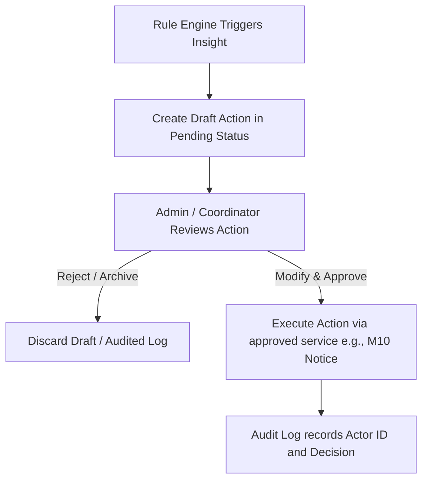

# SchoolOS M11 School Intelligence & Analytics Backend Readiness Plan

**Last updated:** 2026-05-26  
**Status:** Roadmap/Documentation only (No AI/ML runtime code or LLM calls are introduced)

This document defines the backend readiness boundaries, data schemas, architectures, and guardrails for the future **M11 School Intelligence & Analytics** module. Implementation is strictly deferred until reliable production data is established in Phase 6.

---

## 1. Non-Negotiable Guardrails & Policy Constraints

To maintain tenant isolation, user privacy, and data security, the following rules must be enforced at the backend/service layer when M11 is implemented:

1. **No AI/ML Runtime Code or LLM Calls**: Absolutely no machine learning runtime packages (e.g., TensorFlow, PyTorch), LLM clients (e.g., OpenAI, Anthropic, Google Gemini), or external AI API calls may be introduced in this phase.
2. **No Automated Punishment/Risk Action**: M11 must not automate any administrative actions. Specifically:
   - No automated suspension or disciplinary referrals.
   - No automated payroll deductions, teacher rankings, or student sorting/blocking.
   - No automated parent messaging/notices without explicit admin approval.
3. **Mandatory Human Review**: Any system-generated recommendation, notification draft, or critical indicator must flow through a human-review queue where a school administrator or teacher must review, modify, and explicitly approve the action before it becomes official.
4. **Strict Tenant Isolation**: All read models, analytics snapshots, and insights must remain partitioned by `tenantId`. A query must never cross tenant boundaries unless it is an approved, anonymized, platform-wide aggregate.
5. **Audit Logging**: Any retrieval of insights, changes to model definitions, or actions taken on reviews must be recorded in the platform's `AuditLog`.

---

## 2. Approved Read Models & Snapshot Candidates

To support efficient analytics without putting read pressure on active transactional tables, dedicated read models and scheduled database snapshots will be implemented.

### Read Model Candidates
- `StudentAnalyticsProfile`: Consolidated, indexed read-optimized table aggregating attendance rates, grade averages, outstanding fees, and communication logs.
- `ClassPerformanceSummary`: Weekly or monthly aggregation of class attendance, test score distributions, and homework completion ratios.
- `SchoolFinancialSummary`: Daily rolled-up ledger stats, fee collection targets, and payment default trends.

### Snapshot Candidates
- `StudentAcademicSnapshot`: Persisted record at the end of each exam term, freezing the GPA, rank, and CAS points.
- `MonthlyFinanceSnapshot`: Frozen ledger account balances at the end of each fiscal month, aligning with M9 Accounting boundaries.
- `DailyAttendanceSnapshot`: Frozen student counts (present, absent, late) at the lock window of each calendar day to support year-over-year cohort tracking.

---

## 3. Explainable Rule-Based Insight Candidates

Before any complex predictive model is introduced, analytics must rely on clear, deterministic, explainable rules. Examples of insight rules include:

| Insight Type | Trigger Rule | Objective | Explainability / Source Signal |
|---|---|---|---|
| **Defaulter Warning** | Unpaid M3 invoice past due date by > 30 days. | Alert finance desk. | Links directly to Invoice `id` and payment history. |
| **Attendance Intervention** | Cumulative attendance below 80% in a month. | Notify class teacher. | Links directly to monthly `AttendanceRecord` stats. |
| **Grading Deviation** | Term GPA dropped by > 1.0 compared to previous term. | Alert academic coordinator. | Links directly to `StudentAcademicSnapshot` comparison. |
| **Library Overdue Alert** | Book copy overdue by > 14 days. | Alert librarian. | Links directly to `LibraryIssue` status and copy logs. |

---

## 4. Human-Review Workflows & UI Integration

System-generated insight recommendations (e.g., drafting a message to a parent about attendance or generating a library reminder) will not be sent directly. Instead, they must follow this lifecycle:

---

## 5. Anonymized Cross-School Aggregates & Opt-In Rules

To allow schools to compare baseline performance metrics (e.g., average teacher retention rates, baseline Montessori attendance metrics in Nepal) without leaking PII:

1. **Explicit Consent**: A tenant must opt-in via a settings flag (`tenant_settings.allow_anonymous_analytics_sharing = true`).
2. **Aggregated & Anonymized**: Platform-wide jobs must compute aggregates across multiple schools. Individual school names, student profiles, and exact transaction values must be stripped and rolled up into percentiles or district averages.
3. **Platform Audit**: Any platform-level run to generate these aggregates must record an audit entry detailing the query parameters, output destination, and active schools included in the job.
