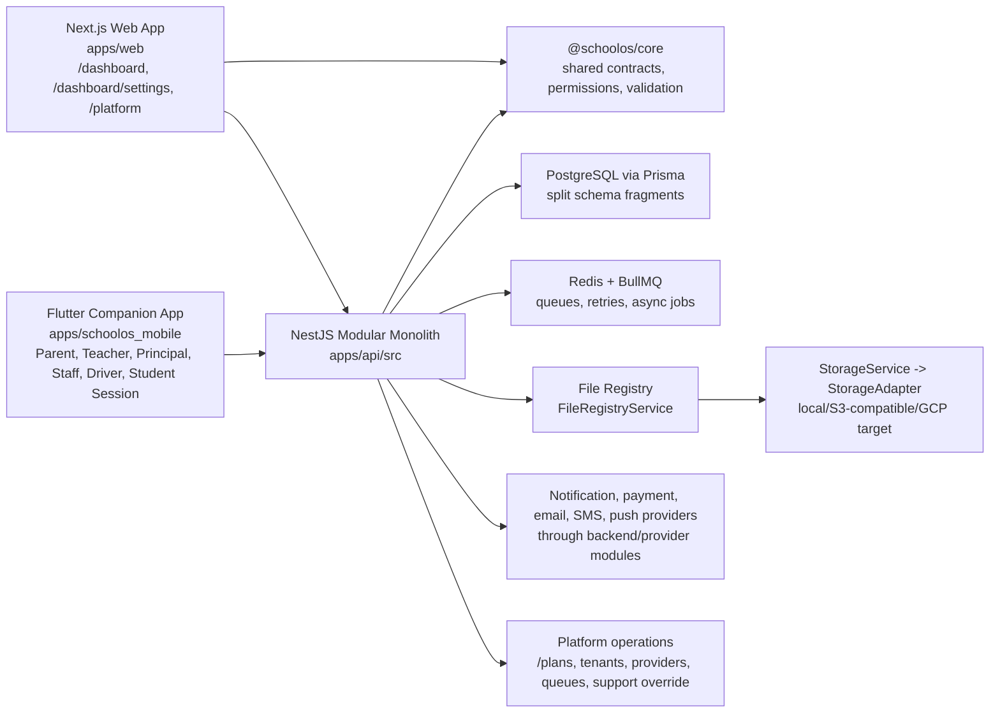

# SchoolOS Software Requirements Specification

**Status:** Canonical SRS
**Owner/audience:** CTO, lead NestJS developer, lead Next.js developer, senior Flutter developer, database designer, PostgreSQL DBA, security engineer, QA lead, DevOps/SRE, support/operations lead
**Scope:** Software requirements, non-functional requirements, system constraints, security, performance, database, API, web, mobile, operations, quality, and evidence classification for the shared SchoolOS platform.
**Precedence:** This SRS translates the BRD, PRD, and FRS into software constraints. It does not replace module behavior in `../product/SCHOOLOS_FUNCTIONAL_REQUIREMENTS.md`, current readiness evidence in `../project/SCHOOLOS_PRODUCTION_READINESS_AUDIT.md`, or implementation sequencing in `../project/SCHOOLOS_NEXT_PHASE_DELIVERY_PLAN.md`.
**Inputs/source documents:** `../product/SCHOOLOS_BRD.md`, `../product/SCHOOLOS_PRODUCT_REQUIREMENTS.md`, `../product/SCHOOLOS_FUNCTIONAL_REQUIREMENTS.md`, `../product/SCHOOLOS_BACKEND_WEB_MOBILE_FEATURE_ALLOCATION.md`, `../architecture/SCHOOLOS_ARCHITECTURE_AND_SECURITY.md`, `../architecture/SCHOOLOS_NOTIFICATION_ARCHITECTURE.md`, `../architecture/SCHOOLOS_PLATFORM_OPERATIONS.md`, `../architecture/SCHOOLOS_NAMING_CONVENTIONS.md`, `../production/SCHOOLOS_GA_RELEASE_POLICY.md`, `../production/SCHOOLOS_PRODUCTION_RUNBOOK.md`, `../project/SCHOOLOS_PRODUCTION_READINESS_AUDIT.md`, `../project/SCHOOLOS_NEXT_PHASE_DELIVERY_PLAN.md`, actual repository code inspected on 2026-06-20.
**Out-of-scope content:** Exact endpoint URLs for proposed APIs, Prisma migrations for proposed structures, screen-by-screen UI specs, pricing, staging secrets, deployment credentials, and GA readiness claims.
**Last reviewed date:** 2026-06-20

---

## 1. System Scope

SchoolOS must remain one multi-tenant education operating platform:

```text
Shared tenant-aware core
+ PRESCHOOL experience pack
+ SCHOOL experience pack
+ HIGHER_SECONDARY experience pack
+ shared Next.js Web application
+ shared Flutter companion app
```

The official record remains:

```text
Student
+ Guardian relationship
+ Student enrollment
+ Academic year
+ Class/section
+ stage/program classification
+ role and permission scope
+ enabled module/capability
```

Do not create separate `PreschoolStudent`, `PrimaryStudent`, or `PlusTwoStudent` systems.

## 2. Verified Repository Baseline

This section records code evidence inspected during this documentation pass. It is not a fresh runtime verification pass.

| Area | Evidence classification | Evidence |
|---|---|---|
| NestJS modular monolith | IMPLEMENTED_UNVERIFIED | `apps/api/src/app.module.ts` imports platform, admissions, attendance, finance, academics, activity, homework, payroll, accounting, messaging, library, transport, canteen, mobile, settings, file-registry, reports, learning, advanced-operations, operational-summary, tenants, Redis, and notifications modules. |
| PostgreSQL/Prisma shared core | IMPLEMENTED_UNVERIFIED | Split Prisma schema files include `Tenant`, `Student`, `Guardian`, `StudentGuardian`, `Enrollment`, `AcademicYear`, `Class`, `Section`, `Subject`, attendance, fees, files, communication, learning, operations, payroll, accounting, transport, canteen, and platform models. |
| Redis/BullMQ | IMPLEMENTED_UNVERIFIED | `BullModule` configured in `AppModule`; `docker-compose.yml` includes Redis; reports and notification/queue surfaces exist. Runtime queue processing was not verified in this pass. |
| OpenAPI/Nest bootstrap | IMPLEMENTED_UNVERIFIED | `apps/api/src/main.ts` sets global prefix `api/v1`, Swagger, validation pipe, safe exception filter, request IDs, Helmet, CORS, and response envelope. |
| API authorization and entitlement | IMPLEMENTED_UNVERIFIED | Controllers use permission/module decorators; `EntitlementGuard` checks required module/feature and suspended tenant state. |
| File Registry | IMPLEMENTED_UNVERIFIED | `FileRegistryService` and `StorageService` exist with signed upload/read paths and tests referenced in prior audit. External object storage was not verified here. |
| Next.js Web | IMPLEMENTED_UNVERIFIED | `apps/web/app/dashboard/**`, `apps/web/app/platform/**`, and domain API clients exist; web client uses cookie credentials, CSRF token header, support override headers, and shared core types. |
| Flutter companion app | IMPLEMENTED_UNVERIFIED | One GoRouter app has parent, teacher, principal, staff, driver, admin, and limited student routes; secure token storage and private read cache exist. Device QA was not run here. |
| Program/stage resolver | NEEDS_SCHEMA_DESIGN | No canonical tenant program-offering, class stage profile, stream/combination, or `ExperienceContext` implementation was found. Current evidence is demo preschool class names and activity milestone stage filters only. |
| Preschool pickup/handover workflow | NEEDS_SCHEMA_DESIGN | No dedicated authorized-pickup, temporary pickup change, arrival/checkout, or pickup exception model was verified. |
| Higher Secondary streams/subject combinations/practicals/projects | NEEDS_SCHEMA_DESIGN | Subjects have practical marks and assessments; no configurable stream/subject-combination/practical/project lifecycle model was verified. |

## 3. System Architecture Requirement



## 4. Experience Resolution Requirement

The effective product experience must be backend-owned and derived from:

```text
Tenant program offerings
+ platform module entitlement
+ school-level configuration
+ class/section stage or program
+ active enrollment
+ user role
+ permission
+ teacher assignment
+ guardian-child relationship
+ enabled capability
```

Conceptual `ExperienceContext` output:

```text
role
tenantId
enabledPrograms
assignedPrograms
activeProgram
activeClassOrChildContext
enabledCapabilities
permissionScope
moduleEntitlements
```

Current repository status: **PROPOSED / NEEDS_SCHEMA_DESIGN**. Do not invent endpoint URLs, DTOs, or Prisma fields until the backend contract is designed, OpenAPI is updated, shared contracts are added, and tests prove tenant/RBAC/stage scope.

## 5. Non-Functional Requirements

| ID | Requirement |
|---|---|
| SRS-NFR-01 | Tenant isolation applies to every API read/write, job, export, report, file, cache, notification, mobile response, and learning session. |
| SRS-NFR-02 | Backend authorization is authoritative; web/mobile hiding is only UX. |
| SRS-NFR-03 | Growing lists require server-side pagination/filtering/sorting and tenant-scoped index review. |
| SRS-NFR-04 | Official totals for money, attendance, payroll, accounting, report readiness, delivery state, library, transport, canteen, and learning progress are backend-owned. |
| SRS-NFR-05 | High-risk actions require permission, confirmation, reason where policy requires it, audit, pending/success/error feedback, and safe retry behavior. |
| SRS-NFR-06 | Sensitive errors must use bounded envelopes and never expose Prisma internals, stack traces, provider secrets, raw object keys, private URLs, token hashes, salary/bank data, or private payloads. |
| SRS-NFR-07 | Reports, PDFs, media processing, imports, exports, provider delivery, retries, and large computations use queues/background jobs where practical. |
| SRS-NFR-08 | Mobile supports offline safe reads only by default; offline writes require explicit idempotency, replay/reconciliation design, and visible queued/synced/failed state. |
| SRS-NFR-09 | No offline payments, wallet debits, refunds, payroll, accounting, report-card publishing, tenant settings, platform controls, or high-risk writes. |
| SRS-NFR-10 | M14 Intelligence / AI remains roadmap-only and must not introduce AI runtime, AI tutor, AI chat, adaptive learning, or inference workflows until approved. |

## 6. Backend API Rules

| Rule | Requirement |
|---|---|
| Module ownership | Endpoint ownership follows the feature module. Mobile-specific contracts must still call module services or purpose-limited mobile services with module-owned rules. |
| Purpose-limited endpoints | Parent, teacher, principal, driver, staff self-service, and student-session endpoints return only the minimum role-scoped data needed for the workflow. |
| Tenant scoping | Every query/mutation/job/export/report/file/mobile response includes `tenantId` scoping or platform-approved tenant override with reason and audit. |
| Resource scoping | Parent = linked children; student = own/session; teacher = assigned class/section/subject unless permitted; driver = assigned trip; staff self-service = own staff record. |
| DTO validation | DTOs use validation decorators/shared schemas; runtime bootstrap keeps whitelist, transform, and forbid-non-whitelisted behavior. |
| OpenAPI alignment | New or changed endpoints require OpenAPI and shared contract alignment before web/mobile integration. |
| Errors | Use safe bounded error envelopes. Logs may retain stack traces server-side, but client payloads must not. |
| Lists | Growing lists use pagination/filtering/sorting. Do not add unbounded `findMany` for tenant-owned operational data. |
| Money | Use database/backend Decimal/numeric totals. Money writes are idempotent and audited; confirmed records use reversal/correction. |
| Files | Use `Feature module -> FileRegistryService -> StorageService -> StorageAdapter`; clients use protected preview/download helpers. |
| Notifications | Source modules emit normalized events; M12 owns recipient resolution, templates, channels, providers, retries, callbacks, read state, and audit. |
| Suspended tenants | Suspended tenants fail closed across API, web, mobile, jobs, exports, files, notifications, and learning. |

## 7. Web Requirements

SchoolOS Web is the daily school operating desk.

| Requirement | Details |
|---|---|
| One screen, one main job | Dense operations are allowed, but each route must have one primary workflow. |
| Real APIs only | No mock production data, browser-owned official totals, or UI-invented lifecycle states. |
| Shared states | Loading, empty, error, permission-denied, module-locked, validation, queued-job, partial-failure, protected-file unavailable, and success states must be distinct. |
| Protected files | No raw private-file `window.open`; use authenticated helper flows and validate content where relevant. |
| Stage-aware composition | One shared shell composes Preschool, School, or Higher Secondary dashboards based on backend experience context; it is not a separate web codebase. |
| High-risk actions | Confirmation, reason where required, audit support, and clear pending/success/error feedback. |

Stage-aware dashboard requirements:

| Experience | Dashboard emphasis |
|---|---|
| `PRESCHOOL` | Child safety, attendance, pickup/drop, parent concerns, fees, admissions, class coverage. |
| `SCHOOL` | Attendance gaps, homework, timetable, exams, marks, report cards, dues, operations. |
| `HIGHER_SECONDARY` | Stream enrollment, practicals, projects, labs, internal assessment, mock exams, workload, dues. |

## 8. Mobile Requirements

SchoolOS mobile remains one Flutter companion app.

| Requirement | Details |
|---|---|
| Persona-first | Parent, teacher, principal, staff, driver, and student-session flows are task-specific. |
| Purpose-limited API | No broad admin dashboard copied to mobile and no admin-shaped payloads for parents/drivers/staff self-service. |
| Secure storage | Credentials and tokens use secure storage. Private read cache is safe-read only and must clear on logout/session expiry where implemented. |
| Offline | Offline reads may show cached private data with visible freshness; writes require explicit idempotency/reconciliation. |
| Context switching | Parent switches child and active stage; teacher switches assigned class/context; principal filters combined alerts by Preschool, School, and +2. |

Mobile workflow priority:

| Workflow | Priority |
|---|---|
| Parent Today, attendance, fees/receipts, notices, activity, milestones, report cards, transport where enabled | P0/P1 depending on stage and module entitlement |
| Teacher Today, attendance, assigned classes, homework, timetable, messages, preschool observations where approved | P0/P1 |
| Principal attention, approvals, admissions snapshot, attendance/fees/academics/transport alerts | P0/P1 |
| Staff own attendance, leave, payslips | P1 |
| Driver assigned trip | P1 |
| Broad admin settings, fee reversals, payroll posting, accounting, tenant/platform controls | Not appropriate for mobile |

## 9. Database And PostgreSQL Requirements

| Area | Current evidence | Requirement / gap |
|---|---|---|
| Tenant isolation | Most core models include `tenantId` and tenant relations. | Every new model/index/query must preserve tenant scoping. |
| Student core | `Student`, `Guardian`, `StudentGuardian`, and `Enrollment` exist. | Program/stage must extend the shared student/enrollment/class model, not create separate student tables. |
| Academic structure | `AcademicYear`, `Class`, `Section`, `Subject`, `SubjectTeacherAssignment`, and timetable/exam models exist. | Need a formal program/stage/profile design for class/section and +2 streams/subject combinations. |
| Enrollment lifecycle | `Enrollment` and lifecycle fields/history exist. | Stage/program transitions require explicit lifecycle/audit design before schema changes. |
| Preschool safety | Emergency/care fields exist on `Student`; activity/milestone models exist. | Authorized pickup, temporary pickup, arrival/checkout, and pickup exception workflows need schema design. |
| Higher Secondary | `Subject.hasPractical`, theory/practical marks, assessments, exams, report cards, and promotion exist. | Stream/subject-combination/practical/project tracking needs ownership, indexes, API, UI, and tests. |
| Money correctness | Fees, payments, receipts, cashier close, accounting, payroll, and canteen wallet/POS models exist. | Continue Decimal/database totals, idempotency, reversal/correction, and transaction-boundary tests. |
| Files | `FileAsset` and module file references exist. | New files must use File Registry metadata, retention, protected access, and lifecycle audit. |
| Reporting performance | Reports/export history and queue processors exist. | Large reports must be queued and indexed; no dashboard raw-table scans. |
| Migration safety | Split schema and migrations exist. | Proposed program/stage structures require migration replay, backfill, index review, and seed idempotency proof. |

## 10. Data Ownership And Lifecycle Matrix

| Data | Owner module | Lifecycle | Security rule |
|---|---|---|---|
| Student | M1 | applicant/admitted/active/transferred/withdrawn/graduated/archived/alumni where supported | Tenant-scoped; no duplicate stage-specific student record. |
| Guardian link | M1/M12 | linked/verified/revoked/removed | Parent access immediately follows active linked-child relationship. |
| Enrollment | M1/M4 | active/promoted/transferred/withdrawn/graduated | Academic-year, class, section, and proposed stage/program scope. |
| Class/section | M0/M4/M6 | configured/active/archived | Tenant-scoped; stage/program profile proposed. |
| Program/stage | Proposed M0/M1/M4 | offered/enabled/assigned/retired | Needs schema design; backend-owned resolver. |
| Fee ledger | M3/M11 | planned/invoiced/paid/reversed/refunded/closed | Backend Decimal truth, idempotency, audit. |
| Attendance | M2 | draft/submitted/locked/corrected/exported | Teacher/guardian scope enforced by backend. |
| Files | M0 File Registry + feature owner | pending/uploaded/linked/previewed/downloaded/expired/deleted | No raw object keys or permanent private URLs in clients. |
| Media consent | M5/M12 | captured/revoked/applied/audited | Consent-safe preschool and parent media visibility. |
| Exam/result | M4 | draft/submitted/locked/generated/published/corrected/unpublished | Parent/student see published own-scope records only. |
| Practical/project | Proposed M4 | assigned/in-progress/submitted/assessed/published | Needs +2 schema, DTO, authorization, and reporting design. |
| Audit event | M0/Audit | recorded/retained/exported | Immutable enough for support/security investigation; no private payload leakage. |

## 11. Scope And Authorization Matrix

| Role | Tenant scope | Child/class/subject/trip scope | Allowed data | Denied data |
|---|---|---|---|---|
| Platform operator | Platform plus audited support override where supported | Tenant only when reasoned override applies | Tenant setup, plans, providers, queues, support/audit | Casual browsing of school-private records, school fee collection as SaaS billing |
| School owner/principal | Own tenant | School-level summaries filtered by permission | Exception summaries, approvals, reports, safe read-only snapshots | Private message bodies, salary/bank fields without permission, raw protected files |
| School admin/reception | Own tenant | School operations permitted by role | Admissions, students, guardians, settings, notices, documents | Platform controls, unrelated private finance/payroll details |
| Accountant/cashier | Own tenant | Finance/cashier scope | Fees, receipts, cashier close, accounting where permitted | Client-calculated official totals, unrelated child care/media data |
| Teacher | Own tenant | Assigned class/section/subject unless permitted | Attendance, homework, marks, class activity, parent-teacher threads | Unassigned students/classes, finance internals, broad admin settings |
| Parent/guardian | Own tenant through linked children | Linked children only | Child attendance, fees, receipts, notices, activity, milestones, published results | Other children, staff finance, raw object keys, private messages outside linked scope |
| Student session | Own tenant | Own/session-scoped | Approved learning/session, own published timetable/homework/result | Broad student app, other students, open chat, admin data |
| Driver/conductor | Own tenant | Assigned trip only | Trip roster/status, route tasks, delay updates | Other routes/students, finance, staff data |
| Staff self-service | Own tenant | Own staff record | Own attendance, leave, payslips where enabled | Other staff salary/bank/payroll records |

## 12. Quality And Operational Matrix

| Area | Requirement | Current proof boundary |
|---|---|---|
| Security | Tenant/RBAC/scope fail closed, safe errors, secrets masked. | Local tests recorded in audit; no full staging security review. |
| Tenant isolation | All records/jobs/files/caches/provider events are tenant-scoped. | Code evidence exists; pilot cross-scope proof pending. |
| RBAC | Backend permissions and entitlements are source of truth. | Decorators/guards exist; live role walkthrough pending. |
| Performance | Pagination, indexes, queued heavy jobs, N+1 review. | Architecture rules exist; load proof pending. |
| Availability | Health/readiness, graceful failure, queue resilience. | Code/scripts exist; staging proof pending. |
| Backups | Scheduled backup and restore drill. | Runbook exists; restore proof missing. |
| Monitoring | Logs, metrics, queue/provider alerts, incident response. | Runbook/platform surfaces exist; deployed alert proof missing. |
| Queue retries | Permissioned/audited retry and poison-job handling. | Queue services/tests exist; runtime proof pending. |
| Provider failure | Disabled/mock/sandbox/configured modes visible and safe. | Provider readiness code exists; external provider proof missing. |
| Data retention | Temporary exports/media/provider diagnostics retention. | Policy direction exists; full retention implementation proof pending. |
| Incident response | Runbook, rollback, support override audit. | Procedures exist; rehearsal proof missing. |

## 13. Stage-Aware Capability Evidence Matrix

| Capability | Current status | Required next evidence |
|---|---|---|
| Shared student/guardian/enrollment core | IMPLEMENTED_UNVERIFIED | Fresh local/staging verification against seeded tenant and role scopes. |
| Preschool class names and milestone templates | IMPLEMENTED_UNVERIFIED | Confirm stage filters, UI behavior, parent visibility, and consent-safe media in browser/mobile. |
| Preschool pickup/drop and authorized pickup contacts | NEEDS_SCHEMA_DESIGN | Define module ownership, schema, DTO, RBAC, audit, mobile/web flows, and tests. |
| Preschool care/allergy alerts | IMPLEMENTED_UNVERIFIED / NEEDS_AUTHORIZATION_RULE | Student care fields exist; narrow staff visibility and preschool UI workflows need verification/design. |
| School Grade 1-10 core workflows | IMPLEMENTED_UNVERIFIED | Authenticated browser E2E, pilot seed, mobile device QA, staging proof. |
| Higher Secondary subject practical marks | IMPLEMENTED_UNVERIFIED | Confirm contracts, UI, report-card handling, and +2 policy fit. |
| Higher Secondary streams/subject combinations | NEEDS_SCHEMA_DESIGN | Design configurable stream/program/combination model and migration plan. |
| Higher Secondary projects/practicals lifecycle | NEEDS_SCHEMA_DESIGN | Design lifecycle, assessment, files, notifications, and parent/student visibility. |
| Conceptual ExperienceContext | PROPOSED | Backend contract, OpenAPI, shared DTO, web/mobile integration, tests. |

