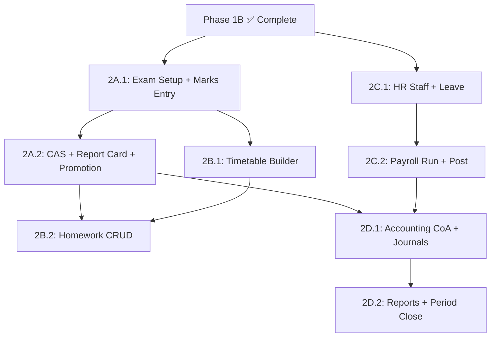

# SchoolOS Phase 2 Implementation Order

## Current State Assessment

Phase 1B is **completed and pilot-ready**. The repo is on `main` at commit `a04cc38` with clean working tree.

### What Already Exists for Phase 2

The codebase has **significant scaffolding** already in place for all Phase 2 modules — this is not starting from zero:

| Module | Backend Service | Schema Models | LOC | Frontend Page | Readiness |
|--------|----------------|---------------|-----|---------------|-----------|
| **M4 Academics** | `academics.service.ts` | ExamTerm, AssessmentComponent, MarkEntry, CasRecord, ReportCard, PromotionRecord, ExamTimetableSlot, MarkLockRequest, SubjectTeacherAssignment, Subject | **1,424** | Placeholder `page.tsx` | **~60% backend scaffolded** — subjects, exam terms, marks entry, CAS, report card generation, Nepal MoEST grading, mark lock/unlock, exam timetable, batch promote all exist |
| **M6 Timetable/HW** | `timetable.service.ts` | TimetableSlot, HomeworkAssignment, HomeworkSubmission, SyllabusTopic | **551** | Placeholder `page.tsx` | **~50% backend scaffolded** — timetable slots with conflict detection, homework CRUD with submission tracking, homework reminders, teacher workload query all exist |
| **M7 HR/Payroll** | `staff.service.ts` + `payroll.service.ts` | Staff, StaffContract, StaffAttendance, StaffLeaveBalance, StaffLeaveRequest, PayrollRun, PayrollLine, Payslip, SchoolCalendarDay | **183 + 602** | Placeholder `page.tsx` | **~55% backend scaffolded** — staff CRUD, contracts, payroll run with attendance-prorated calculation, review/approve/post workflow, journal posting, payslip PDF all exist |
| **M9 Accounting** | `accounting.service.ts` | ChartAccount, JournalEntry, JournalLine, AccountingPeriod | **446** | Placeholder `page.tsx` | **~40% backend scaffolded** — chart of accounts, manual journals, expense vouchers, reversal workflow, trial balance + income statement + balance sheet + cash flow reporting, period close all exist |

### Key Dependencies Already Wired

- **Finance → Accounting:** `finance.service.ts` has journal-posting event seam (domain events for `fee.payment`, `payment_refund`)
- **Payroll → Accounting:** `payroll.service.ts` already creates journal entries when posting payroll (salary expense ↔ salary payable)
- **Academics → M10 Notices:** `academics.service.ts` already uses `CommunicationsService` for exam timetable publish notifications
- **Timetable → M10:** `timetable.service.ts` already uses `CommunicationsService` for homework reminders
- **Academics → M3 Fees:** Report card generation already checks `reportCardBlocked` / `hallTicketBlocked` on unpaid invoices

---

## Module Evaluation Matrix

| Criteria | M4 Academics | M6 Timetable/HW | M7 HR/Payroll | M9 Accounting |
|----------|:------------:|:----------------:|:-------------:|:-------------:|
| **Pilot Value** | 🔴 Critical | 🟡 High | 🟡 High | 🟢 Medium |
| **Parent Visibility** | 🔴 Highest | 🟡 High | ⚪ None | ⚪ None |
| **Schema Readiness** | ✅ Complete | ✅ Complete | ✅ Complete | ✅ Complete |
| **Backend Scaffolding** | ✅ 60% done | ✅ 50% done | ✅ 55% done | ✅ 40% done |
| **Dependencies On Others** | None (uses existing M1, M2, M3) | Needs M4 subjects/teachers | Standalone | Needs M3+M7 event seams |
| **Others Depend On It** | M6 uses subjects, M7 uses teacher assignments | M7 uses teacher schedules | M9 payroll posting | All modules post to it |
| **Database Migration Risk** | 🟢 Low — all models exist | 🟢 Low — all models exist | 🟢 Low — all models exist | 🟡 Medium — may need fiscal year model refinement |
| **Technical Complexity** | 🟡 Medium — grading rules, Nepal MoEST compliance | 🟢 Low — CRUD + conflict checks | 🟡 Medium — statutory compliance, PF/TDS | 🔴 High — immutable ledger, double-entry enforcement, fiscal controls |

---

## Recommended Implementation Order

### Why Academics (M4) Must Start First

1. **Highest school pilot value.** No school considers a system operational without exams and report cards. Parents judge the system by report cards. Pilot schools will ask "where are report cards?" before anything else.

2. **Already 60% scaffolded.** The backend has subjects, exam terms, assessment components, marks entry, CAS records, report card generation with Nepal MoEST grading, mark lock/unlock, exam timetable, promotion — all coded. The gap is **production hardening, frontend UI, and workflow polish**.

3. **Zero new schema migrations needed.** All 10 models already exist in `schema.prisma`. No database impact whatsoever.

4. **Unblocks M6.** Timetable/Homework depends on subjects and teacher assignments, which M4 owns. Building M4 first ensures M6 has a solid foundation.

5. **Integrates cleanly with Phase 1.** M4 reads from M1 roster, M2 attendance, M3 fee defaulter block — all completed in Phase 1.

### Recommended Sprint Order

```
Sprint 2A.1  →  M4 Academics: Exam Setup + Marks Entry UI          (Week 1-2)
Sprint 2A.2  →  M4 Academics: CAS + Report Card + Promotion UI     (Week 3-4)
Sprint 2B.1  →  M6 Timetable: Weekly Builder + Conflict Detection   (Week 5)
Sprint 2B.2  →  M6 Homework: Assignment + Submission + Reminders    (Week 6)
Sprint 2C.1  →  M7 HR: Staff Profile Depth + Leave Management       (Week 7)
Sprint 2C.2  →  M7 Payroll: Run + Approve + Post + Payslip UI      (Week 8)
Sprint 2D.1  →  M9 Accounting: Chart of Accounts + Journal UI       (Week 9-10)
Sprint 2D.2  →  M9 Accounting: Reports + Period Close + Integration  (Week 11-12)
```

> [!IMPORTANT]
> This order places the highest-risk, most complex module (M9 Accounting) last intentionally. By the time you reach M9, both the fee-payment event seam (M3) and payroll posting seam (M7) will be hardened, giving M9 real transaction data to work with instead of building in a vacuum.

---

## Sprint 2A.1 — Detailed Scope

**Goal:** Build production-ready Exam Setup and Marks Entry UI on top of the existing backend scaffolding.

### Backend Gaps to Close

The `academics.service.ts` (1,424 LOC) already has most CRUD methods. The gaps are:

1. **Subject management UI endpoints** — `listSubjects`, `createSubject` exist but need class/section-scoped filtering for the UI
2. **Marks entry batch endpoint** — Current `enterMark` is single-student; teachers need bulk marks entry per class/section/subject
3. **Grade boundary configuration** — Nepal MoEST grading is hardcoded in `calculateMoestGrade`; needs tenant-configurable grading override option
4. **Assessment component listing** — Needs filtering by exam term + subject for the marks entry UI
5. **Exam term + subject validation** — Existing validation is sufficient but needs error message polish

### Frontend to Build

1. **Academics workspace** at `/dashboard/academics` with tabs:
   - Subjects — list, create, assign teachers
   - Exam Terms — list, create, lock/unlock
   - Marks Entry — select exam term → class → section → subject → bulk marks grid
   - CAS Records — entry form
   - Report Cards — list, generate, PDF download
   - Exam Timetable — create slots, publish
2. **Marks Entry Grid** — the critical UI: teacher selects class/section/subject/exam-term, sees student roster with marks input fields, saves batch

### What Does NOT Change

- No new Prisma models
- No new database migrations
- No changes to Phase 1 modules
- No changes to auth/RBAC/tenant isolation

---

## Sprint Dependency Graph



> [!NOTE]  
> Sprint 2C.1 (HR/Staff) can run **in parallel** with Sprint 2A.1 (Academics) since they share no dependencies. However, if you're working sequentially, Academics first provides more pilot value.

---

## Risk Assessment

| Risk | Impact | Mitigation |
|------|--------|------------|
| Nepal MoEST grading rules change | Medium | Already server-side; add tenant-configurable override |
| Report card PDF layout expectations | High | Start with `buildSimplePdf` placeholder, iterate with pilot school |
| Payroll statutory rates (PF/TDS) | Medium | Currently 1% demo rate; make configurable before pilot |
| Accounting double-entry bugs | High | Existing `sumJournalSides` validation + balance check; add integration tests |
| Schema migration conflicts | 🟢 None | All 10+ Phase 2 models already exist in `schema.prisma` |

---

## Open Questions

> [!IMPORTANT]
> **Q1: Academics-first or HR-first?**
> My analysis strongly recommends Academics first for pilot value. However, if your pilot school has an immediate payroll deadline (e.g., salary month-end), HR/Payroll could jump ahead. Which module does the pilot school need most urgently?

> [!IMPORTANT]
> **Q2: Frontend depth vs. breadth?**
> Should Sprint 2A.1 deliver a polished marks-entry UI with full CRUD, or would you prefer a faster "admin-only setup + basic grid" and iterate later? This affects the sprint estimate.

> [!IMPORTANT]
> **Q3: Report card PDF template?**
> The existing `getReportCardPdf` uses `buildSimplePdf` (plain text). Do you want to invest in a proper Nepal-format report card template during Sprint 2A.2, or defer PDF polish to a later sprint?

---

## First Task Prompt (Sprint 2A.1)

When approved, the first task will be:

```
Phase 2A.1 — Academics: Exam Setup + Marks Entry

Scope:
1. Backend: Add batch marks entry endpoint (POST /academics/marks/batch)
   for teacher bulk-entry per class/section/subject/exam-term.
2. Backend: Add filtered subject listing by class
   (GET /academics/subjects?classId=X).
3. Backend: Add filtered assessment component listing
   (GET /academics/exam-terms/:id/components?subjectId=X).
4. Frontend: Build `/dashboard/academics` workspace with:
   - Subjects tab (list + create + assign teacher)
   - Exam Terms tab (list + create + lock/unlock)
   - Marks Entry tab (exam term → class → section → subject → marks grid)
5. Use existing Prisma schema — no migrations.
6. Use existing AcademicsService methods where possible.
7. Follow existing SchoolOS patterns: tenant-scoped, audited, RBAC-guarded.
8. Run pnpm lint, typecheck, test, build after completion.
```

---

## Verification Plan

### Automated Tests
- `pnpm test` — existing academics and timetable specs must pass
- `pnpm typecheck` — no regressions
- `pnpm build` — clean production build
- `pnpm verify:production` — existing gate passes

### Manual Verification
- Login as class teacher → navigate to `/dashboard/academics`
- Create exam term, add assessment components, enter marks, generate report card
- Verify PDF opens and contains correct Nepal MoEST grade
- Verify report card blocked by unpaid fees returns 409
